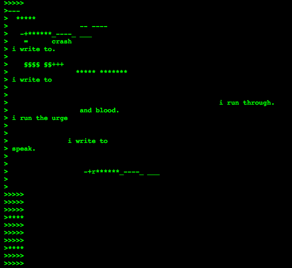

[Tutorials](README.md) | [Home](../../README.md)

-------------------------------------------------------------------------------

<style>
  .tts-button {
    position: fixed;
    top: 20px;
    right: 20px;
    padding: 10px 15px;
    background-color: #4CAF50;
    color: white;
    border: none;
    border-radius: 5px;
    cursor: pointer;
  }

  .tts-button:hover {
    background-color: #45a049;
  }
</style>

<button class="tts-button" onclick="speakText()">🔊 Read Aloud</button>

<script>
  function speakText() {
    let text = document.body.innerText;
    let speech = new SpeechSynthesisUtterance(text);
    speech.lang = "en-US"; // Set language
    speech.rate = 1; // Adjust speed (1 = normal)
    window.speechSynthesis.speak(speech);
  }
</script>

## Codework: Non-Executable Code-Poetry

In simple terms, a **codework** is a form of **creative writing influenced by computer languages** (*<a href="https://collection.eliterature.org/1/aux/keywords.html" target="_blank">Electronic Literature Collection, Volume One</a>*).  

Canadian author **John Cayley** identifies categories for classifying codeworks, including:  

+ **"Code infecting or modulating language"**—where the language functions, but the code is broken (*p.311-312*).

**Cayley, J. (2006).** *Time code language: New media poetics and programmed signification.*  
In **New Media Poetics: Contexts, Technotexts, and Theories**, pp. 307-334.

The **code-poetry** (Fig.1) of Australian artist and poet *<a href="https://www.mezbreezedesign.com/" target="_blank">Mez Breeze</a>*, particularly her *<a href="https://anthology.rhizome.org/mez-breeze" target="_blank">Mezangelle</a>* style, exemplifies this category.  

Her work is frequently described as **non-functional code-poetry**, or as I call it, **non-executable code-poetry** where the code is **not broken** but purposely design in a way that not necessarily has to be read by a computer.

<figure>
    
    <figcaption>Figure 1: Screenshot of Mez Breeze, 4-7 5-kc5, email from 7-11 email list, May 13, 1998.</figcaption>
</figure>

### 🖼️ Image Description:
The image features a glitchy, terminal-style digital poem displayed in green text on a black background, resembling an old computer screen or hacker aesthetics. The text is arranged in an asymmetrical layout, with a mix of symbols, letters, and spaces that create a fragmented, non-linear poetic structure.

### 🔊 Listen to the Audio version:
<audio controls>
  <source src="imgs/codework-mez.wav" type="audio/mpeg">
</audio>

**Mezangelle** is a non-functional programming language that poetically merges machine and human languages, reshaping English with code-inspired syntax. Mezangelle disrupts both code and English, blending them into a non-functional, unreadable form that challenges dominant language structures creating alternative ways of meaning and knowledge.

--

# 🌟 Codework Activity: Writing Non-Executable Code-Poetry

## 🎯 Objective:
Explore the intersection of **computer language syntax and poetry** by crafting a **non-executable code-poetry** using/breaking **CSS syntax**.

---

## 📌 Activity Overview:
1. **Class Discussion:** Understanding CSS Syntax & Structure *(Whole Class, 10 min)*
2. **Codework Writing:** Creating Your Code-Poetry *(In Groups, 10 min)*
3. **Class Reflection:** Sharing and Analyzing Class Code-Poetry Examples *(Whole Class, 10 min)*

---

## 1️⃣ Class Discussion: Understanding CSS Syntax & Structure *(10 min)*

### **What is CSS?**
CSS (**Cascading Style Sheets**) is a computer language used to **style web pages**, controlling elements like fonts, colours, and layout.

### **Example: CSS syntax**

```css
body {
    background: black;
    font-family: "Raleway", sans-serif;
    color: green;
}

a:hover {
    content: "uncertainty";
    transition: fade-out 2s;
}
```

## 📢 Discussion Questions:
- What programming symbols do you notice?
- What words do you recognize?
- What similarities do you recognize in these two sections: `body` and `a:hover`?

💡 What if we **repurpose this CSS example create poetry**?
- If CSS controlled emotions instead of styles, what would you write?

---

## 2️⃣ Codework Writing: Creating Your Code-Poetry *(In Groups, 10 min)*  

### **📝 Task: Write a Short Code-Poem**  
1. Go to **this online document**: <a href="https://docs.google.com/document/d/1rPHzvru9saW5Bf-Y6ho8K36VdwdjU2uCjj_UMOudpOw/edit?usp=sharing" target="_blank">Dropbox link</a>
2. In **groups**, create a **code-inspired poem** using CSS syntax as your foundation.  

✅ **Choose a theme** (e.g., memory, glitch, loss, love, happiness).
✅ **Use at least two elements** from CSS (structure, symbols, keywords, values).
✅ **Use other languages**. You can write your code-poetry using a language other than English, or mixing words from different languages.
✅ **Break the syntax if needed**—prioritize meaning over functionality; remember this is a non-executable codework!  

### **Examples Code Poetry (For Inspiration)**

```css
body {
    background: life;
    my-family: "forgotten", "lost";
    text-continues: justify;
    display: none;
}
```

```css
soul {
    transition: fading 20y slowly-coming-and-growing;
}

/* and then */

love:active {
    transform-at-any-time: withLife(∞);
}
```

## 3️⃣ Class Reflection: Sharing Class Code-Poetry Examples *(Whole Class, 10 min)*  

### 📢 Discussion Questions:
- How does each piece **play with CSS syntax**?  
- What **emotions or themes** emerge from the code?  
- What **challenges did you face** when manipulating/breaking CSS syntax for creative expression?  

---

## 🔄 Wrap-Up:
🔸 **Codeworks** is type of **Electronic Literature** because it **integrates** programming languages and code syntax into the fabric of literary expression.   
🔸 **Codeworks "breaks"** both code syntax and language syntax for poetic & critical purposes.   

## Why is this relevant?:
🔸 **Codeworks exemplify** the intersection of computational thinking and creative expression.  
🔸 **Codeworks intersects** with **Speculative Design** by challenging traditional narratives and exploring alternative ways to design computer languages and approach creative writing.  
🔸 **How can executable-programming syntax be structured poetically to imagine new linguistic and computational realities?**

---
