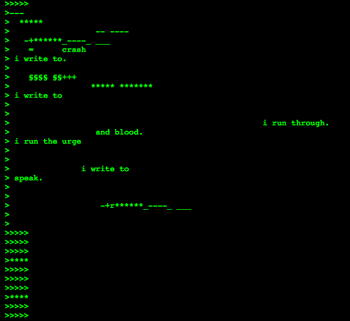

[Tutorials](README.md) | [Home](../../README.md)

-------------------------------------------------------------------------------
### Click the Button to Read Aloud:

<button onclick="speakText()">🔊 Read Aloud</button>

<script>
  function speakText() {
    let text = document.body.innerText;
    let speech = new SpeechSynthesisUtterance(text);
    speech.lang = "en-US"; // Set language
    speech.rate = 1; // Adjust speed (1 = normal)
    window.speechSynthesis.speak(speech);
  }
</script>

## Codeworks

In simple terms, a **codework** is a form of creative writing that integrates programming languages within the text (*<a href="https://collection.eliterature.org/1/aux/keywords.html" target="_blank">Electronic Literature Collection, Volume One</a>*).  

Author **John Cayley** identified categories for classifying codeworks, including:  

+ **"Code infecting or modulating language"**—where the language functions, but the code is broken (*p.311-312*).

**Cayley, J. (2006).** *Time code language: New media poetics and programmed signification.*  
In **New Media Poetics: Contexts, Technotexts, and Theories**, pp. 307-334.

--

The **code poetry** (Fig.1) of Australian artist and poet *<a href="https://www.mezbreezedesign.com/" target="_blank">Mez Breeze</a>*, particularly her *<a href="https://anthology.rhizome.org/mez-breeze" target="_blank">Mezangelle</a>* style, exemplifies this category. Her work is frequently described as **non-executable code poetry**.

<figure>
    
    <figcaption>Figure 1: Screenshot of Mez Breeze, 4-7 5-kc5, email from 7-11 email list, May 13, 1998.</figcaption>
</figure>

**Mezangelle** is a non-functional programming language that poetically merges machine and human languages, reshaping English with code-inspired syntax. Mezangelle disrupts both code and English, blending them into a non-functional, unreadable form that challenges dominant language structures creating alternative ways of meaning and knowledge.

--

---

# 🌟 Codework Activity: Writing Code Poetry

## 🎯 Objective:
Explore the intersection of **computer language syntax and poetry** by crafting your own **non-executable codework** using **CSS syntax** as a creative tool.

---

## 📌 Activity Overview:
1. **Class Discussion:** Understanding CSS Syntax & Structure *(Whole Class, 10 min)*
2. **Code Poetry Writing:** Crafting Your Own Codework *(Pairs, 10 min)*
3. **Sharing & Discussion:** Analyzing & Reflecting on the Work *(Whole Class, 10 min)*

---

## 1️⃣ Class Discussion: Understanding CSS Syntax & Structure *(10 min)*

### **What is CSS?**
CSS (**Cascading Style Sheets**) is a computer language used to **style web pages**, controlling elements like fonts, colours, and layout.  
💡 But what if we **repurposed its syntax** for poetry instead of design?

### **Example: CSS syntax**

```css
body {
    background: black;
    font-family: "Raleway", sans-serif;
    color: green;
}

a:hover {
    content: "uncertainty";
    transition: fade-out 2s;
}
```

## 💡 Discussion Questions:
- What programming symbols do you notice?
- What words do you recognize?
- How do you think the `body` and `a:hover` sections changes the style?
- If CSS controlled emotions instead of styles, what would you write?

---

## 2️⃣ Code Poetry Writing: Crafting Your Own Codework *(Pairs, 10 min)*  

### **💻 Task: Write a Short Code Poem**  
In **pairs**, create a **code-inspired poem** using CSS syntax as your foundation.  

✅ **Use at least three elements** from CSS (symbols, functions, values).  
✅ **Choose a theme** (e.g., memory, glitch, loss, love, repetition).  
✅ **Break the syntax if needed**—prioritize meaning over functionality; remember this is a non-functional codework!  

### **Examples Code Poetry (For Inspiration)**

```css
body {
    background: life;
    my-family: "forgotten", "lost";
    text-continues: justify;
    display: none;
}
```

```css
love:active {
    transform-at-any-time: withLife(∞);
}
```

## 3️⃣ Sharing & Discussion: Reading & Analyzing Code Poetry *(Whole Class, 10 min)*  

1. Save your codework as an image (JPEG) or PDF file.
2. **Upload your codework** to this <a href="https://www.dropbox.com/request/N5HktCap6Am4VywsxCM1" target="_blank">Dropbox link</a>

- 🔹 I will **open 2-3 examples** for the class to discuss.

### 💡 Discussion Questions:
- How does each piece **play with CSS syntax**?  
- What **emotions or themes** emerge from the code?  
- Could this be **read in multiple ways**?  

---

## 🎯 Wrap-Up:
🔸 **Code poetry blurs the boundaries** between language, programming, and creative expression.    
🔸 **Programming syntax can be a poetic structure**—it doesn't need to function, only to evoke meaning.   
🔸 **How else could digital language be repurposed for creative writing?**  


---
