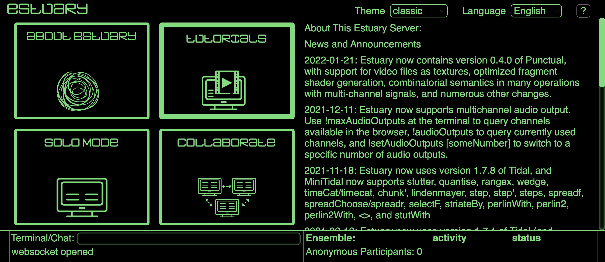
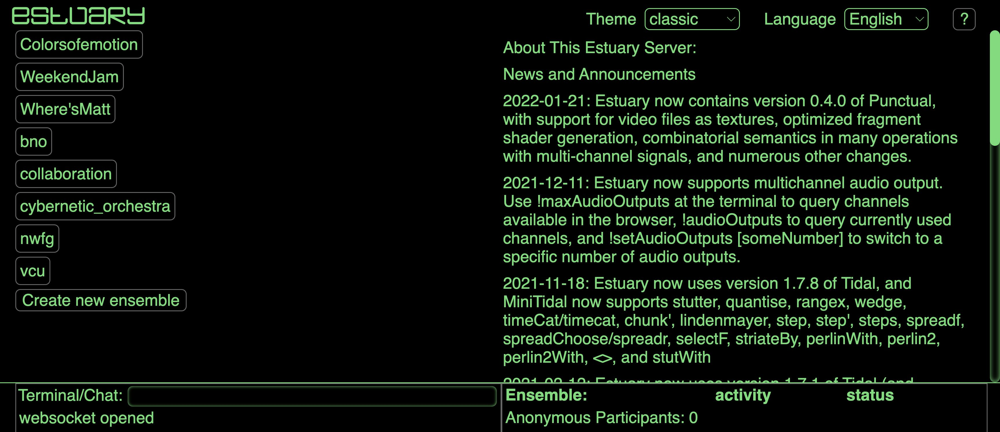
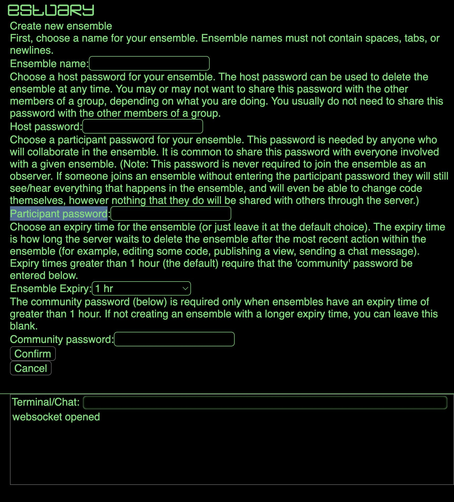
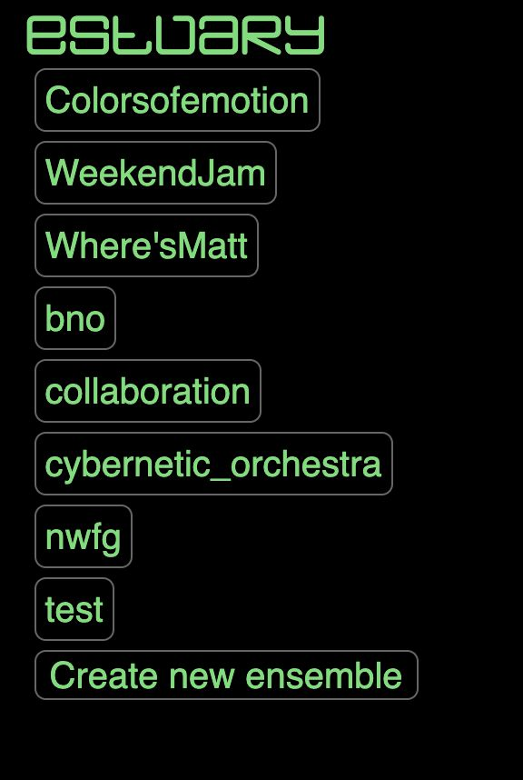
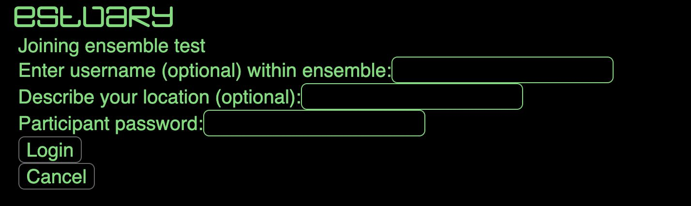
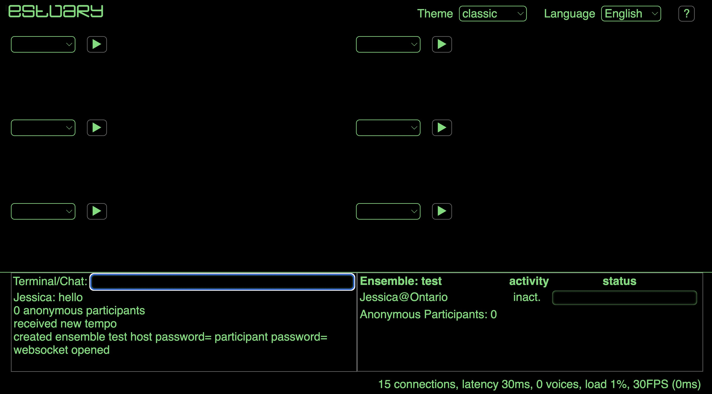

[Tutorials](../Tutorials/README.md) | [Home](../../README.md)    

-------------------------------------------------------------------------------  

## Estuary: Ensemble Mode

You can play collaboratively and online (using different computers) on Estuary.  

### First Step: Set up an ensemble

Go to `Collaborate`:  

Click on `Create New Ensemble`  

It will ask you several information. Only fill: `Ensemble Name`. You can also add a `Participant password`.  

Press `Confirm`. Your ensemble will only last one hour after you stop using it.  

### Second Step: Go into your ensemble

Go to `Collaborate`  

Click on the created ensemble (for this tutorial, I created the ensemble called “test”)

Fill with your info. If you did not add a password, just leave it in blank. Click `Login`.  

Once in, make sure you are connected:

+ Check that you can see the names of your peers in the Ensemble activity (bottom-right).
+ Send a message using the Terminal/Chat. If your peers receive that message, everything is ok.

Now, you can start playing collaboratively! Take a code box and start jamming.
