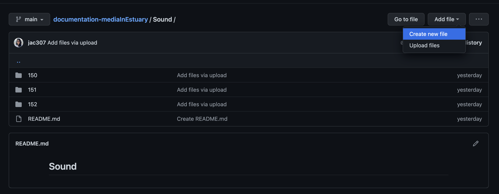
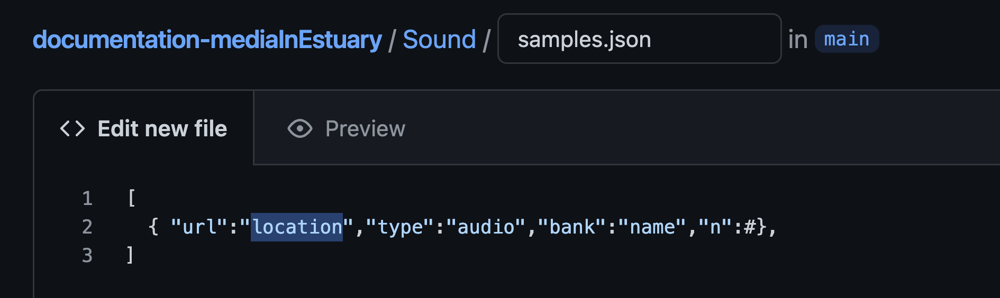
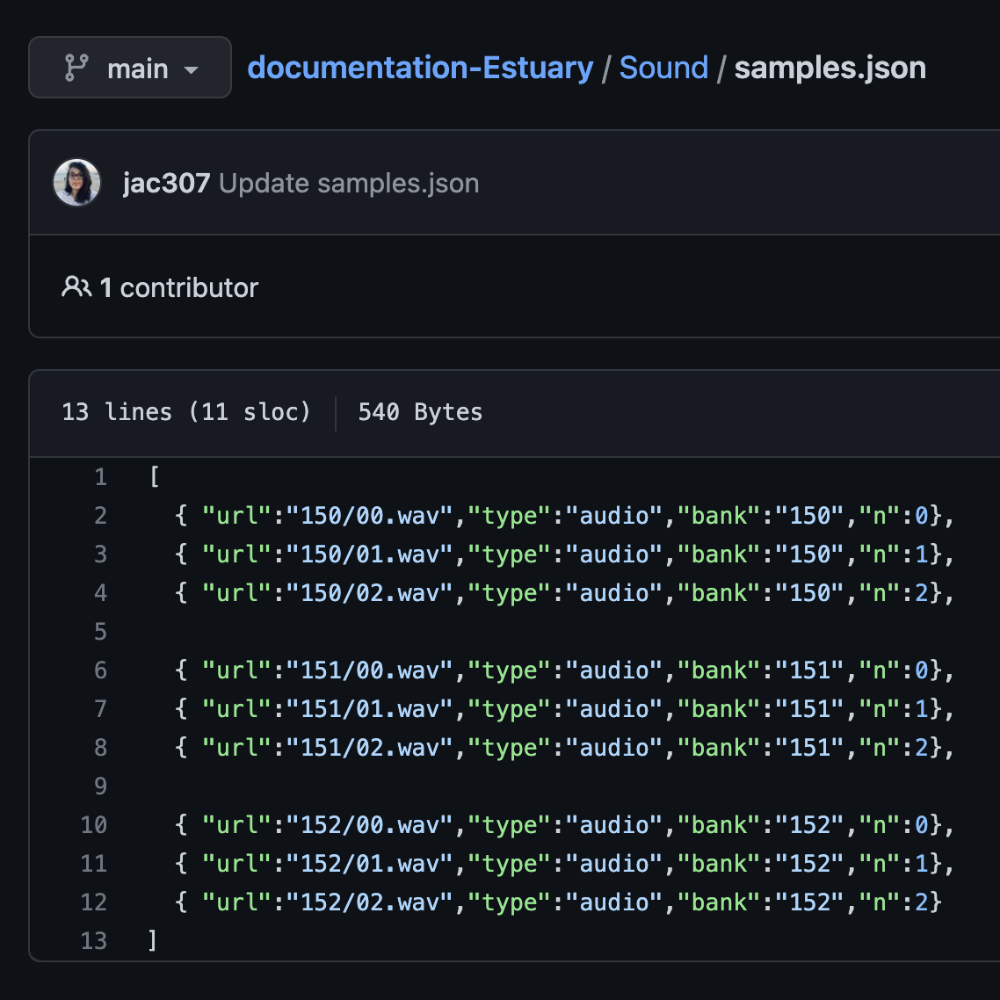
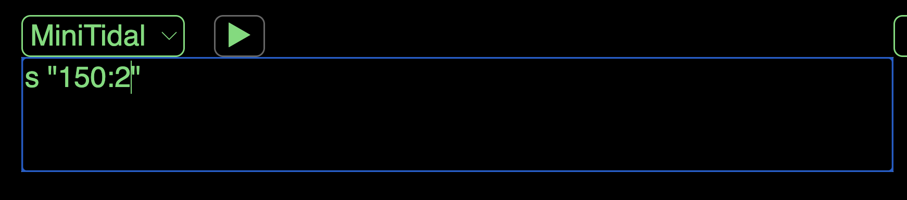

[Tutorials](../Tutorials/README.md) | [Home](../../README.md)    

-------------------------------------------------------------------------------  

## Temporally importing samples in Estuary

If you have not made your repo a GitHub Page, please follow [GitHub: Setup](GitHub-setup.md){:target="_blank"} tutorial first.

+ On your repository, go to the section you have uploaded your sound files.
+ Create a new file.

In this example, I have a folder named "Sound" with three sub-folders with different samples.  

  

+ Name your file and add the extension ".json".  

  

+ You will make a list of your sound samples `[]`.  

The sintax is the following: `[ { "url":"locationInGitHub","type":"audio","bank":"name-of-the-bank","n":samplesNumber} ]`.

  

+ Write the correct information in those fields.  

  

In this example, I have three folders/banks (150, 151, 152) with three sound samples in each folder. The location is `"nameOfFolder/file.extension"`, in `name-of-the-bank` I am keeping the name of the folder (but this can be different), lastly, `samplesNumber` should start from 0,1,2...  

  

+ Add more files if needed separated by commas.  
+ Press commit at the end of the page.  

  

You can see the file now. In this example, I finished adding the information of the other files I have.

  

+ Go to the folder where you have the new .json file and edit the README.md file there.  
+ Add a link to the .json file by following this sintax: `[text](url or location-on-GitHub)`, Commit changes.   

+ Confirm the link works.  

   

+ If you have uploaded and created these files inside of a folder/sub-folder, go to the beginning of your repository.  
+ Edit the README file there and add a link to your previous, Sound README file.  
These steps are not necesarry if you have all your files in the main repo.  

+ Go to "Settings", then "Pages", click on the site's url.   

+ Click until you get to your .json file / Dale click hasta entrar a tu archivo de .json.  
In this example, I have to go to Sound Samples, then Samples.  

Something like this should appear.  
+ Copy the URL / Copia la URL.  

+ Go to one of your README files (In this case, I will modify the README on Sound).  

+ Add the following: `!reslist "paste-url"`.  
In this case, I also added some other information about the samples.   

+ Go to: <a href="https://estuary.mcmaster.ca/" target="_blank">Estuary</a>
+ Go into Solo Mode or enter an ensamble.  
+ In the terminal, send your `!reslist "pasted-url"`.  

  

Now you can use your samples!

   

In Solo Mode, you will have to do this last step everytime you enter. In Collaborative/Ensamble mode, it should be saved.  
En Modo Solo, tendrás que hacer este último paso cada vez que entres. En modo Colaborativo/Ensamble, se deberían guardar.   

