[Tutorials](../Tutorials/README.md) | [Home](../README.md)    

-------------------------------------------------------------------------------  

## Using/Playing Media (video,image,gif) on CineCer0

+ Go to the repo/folder where you have your videos or images.    

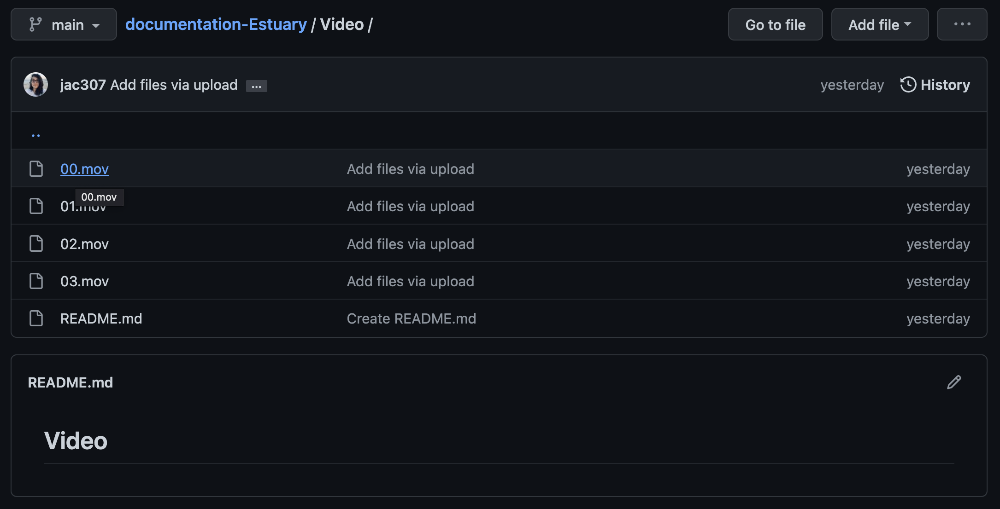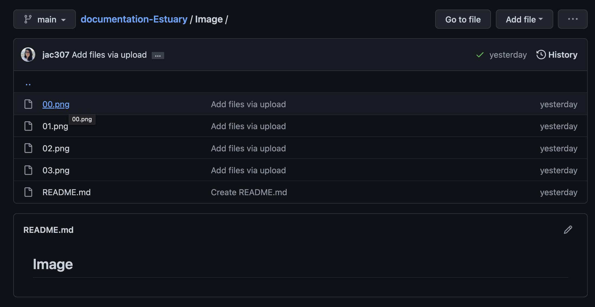  

+ For videos: Open the file, Right-Click on "View raw", then "Copy Link Address".  

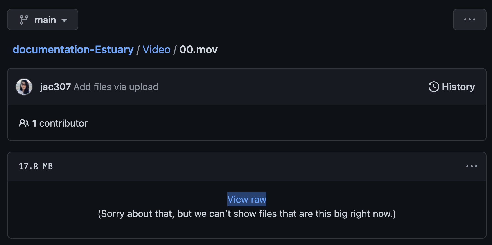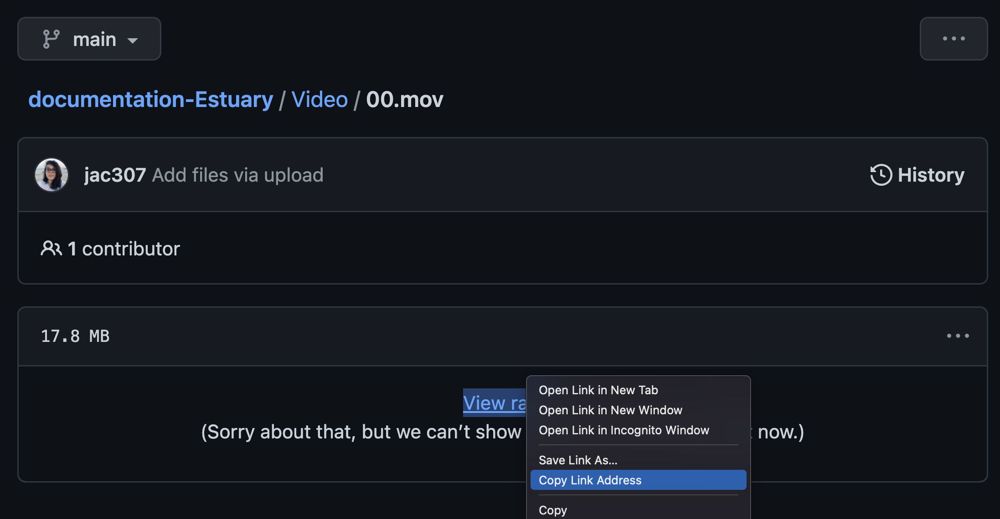  

+ For images: Open the file, Right-Click on the image, then "Copy Link Address".  

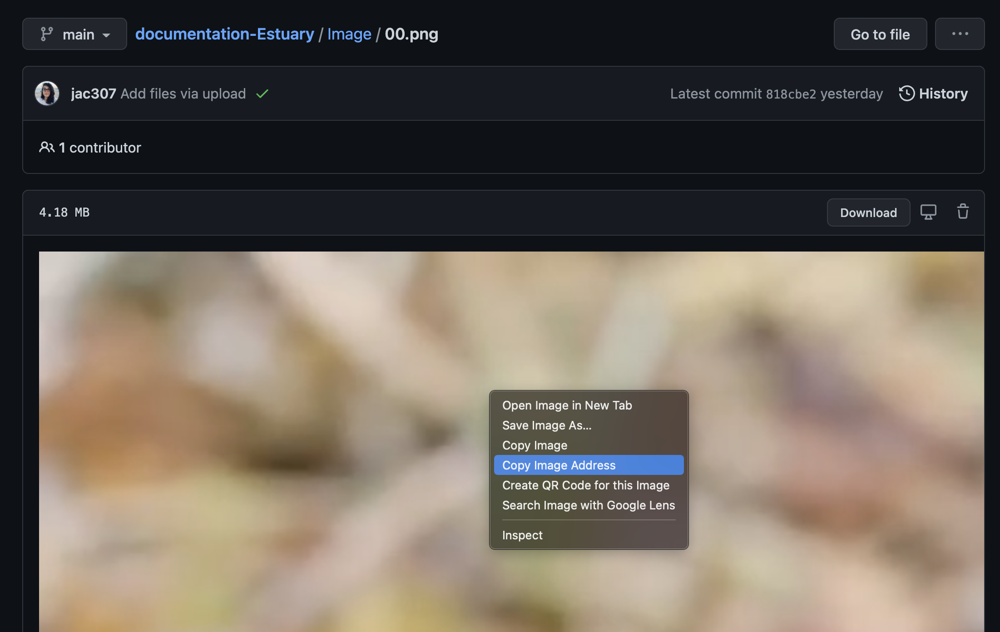  

+ As a good practice, you can copy the url links on your README file, so they're always accesible.  

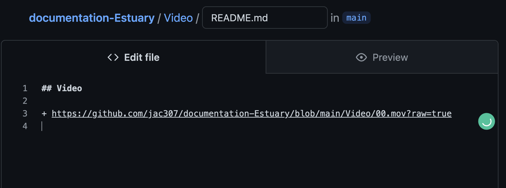   

In this example, I copied/pasted the links in both, the Image and Video README files.  

   

+ En Estuary, you can use these links on CineCer0.  

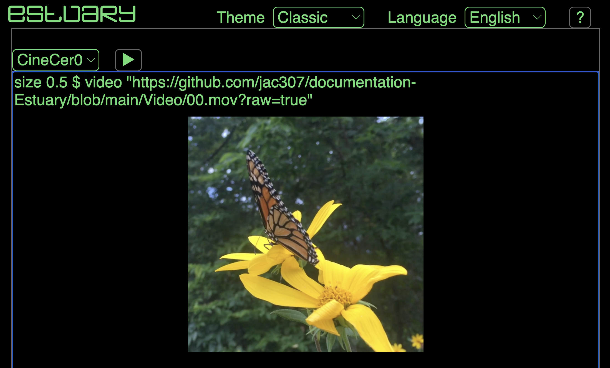  
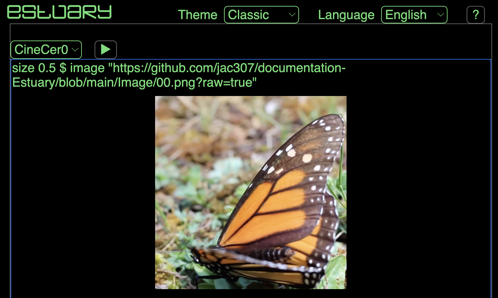  

You can follow these steps to use GIFs. Get the link the same as images, then use it with `image "url"` function in CineCer0 to play them.   

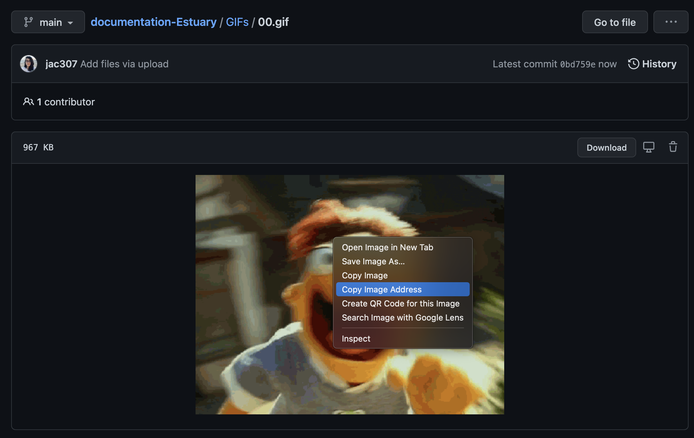  
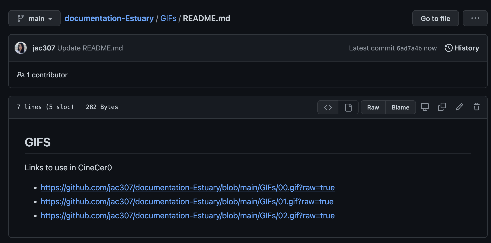  
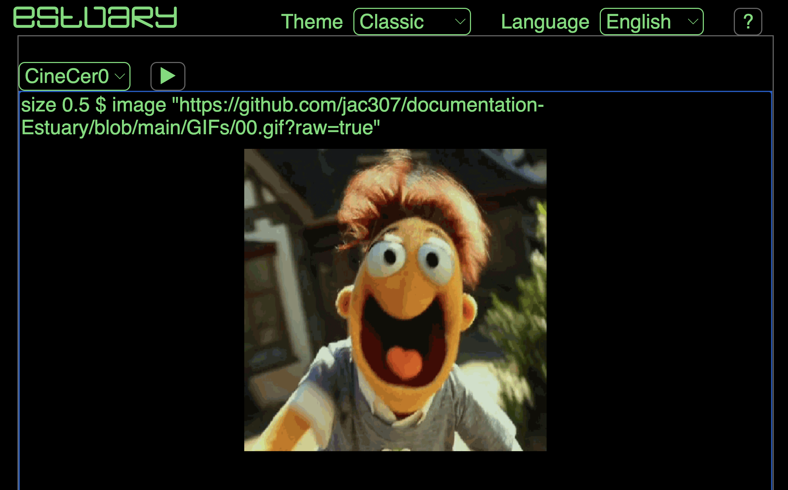  
