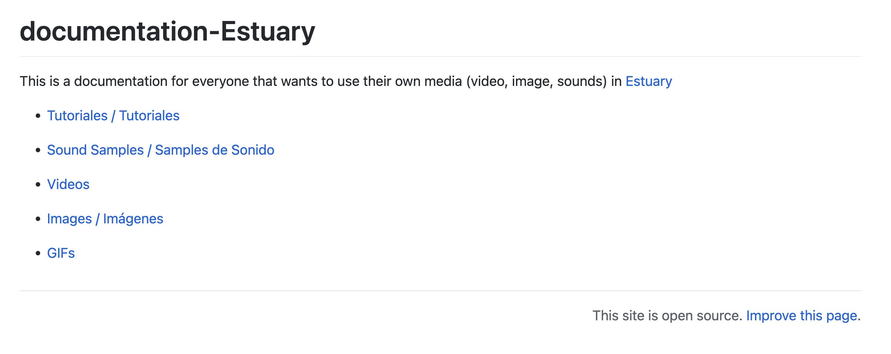
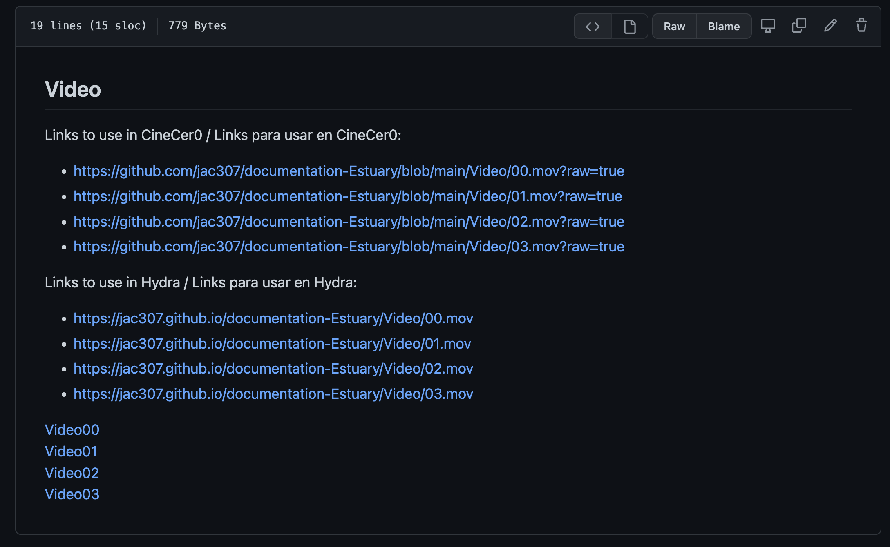

[Tutorials](../Tutorials/README.md) | [Home](../README.md)    

-------------------------------------------------------------------------------  

## Using/Playing Media (video,image) on Hydra

*This info also works for media in Punctual*  

In Hydra, if you use the URL from Media that is just hosted in a GitHub repo, you will get the following error:    

  

To solve this, we have to use the GitHub Page settings to publish our media and then get a usable URL for Hydra. If you have not made your repo a GitHub Page, please follow [GitHub: Setup](GitHub-setup.md) tutorial first.      

+ Go to the repo/folder where you have your videos or images.  
+ Edit the README file in that folder, adding a direct link to each video or image using the following sintax: `[text](GitHub-location)`. Commit your changes.  
+ Check that the links work.

  

+ Go to Settings, then Pages, then click on the URL.  
In this example, I have created direct links on my main README so I can access the Video and Image sections.    

  

+ Right Click on your video or image, then click on "Copy link address".  

  

+ As a good practice, you can copy the url links on your README file, so they're always accesible.  
In this example, I copied/pasted the links in both, the Image and Video README files.  

  

+ En Estuary, you can use these links on Hydra.  

  
  
