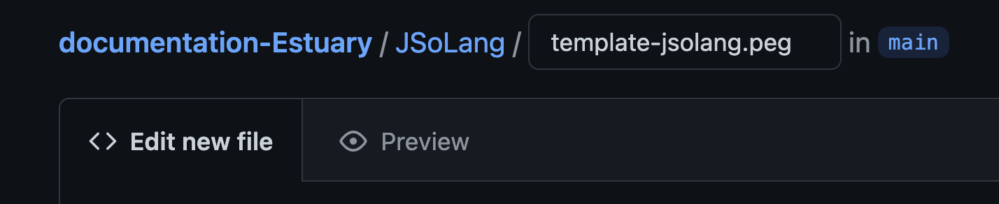
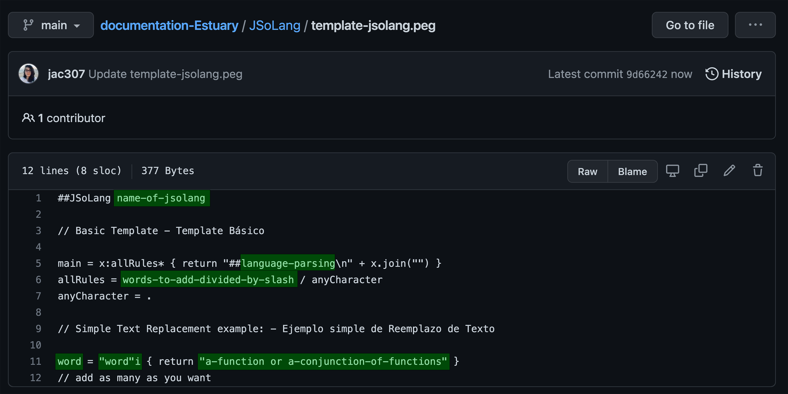

[Tutorials](../Tutorials/README.md) | [Home](../README.md)    

-------------------------------------------------------------------------------  

## JSoLangs: Simple Text Replacement

<a href="#temp">Template</a>  
<a href="#ex1">Example</a>  
<a href="#ex2">Example</a>  
<a href="#ex3">Example</a>    

-------------------------------------------------------------------------------  

<h3 id="temp">Template</h3>  

JSoLangs is an application in <a href="https://estuary.mcmaster.ca/" target="_blank">Estuary</a> to parse available live coding language to create new ones.    

For this tutorial, I have created this [folder](../../JSoLang/README.md) to host a simple text replacement template as well as some examples.    

JSoLangs can be written directly on Estuary but it is always better to write and save your JSoLang locally or in any other platform. For my project, I am using GitHub.

+ Create a `name.peg` file.  

  
  

+ Write and save your JSoLang.  
For this project, I have this [template](../../JSoLang/template-jsolang.peg).

  + `name-of-jsolang` = Name your JsoLang.  
  + `language-parsing` = Write the name of one of the lc languages in Estuary.   
  + `a-function or a-conjunction-of-functions` = Write the function(s) you want to translate.  
  + `word` = Write the word you want to use to replace the above.  
  + `"word"i` = Write the word again inside quotation marks.  
       + erase the i so it is case sensitive.  
  + `words-to-add-divided-by-slash` = Write all the words you used divided by "/".  

  

+ Go to: / Ve a: <a href="https://estuary.mcmaster.ca/" target="_blank">Estuary</a>
+ Copy/Paste your JSoLang in one editor-box. Evaluate and check for sintax errors.  
+ In a different editor-box write: `##name-of-jsolang`.    
+ You can now use this second box to write with your new sintax.    

    

_________________________________________________________________________________________
_________________________________________________________________________________________

<h3 id="ex1">Example 1</h3>  

### Text Replacement with MiniTidal

[This](../../JSoLang/drSeuss.peg) is the JSoLang I wrote with the name `drSeuss`, where you can run the following sintax:   

  `I donT like "green" eggs 0.9 and ham 1.0`.   

which translate in MiniTidal as:   

  `slow 3.2 $ s "alphabet:4 alphabet:6 alphabet:6 alphabet:18" # gain 0.9 # up 1.0`   

I have seven statements, translating:   

+ `like = "like"i { return "s" }` = single function.    

+ `eggs = "eggs"i { return " # gain" }` and `ham = "ham"i { return "# up" }` = operator # + function.  

+ `green = "green"i { return "alphabet:4 alphabet:6 alphabet:6 alphabet:18" }` = a sound pattern.

+ `I = "I"i { return "slow 3.2 $" }` = function + parameter + operator $ .  

+ `and = "and"i { return "" }` and `donT = "donT"i { return "" }` = empty statement.  

My new sintax must respect the rules of the pre-existing live coding language.  

  

_________________________________________________________________________________________
_________________________________________________________________________________________

<h3 id="ex2">Example 2</h3>  

### Text Replacement with CineCer0

[This](../../JSoLang/humptyDumpty.peg) is the JSoLang I wrote with the name `humptyDumpty`, where you can run the following sintax:    

  `first Humpty dumpty sat on a wall; then Humpty Dumpty had a fall;`.   

which translate in CineCer0 as:  

  `setPosY (-0.2) $ setSize 0.5 $ setOpacity (range 0 1 $ sin 0.5) $ image "specific-url-01";`
  `setPosY (-0.2) $ setSize 0.5 $ setOpacity (range 1 0 $ sin 0.5) $ imagespecific-url-02;"`   

I have ten statements, translating:    

+ `a = "a"i { return "image" }` = single funcion:    

+ `sat = "sat"i { return "$" }` = operator $ .    

+ `humpty = "humpty"i { return "setSize 0.5" }` = function + parameter.  

+ `first = "first"i { return "setPosY (-0.2) $" }` = function + parameter + symbol $ .
The same translation applies to `then = "then"i { return "setPosY (-0.2) $" }`, so I have two options.

+ `dumpty = "dumpty" { return "$ setOpacity (range 0 1 $ sin 0.5)" }` and `Dumpty = "Dumpty" { return "$ setOpacity (range 1 0 $ sin 0.5)" }` = symbol $ + function + dynamic-parameter.  
In this case, I erased `i` so it is case sensitive and I can write `dumpty` or `Dumpty` and have two different functions.     

+ `on = "on"i { return "" }` = empty statement.  

+ `wall = "wall"i { return "\"url1\"" }` and `wall = "wall"i { return "\"url2\"" }` = url inside quotation marks.  

My new sintax must respect the rules of the pre-existing live coding language.   

  

_________________________________________________________________________________________
_________________________________________________________________________________________

<h3 id="ex3">Example 3</h3>  

### Text Replacement with Hydra

[This](../../JSoLang/peterPeter.peg) is the JSoLang I wrote with the name `peterPeter`, where you can run the following sintax:    

  `Peter.peter(punkinEater;`  
  `is(Peter).Punkin.eating`   

which translate in Hydra as:  

  `s0.initVideo("specific-url");`  
  `src(s0).modulate(o0).out()`      

I have seven statements, translating:    

In this case, I erased all `i` so it is case sensitive.   

+ `Peter = "Peter" { return "s0" }`, `peter = "peter" { return "initVideo" }`, and `is = "is" { return "src" }` = single function.  

+ `punkin = "punkin" { return "\"url\"" }` = url inside quotation marks.  

+ `Eater = "Eater" { return ")" }` = symbol ) .    

+ `eating = "eating" { return "out()" }` = function + symbols () .    

+ `Punkin = "Punkin" { return "modulate(o0)" }` = function + symbols (+ parameter +).    

My new sintax must respect the rules of the pre-existing live coding language.  

  
