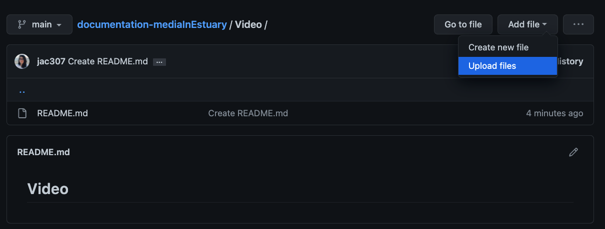
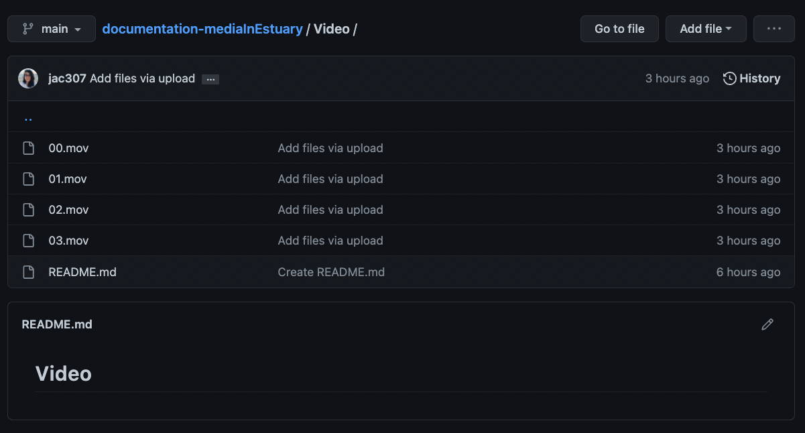

[Tutorials](../Tutorials/README.md) | [Home](../../README.md)    

-------------------------------------------------------------------------------  

## Adding media files to GitHub

There are many ways to add/create files in GitHub. This tutorial will go through the steps to create folders for each Media type and uploading files in those folders.  

+ On your repository, main section: click on "Add file", then "Create new file".  

  

+ Write the name of your folder first. In this case "Video".  

  

+ Write: "/" , the folder will be created / Escribe: "/".  

  

+ Write "README.md" to create a text file. On the lower text-area, write "##" followed by your title.

5. You can add more information if you desire. To do this, please use the [Markdown sintaxis](https://www.markdownguide.org/basic-syntax/).  

  

+ Go to the end and click on "Commit new file".  

  

Now you can see your new folder and file.  
If you want to make changes to your text file, click on the pencil icon.  

  

+ On your Video folder: click on "Add file", then "Upload files".  

  

+ Click on "Choose your files". Then select/open them.  

   
   

+ Wait until they're ready, then Commit changes. Wait until the files are processed.   

  
  

+ Check that your files are on the folder.  

  

__________________________________________________________   
__________________________________________________________   

You can also upload new files by Dragguing and Dropping. In the following steps, I created a Sound folder.   

+ On your Sound folder: click on "Add file", then "Upload files".   
+ Select, drag, and drop.  
In this example, I am selected three folders (150, 151, 152) instead of single files. I am doing this so I also import the corresponding folders.

    

+ Wait until they're ready, then Commit changes. Wait until the files are processed.  
You can notice the name of my uploaded information: "/150/02.wav..." - The folder's name is 150, then inside there are the audio files.  

  

+ Check that your folder/files are there.   

  

__________________________________________________________   
__________________________________________________________   

I repeated this process openning an Image folder and uploading some files.

  

On the main repo, I can see those three folders now.  

  
