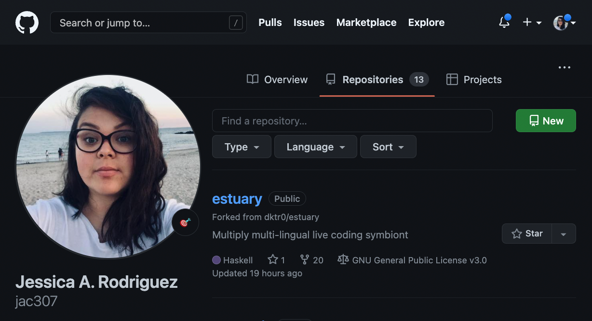
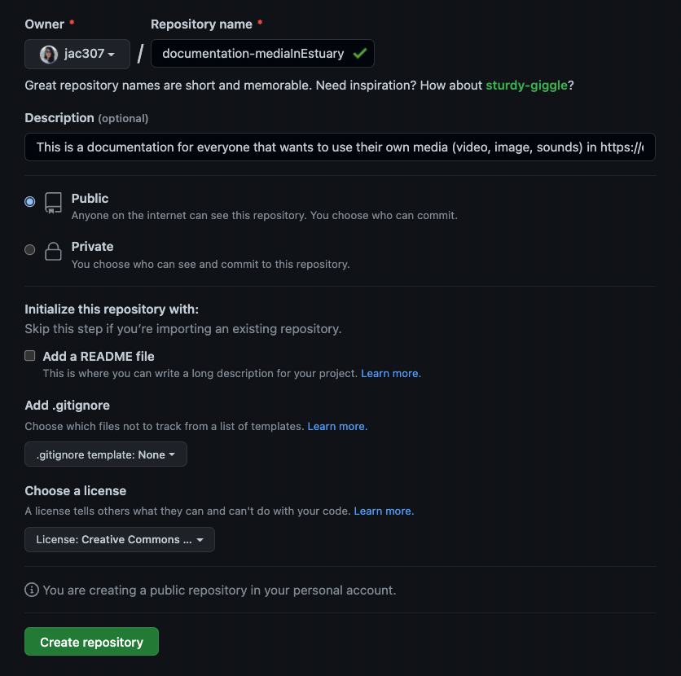
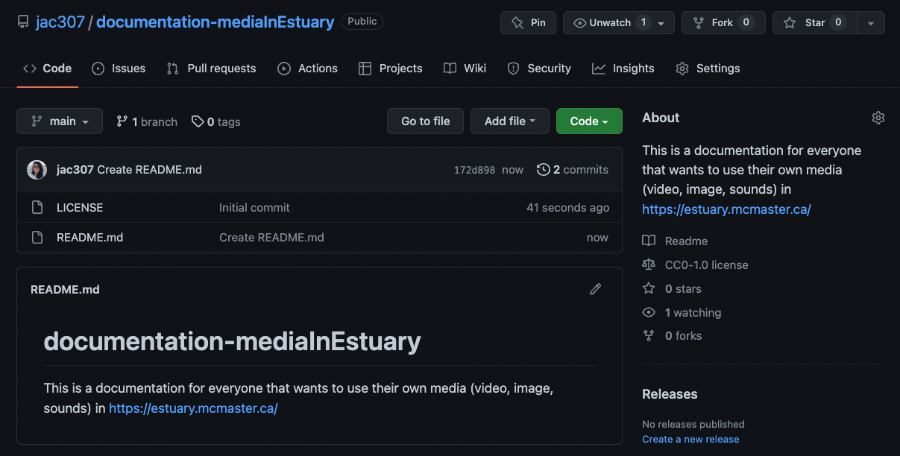
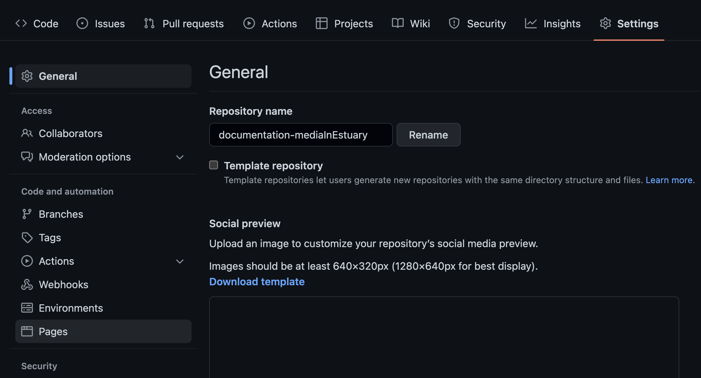
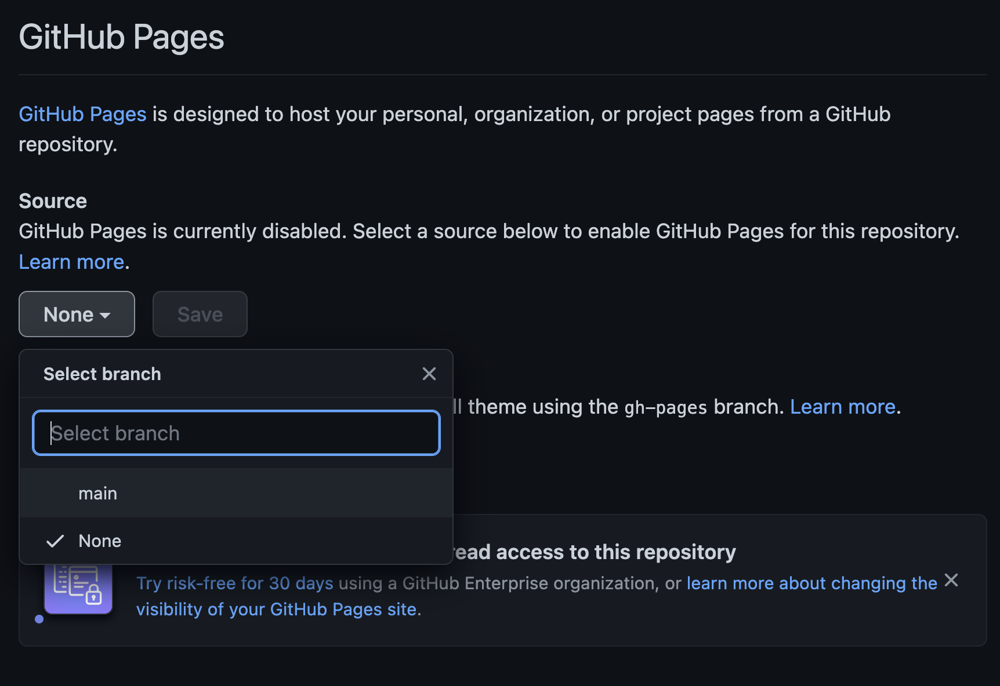
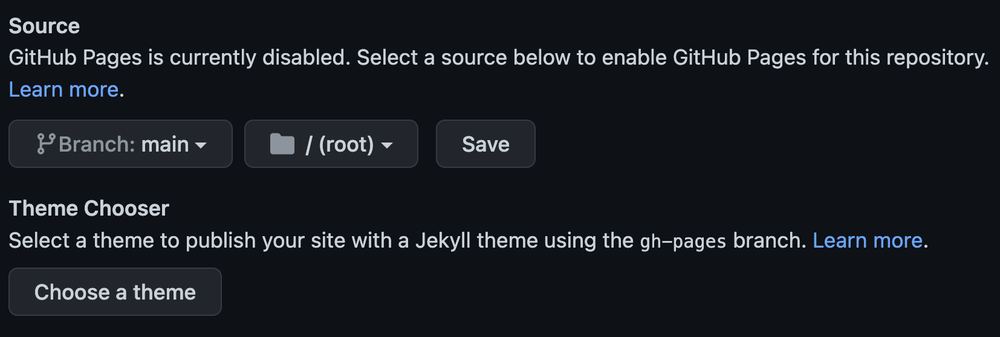
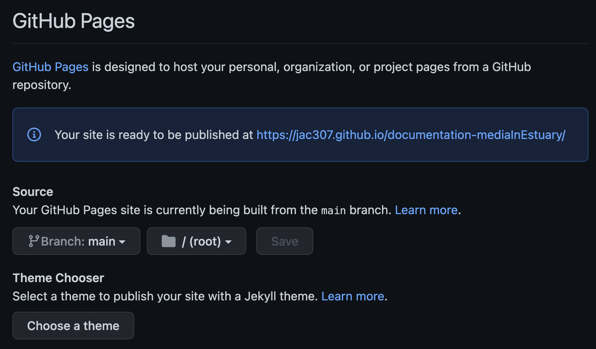
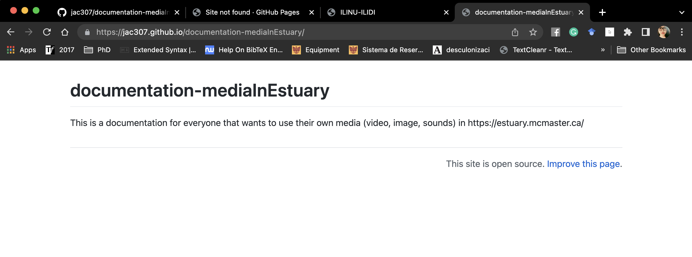

[Tutorials](README.md) | [Home](../../README.md)    

-------------------------------------------------------------------------------  

## GitHub Setup

+ Open/have an account on [GitHub](https://github.com/){:target="_blank"}.  
+ On your "Repositories", click on "New".   

  

+ Add information: name, description, add a README file, make the repo public. Then, press "Create repository".  

  

+ You can now see you repository.  

  

+ Go to "Settings", then on the left meny, choose "Pages".   

  

+ Open the dropdown menu where it says "None" and choose your main branch.  

  

+ Once selected, click on "save".  

  

+ The following message with the url of your site should appear.  

  

+ If you click on the url, the page should open.  
A "not-found" message may appear, so give it some time to the browser updates the info and re-fresh.  

  
