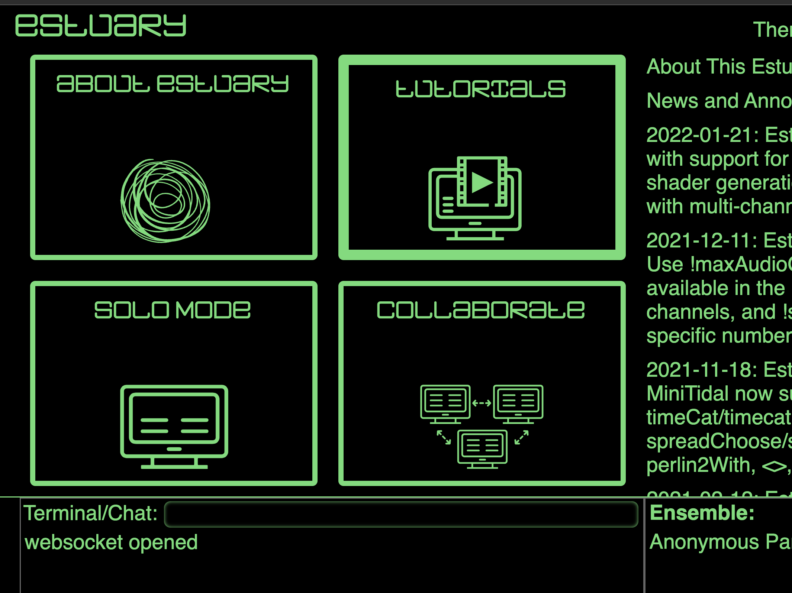
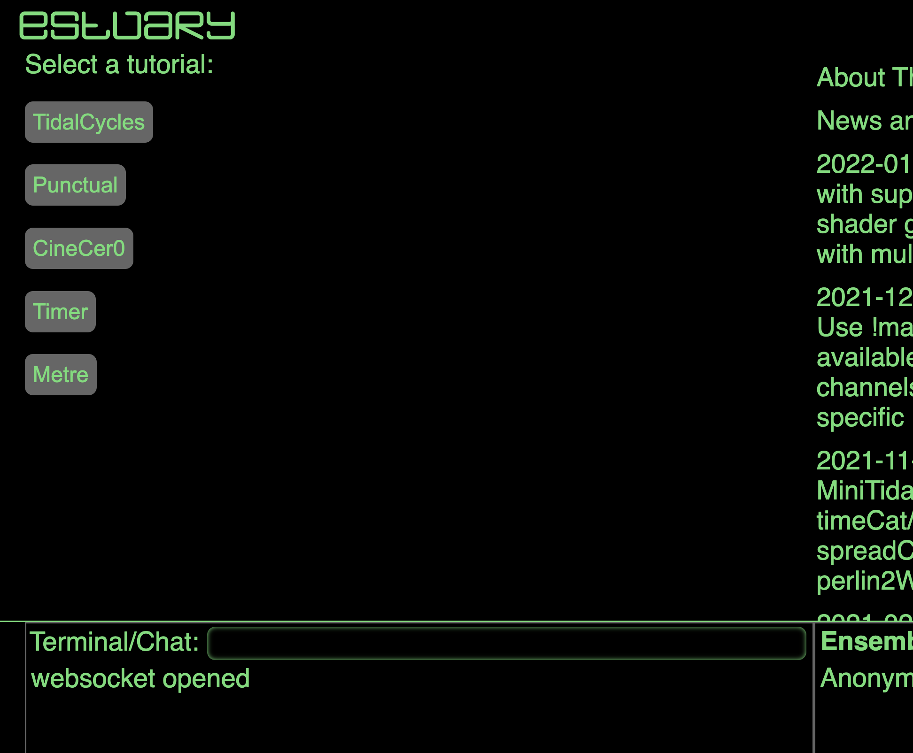
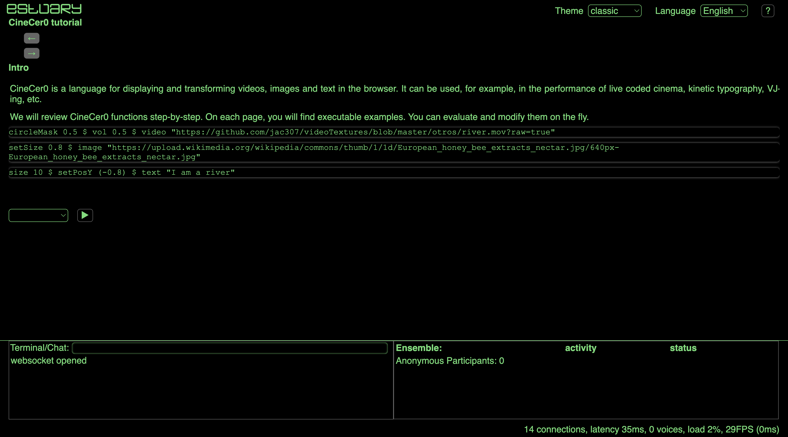

[Tutorials](../README.md) | [Tutorials on MiniTidal (TidalCycles), Hydra, & CineCer0](README.md)    

-------------------------------------------------------------------------------  

## CineCer0: Advance References

Just check the following references if you are interested in exploring more advance CineCer0 features.

_________________________________________________________________________________________
_________________________________________________________________________________________

### Complete Step-by-Step Tutorial on CineCer0

Estuary has a complete step-by-step / interactive tutorial on Cinecer0. To access this tutorial:

1. Open [https://estuary.mcmaster.ca/](https://estuary.mcmaster.ca/){:target="_blank"}
2. Select Tutorials.

3. Select CineCer0.

4. Follow the tutorial.

