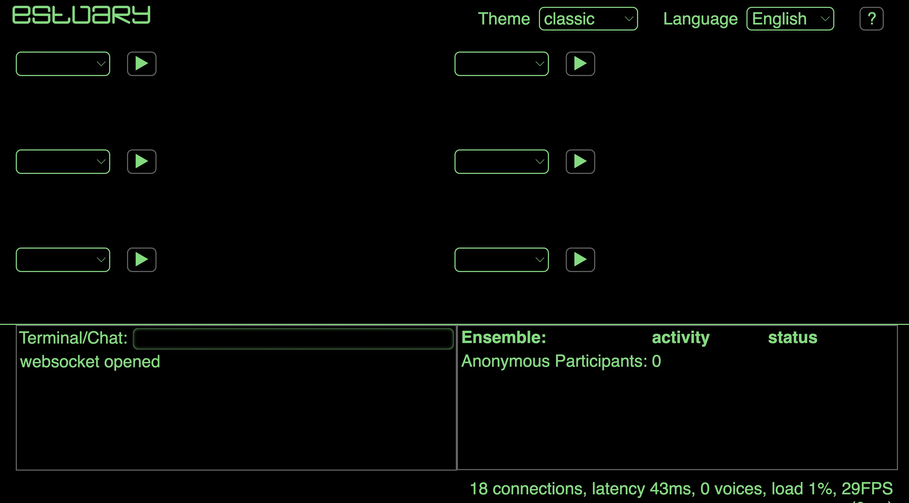
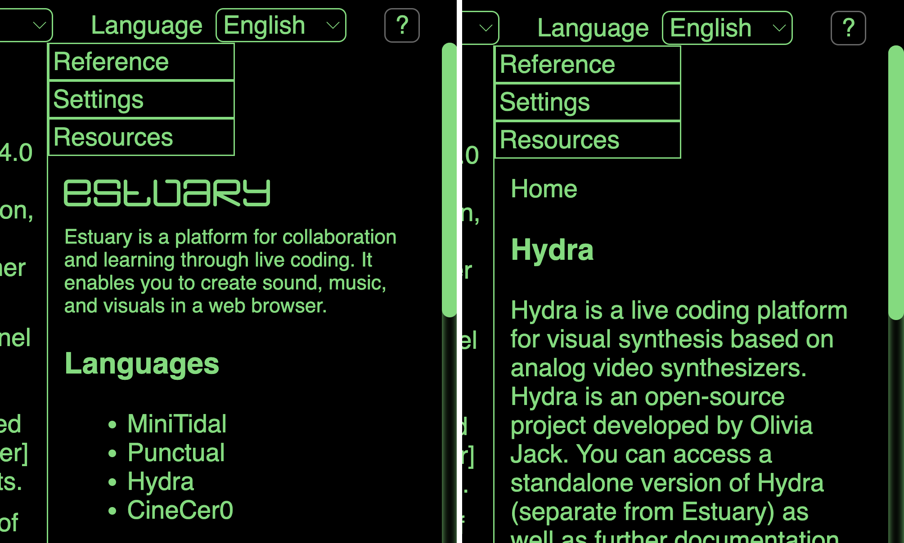

[Tutorials](../README.md) | [Tutorials on MiniTidal (TidalCycles), Hydra, & CineCer0](README.md)    

-------------------------------------------------------------------------------  

## CineCer0: Advance References

Just check the following references if you are interested in exploring more advance CineCer0 features.

_________________________________________________________________________________________
_________________________________________________________________________________________

### More information

In [https://estuary.mcmaster.ca/](https://estuary.mcmaster.ca/){:target="_blank"}:  

Click on the `?` Button located in the top-right corner.

A menu with information will appear. Click where it says CineCer0.

You can copy/paste the available examples and play around. You can also read the other provided information.

The Estuary Discord server - all welcome! Sign-up at the following link (note that it's recommended to make an account on discord.com first): [https://discord.gg/snvFzkPtFr](https://discord.gg/snvFzkPtFr){:target="_blank"}    

If you would like to know more information about some of the functions, you can look for them on the search tool at [https://hydra.ojack.xyz/](https://hydra.ojack.xyz/){:target="_blank"} (located on the top-right corner). See the bellow information if you do this.

_________________________________________________________________________________________
_________________________________________________________________________________________

### Hydra in Estuary Vs Hydra website

Hydra in Estuary is a slightly reduced version of its standalone website.  

+ You can check tutorials directly on the Hydra official webpage, such as this: [https://hydra.ojack.xyz/docs/docs/learning/](https://hydra.ojack.xyz/docs/docs/learning/){:target="_blank"}  

Estuary currently has partial access to Hydra functionality. The idioms below are unavailable:

+ Anonymous (global) functions. For example, `() => mouse.x` and `({time}) => time%360`.
+ Audio functions. For example, `a.show()` and `()=>a.fft[1]`

_________________________________________________________________________________________
_________________________________________________________________________________________

### Import Video, Image, Camera, and Screen feedback

You can import and transform any of the above external sources. To do this, follow this tutorial:

+ [https://hydra.ojack.xyz/docs/docs/learning/video-synth-basics/external-sources/](https://hydra.ojack.xyz/docs/docs/learning/video-synth-basics/external-sources/){:target="_blank"}

If you would like to use your own videos and images, follow these tutorials:

+ [GitHub: Setup](../GitHub-setup.md){:target="_blank"}

+ [GitHub: Adding Media Files](../GitHub-addingFiles.md){:target="_blank"}

+ [Using/Playing Media (video,image) on Hydra](../Estuary-MediaInHydra.md){:target="_blank"}
