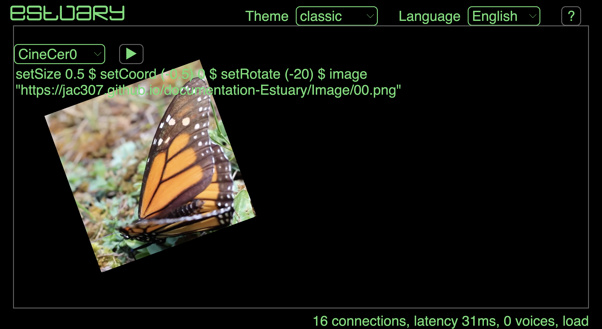

[Tutorials](../README.md) | [Tutorials on MiniTidal (TidalCycles), Hydra, & CineCer0](README.md)    

-------------------------------------------------------------------------------  

## CineCer0: Advance References

Just check the following references if you are interested in exploring more advance CineCer0 features.

_________________________________________________________________________________________
_________________________________________________________________________________________

### More information

In [https://estuary.mcmaster.ca/](https://estuary.mcmaster.ca/){:target="_blank"}:  

Click on the `?` Button located in the top-right corner.

<!--  -->

A menu with information will appear. Click where it says CineCer0.

You can copy/paste the available examples and play around. You can also read the other provided information.

<!--  -->

The Estuary Discord server - all welcome! Sign-up at the following link (note that it's recommended to make an account on discord.com first): [https://discord.gg/snvFzkPtFr](https://discord.gg/snvFzkPtFr){:target="_blank"}    

If you would like to know more information about some of the functions, you can look for them on the search tool at [https://hydra.ojack.xyz/](https://hydra.ojack.xyz/){:target="_blank"} (located on the top-right corner). See the bellow information if you do this.

_________________________________________________________________________________________
_________________________________________________________________________________________

### Complete Step-by-Step Tutorial on CineCer0

Estuary has a complete step-by-step / interactive tutorial on Cinecer0. To access this tutorial:

1. Open [https://estuary.mcmaster.ca/](https://estuary.mcmaster.ca/){:target="_blank"}
2. Select Tutorials.
3. Select CineCer0.
4. Follow the tutorial.

<!--  -->
