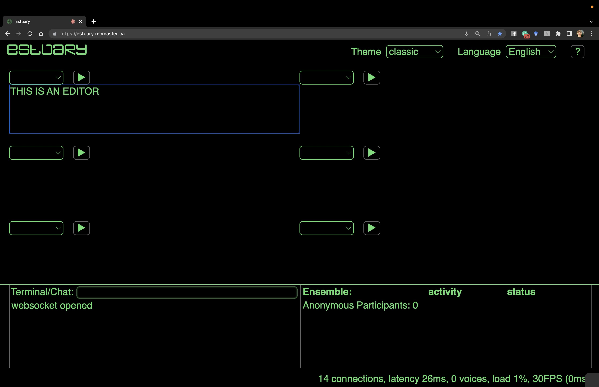

[Tutorials](../README.md) | [Tutorials on MiniTidal (TidalCycles), Hydra, & CineCer0](README.md)    

-------------------------------------------------------------------------------  

## CineCer0: Intro

### First Steps

CineCer0 is a live coding language that allows live interactions with video, image, and text. CineCer0 is implemented in [https://estuary.mcmaster.ca/](https://estuary.mcmaster.ca/){:target="_blank"} and was developed by [Prof. David Ogborn](https://experts.mcmaster.ca/display/ogbornd){:target="_blank"} and the research team of this platform.  

How to use it:  

Go to [https://estuary.mcmaster.ca/](https://estuary.mcmaster.ca/){:target="_blank"}  
Select SOLO MODE.  

You will find a working space that, by default, has 6 code editors. Each code editor has a empty dropdown menu on the top-left. Estuary allows you to work with different programming languages to create visuals and/or sound. You can choose the programming language you want by opening the dropdown menu.

Choose CineCer0 on the dropdown menu of one of the code editors.

### Text Function

Write the following and press play (shift+return/enter or click on the play button)

+ `text "This is my intro text"` = this line will visualize the text inside quotation marks. The text will appear in the middle of the screen.

IMPORTANT: Be careful with the quotation marks you use. They must be this type `""`, not this type “” (they generate a syntax error). If you copy/paste code from this tutorial, make sure that it has the correct type since text-editing software often changes the style.

Change the text inside the quotations marks, playing around with the text you can visualize.

Delete text by erasing everything and pressing the play button.

### Image Function

Copy/Paste the following and press play (shift+return/enter or click on the play button)

+ `image "https://jac307.github.io/documentation-Estuary/Image/00.png"` = this line will visualize the image (represented by the URL) inside quotation marks. This image will appear at the center, fitting the height of the screen.

Slightly change the URL of the above image. Change only the last number => Instead of `/00.png`, write `/01.png`, `/02.png`, or `/03.png`. See how the image changes.

Delete image by erasing everything and pressing the play button.

### Video Function

Copy/Paste the following and press play (shift+return/enter or click on the play button)

+ `video "https://jac307.github.io/videoTextures/mariposa/01.mov"` = this line will visualize the video (represented by the URL) inside quotation marks. This video will appear at the center, fitting the height of the screen.

Slightly change the URL of the above video, changing only the last number => Instead of `/01.mov`, write `/02.mov`, `/03.mov`, so on; you can choose any number from `01` to `80`. See how the video changes.

Delete video by erasing everything and pressing the play button.

_________________________________________________________________________________________
_________________________________________________________________________________________

### URL for Videos and Images

The URL for videos and images must point directly to a file that the web browser can play or that is openly published in a website (URLs from streaming services and social media won't work).  

Files you can use: .mov, .mp4, .jpeg, .png, .svg, .gif.  

If you would like to use your own files, please check the following tutorials in order:

+ [GitHub: Setup](../GitHub-setup){:target="_blank"}
+ [GitHub: Adding Media Files](../GitHub-addingFiles){:target="_blank"}
+ [Estuary: Using Media in CineCer0](../Estuary-MediaInCineCer0){:target="_blank"}
