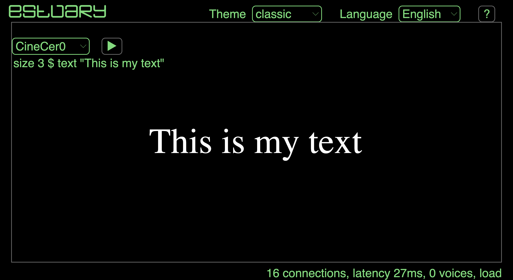
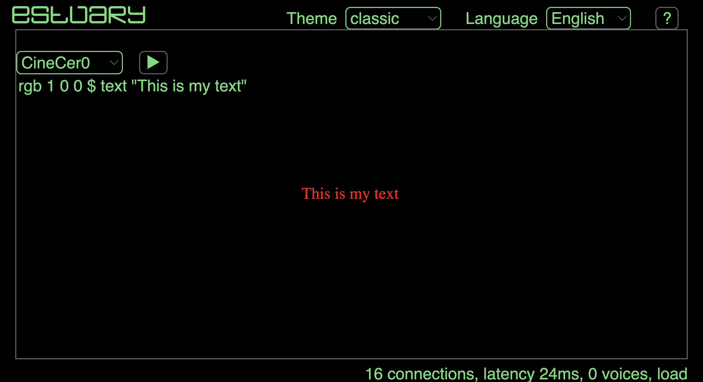
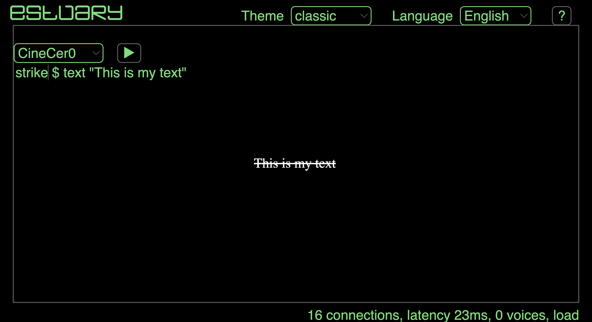
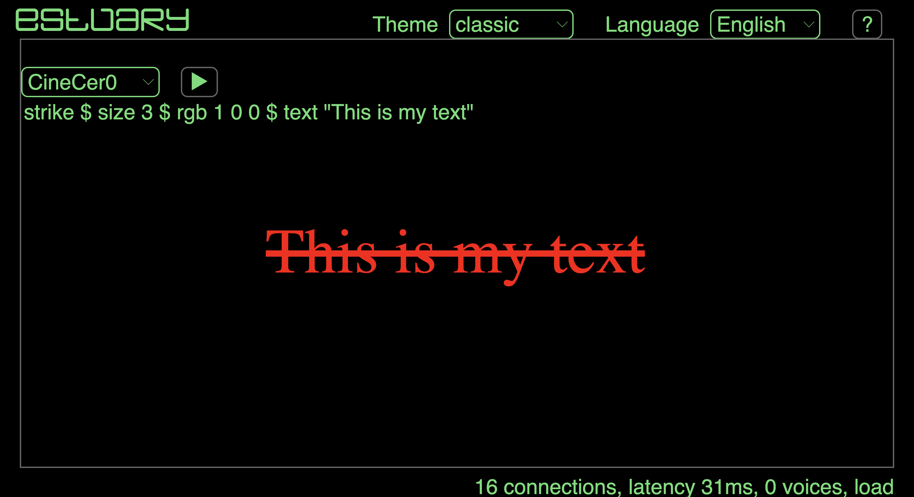
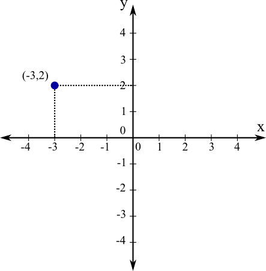

[Tutorials](../README.md) | [Tutorials in MiniTidal (TidalCycles), Hydra, & CineCer0](README.md)    

-------------------------------------------------------------------------------  

## CineCer0: Transforming Text, Image, or Video

These functions should be added in any order before `text`, `image`, or `video`. All transformers are applied to each other using `$`:

+ `transformer` + `$` + `text ""`
+ `transformer` + `$` + `image ""`
+ `transformer` + `$` + `video ""`

Example:

+ `setSize 0.5 $ video "https://jac307.github.io/videoTextures/mariposa/01.mov"` // This runs a video half the size the width keeping its natural aspect ratio (proportions).

More transformers can be added, always linked (applied) by using `$`.

+ `setCoord 0.5 0 $ setSize 0.5 $ video "https://jac307.github.io/videoTextures/mariposa/01.mov"` // This changes the position of the video.

_________________________________________________________________________________________
_________________________________________________________________________________________

### Transforming Text

Syntax: `size n $`

+ `size 3 $ text "This is my text"` // The text will be three times its default size.
+ `size 0.5 $ text "This is my text"` // The text will be half the size its default size.

This transformer modifies the size of the text proportionally and in increments.

Syntax: `rgb r g b $`

+ `rgb 0 0 1 $ text "This is my text"` // The text will be blue
+ `rgb 1 0 0 $ text "This is my text"` // The text will be red
+ `rgb 0 1 0 $ text "This is my text"` // The text will be green

This transformer modifies the values of red, green, and blue which are normalized from 0 (no colour) to 1 (full colour).

Syntax: `strike $`

+ `strike $ text "This is my text"`

This transformer strikes the text; it doesn't need a parameter/value.  

You can apply all of the above functions together using the following example:

+ `strike $ size 3 $ rgb 1 0 0 $ text "This is my text"`

####  List of Transformers for Text

+ `setPosX x $` -- from left (-1) to right 1
+ `setPosY y $` -- from bottom (-1) to top 1
+ `setCoord x y $`
+ `size n $` -- 1++ bigger font size
+ `font "fontType" $` -- change font
+ `colour "colour" $` -- change colour, value = hexacolor
+ `rgb r g b $` -- change colour, values = red green blue, normalized from 0 to 1
+ `rgba r g b a $` -- with fourth value = alpha
+ `hsl h s l $` -- change colour, values = hue saturation lightness, normalized from 0 to 1
+ `hsla h s l a $` -- with fourth value = alpha
+ `strike $` -- crossed text
+ `bold $` -- bold text
+ `italic $` -- italic text
+ `z n $` -- change in the order of the layer

_________________________________________________________________________________________
_________________________________________________________________________________________

### Transforming Image and Text

Syntax: `setSize n $`

+ `setSize 3 $ video "https://jac307.github.io/videoTextures/mariposa/01.mov"` // The video will be three times its default size.
+ `setSize 0.5 $ image "https://jac307.github.io/documentation-Estuary/Image/00.png"` // The image will be half the size its default size.

This transformer modifies the size of the image/video proportionally and in increments.

Syntax: `setCoord x y $`

+ `setCoord 0 0.5 $ video "https://jac307.github.io/videoTextures/mariposa/01.mov"` // The video will be positioned slightly to the right.
+ `setCoord (-0.5) 0 $ image "https://jac307.github.io/documentation-Estuary/Image/00.png"` // The image will positioned slightly to the left

This transformer modifies the position following the coordinates; `0 0` = centre of the screen. The anchor point is at the centre of the image/video. Negative numbers must be inside parentheses `()`.

Syntax: `setRotate 100 $`

+ `setRotate 100 $ video "https://jac307.github.io/videoTextures/mariposa/01.mov"` // The video is drastically rotated to the right
+ `setRotate (-20) $ image "https://jac307.github.io/documentation-Estuary/Image/00.png"` // The image is slightly rotated to the left

The values of `setRotate` are in degrees.

You can apply all of the above functions together using the following examples:

+ `setSize 3 $ setCoord 0 0.5 $ setRotate 100 $ video "https://jac307.github.io/videoTextures/mariposa/01.mov"`
+ `setSize 0.5 $ setCoord (-0.5) 0 $ setRotate (-20) $ image "https://jac307.github.io/documentation-Estuary/Image/00.png"`

####  List of Transformers for Image and Text

+ `setPosX x $` -- from left (-1) to right 1
+ `setPosY y $` -- from bottom (-1) to top 1
+ `setCoord x y $` -- set both positions
+ `vol 0.5 $` -- no vol 0 to max vol 1; only for video
+ `setWidth w $` -- 1 = natural width
+ `setHeight h $` -- 1 = natural height
+ `setSize wh $` --one value will affect proportionally the width and height
+ `setRotate d $` --value in grades
+ `setOpacity o $` -- from 0 to 1 (no opacity)
+ `setBlur bl $` -- 0 = no blur (1++ = more)
+ `setBrightness br $` -- 0-0.9 = less, 1++ = more
+ `setContrast c $` -- 0-0.9 = less, 1++ = more
+ `setGrayscale g $` -- 0 = color, 1 = to grayscale
+ `setSaturate s $` -- 1 = natural saturation (1++ = more, 1-- = less)
+ `circleMask m $` -- 0 no mask, 0-0.99 bigger mask (growing from the centre)
+ `circleMask' m x y $` -- similar to circleMask but with a third value that affects the position of the mask in the centre
+ `sqrMask m $` -- 0 no mask, 0-0.99 bigger mask ((growing from the centre)
+ `rectMask t r b l $` -- four values: top, right, bottom, left.
+ `z n $` -- change in the order of the layer

--
