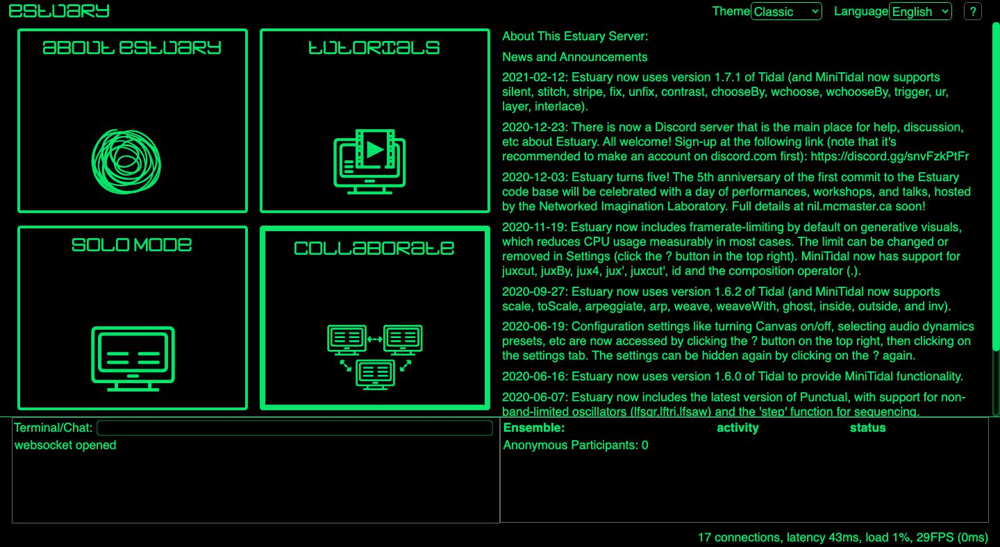

[Tutoriales](../README.md) | [Tutoriales en MiniTidal (TidalCycles), Hydra, y CineCer0](README.md)    

-------------------------------------------------------------------------------  

## Hydra: Intro

Hydra is a live coding platform for visual synthesis based on visual analog synthesizers. Hydra is an open-source project developed by [Olivia Jack](https://ojack.github.io/){:target="_blank"}.  

Hydra in Estuary is a reduced version of Hydra stand-alone.  

### First step

Go to [https://estuary.mcmaster.ca/](https://estuary.mcmaster.ca/){:target="_blank"}  
Select SOLO MODE.  

You will find a workspace with 6 code editors. Each editor has an empty dropdown menu at the top left. Estuary allows you to work with different languages ​​for live coding. You can choose the programming language you want to operate in this menu.

Select Hydra in one of the code editors using the dropdown menu.

Type the following and press the play button (you can also press shift+return/enter to play).

+ `osc().out()` = esta línea reproducirá un oscilador en escala de grises. Oscillator is a "device for generating oscillatory electric currents or voltages by nonmechanical means".

IMPORTANT: be careful with the quotes you use. These have to be of type `""`, not “” (the latter will generate a syntax error). If you copy and paste the lines of code from this tutorial code from this tutorial, check that they have the correct quotes as they can sometimes be changed.

Change this line `osc().out()` using other available sources:  

+ `voronoi().out()`
+ `noise().out()`

_________________________________________________________________________________________
_________________________________________________________________________________________

### Sources

One of the simplest structures of hydra is the following:

+ `source` + `.` + `output`

Sources are the starting objects/visualizations that you can generate in Hydra:

+ `osc()`
+ `voronoi()`
+ `shape()`
+ `noise()`
+ `solid()`

`out()` is the function to set the output.

Example:

+ `solid()` + `.` + `out()`

#### Source: `solid(r,g,b)`

`solid().out` generates a solid with default parameters: (0,0,0,1) = black.

In a digital environment, color composition can be done through different models.

The parameters to create solids in Hydra use the RGB model that takes the primary colors (red, green, blue), modifying the intensity through these three channels from 0 (no colour) to 1 (full colour). The fourth channel: RGBA = "alpha", which modifies the opacity or transparency.

Examples:

+ `solid(1).out()` // red
+ `solid(0,1).out()` // green
+ `solid(0,0,1).out()` // blue
+ `solid(1,1,1).out()` // white
+ `solid(0.3,0,0.5).out()` // purple
+ `solid(0.5,0.5,0.9,0.5).out()` // colour solid with 50% opacity

The parameters can be integers (int), numbers with decimals (double), and lists []. The latter will result in a type of discrete modulation (jumping between parameters).

+ `solid([0.4,0.5,0.0,1.0],0,0).out()` // solid with modulation in the red channel.
+ `solid([0.4,0.5],[0.0, 0.5],[0.1, 0.2]).out()` // solid with modulations in all channels.

Play around with the parameters!

#### Source: `gradient(speed)`

`gradient().out()` generates a gradient with the default parameter: (0).

The value (speed) modifies the speed of change of the position of colors within the chromatic circle = varies the shades of the gradient.

Examples:

+ `gradient(1).out()` // Relatively slow rate of change
+ `gradient(40).out()` // Relatively fast rate of change
+ `gradient([1,2,0.5]).out()` // Modulation of the rate of change

Play around with the parameters!

#### Source: `osc(frecuency, syncronization, offset)`

`osc().out()` generates an oscillator with default parameters: (60,0.1,0).

Oscillators generate periodic signals (in this case color). Frequency modulation produces variations in visible oscillations (a type of gradient line effect): the higher the frequency, the more oscillations.

+ `osc(2).out()`
+ `osc(40).out()`
+ `osc(400).out()`

The second parameter (synchronization) corresponds to the speed of the oscillations.

+ `osc(40,0).out()` // no movement
+ `osc(40,0.3).out()` // numbers above 0 accelerate the visible frequencies

Examples:

+ `osc(40,0.1,0.5).out()` // Oscillator with the third parameter (offset = colour)
+ `osc(40,0.1,[2.0,0.5,1.0]).out()` // Offset channel modulation using lists
+ `osc([4,100],[0.1,0.5],[2.0,0.5,1.0]).out()` // Modulation of all parameters

Play around with the parameters!

#### Source: `noise(scale, speed)`

`noise().out()` generates a texture similar to Perlin Noise (or the visible static generated on televisions). Default parameters (10,0.1)

The first parameter (scale) modifies the size of the noise shapes generated. Low parameters = larger scale; high parameters = smaller scale.

+ `noise(2).out()`
+ `noise(100).out()`

Examples:

+ `noise(2,4).out()` // Noise with a higher speed parameter
+ `noise([5.5, 10, 20.7],2).out()` // Noise with modulation on the scale
+ `noise([5.5, 10, 20.7],[2,0,4]).out()` // Noise with modulation in both parameters

Play around with the parameters!

#### Source: `voronoi(scale, speed, blending)`

`voronoi().out()` generates a texture from the partition of space with geometric constructions, this is called Thiessen polygons (Voronoi diagram). Default parameters: (5,0.3,0.3).

The third parameter corresponds to the way the geometric constructions are combined. Positive values ​​generate a type of negative (black) space that deforms the polygons. Negative values ​​create a positive (white) space between them.

+ `voronoi(5,0.3,2).out()` // Voronoi with negative spaces between polygons
+ `voronoi(5,0.3,-2).out()` // Voronoi with positive spaces between polygons

Examples:

+ `voronoi(3).out()` // Voronoi on a high scale
+ `voronoi(30,40).out()` // Voronoi on a small scale with a fast speed
+ `voronoi(1,0.3,2).out()` // Voronoi with a larger scale between negative spaces
+ `voronoi(100,5,-1).out()` // Voronoi with a small scale between positive spaces at a medium speed
+ `voronoi([1,10,100],0.3).out()` // Voronoi with modulation on the scale
+ `voronoi([4,30,70,10],[0.1,3],[-1,1,-2]).out()` // Voronoi with modulation in all parameters

Play around with the parameters!

#### Source: `shape(sides, radius, smoothing)`

`shape().out()` generates a polygon. Default parameters: (3,0.3,0.01)

Ejemplos:

+ `shape(5).out()` // Pentagon
+ `shape(8,0.9).out()` // Octagon with a large size
+ `shape(4,0.5,0.1).out()` // Rectángulo con límites difuminados
+ `shape(3,[0.1,0.2,0.3,0.4]).out()` // Triangle with modulation in size
+ `shape([3,4,5],[0.1,0.5,0.2],[0.5,0.2]).out()` // Diferentes formas que están siendo moduladas en los tres parámetros

--
