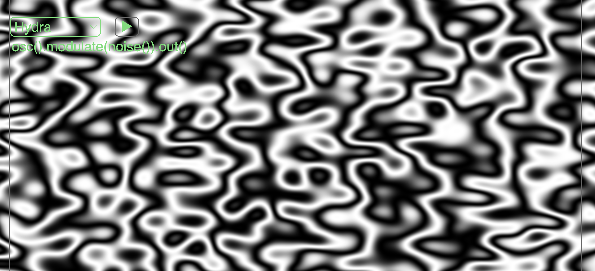
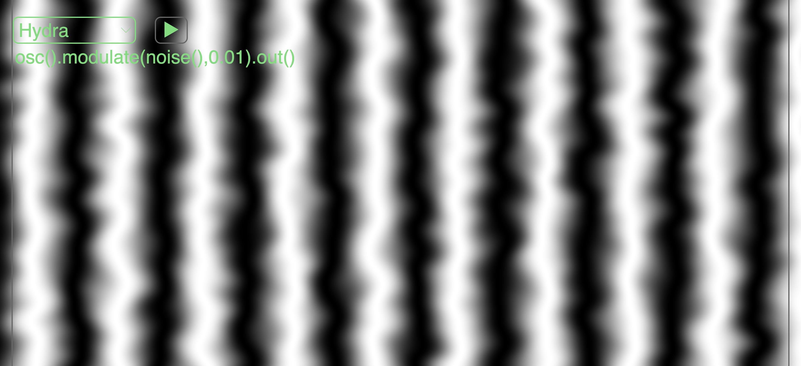
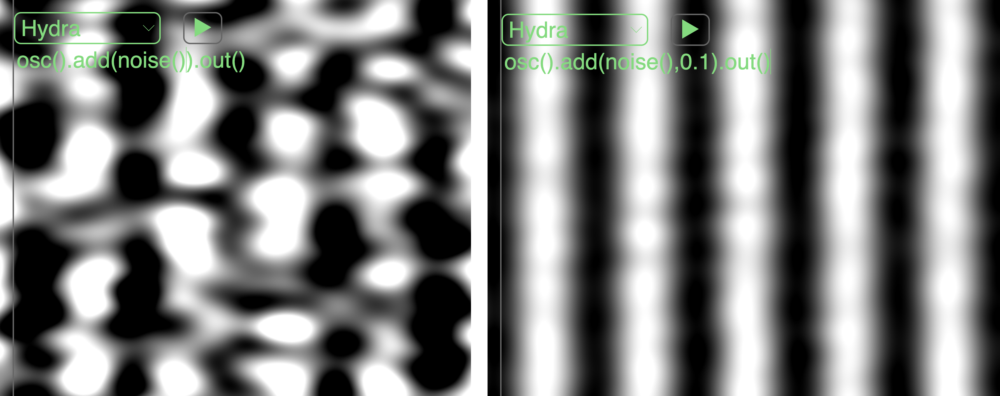

[Tutorials](../README.md) | [Tutorials in MiniTidal (TidalCycles), Hydra, & CineCer0](README.md)    

-------------------------------------------------------------------------------  

## Hydra: Modulators and Operators

Like Transformers, Modulators and Operators are functions that can be applied to sources to change them in different ways.

Modulators and operators should be applied between the source and the output, always linked (applied) by `.` (point).

+ `source` + `.` + `operator-or-modulator` + `.` + `output`

The difference is that modulators and operators will always need a source as their first parameter.

Let's analyze the following line:

+ `osc().modulate(noise()).out()`

In this line we are applying a basic modulator `.modulate(t,v)`. The first parameter `t` = texture = source => `osc()`, `solid()`, `gradient()`, `noise()`, `shape()`, `voronoi()`. This parameter `t` always has to be added, it cannot be left empty. In the example above we are using a `noise()` as a texture parameter, which causes the initial `osc()` to be distorted by source/texture.

The second parameter is a number that determines the amount by which this second source/texture is applied. The default parameter is 0.1. In this second example we are using a smaller number to reduce the effect of `noise()`.

+ `osc().modulate(noise(),0.01).out()`

Like modulators, operators also require a `t` parameter. Operators will blend two sources together using different juxtaposition methods. The parameter determines how much the second source is applied over the first.

+ `osc().add(noise()).out()`
+ `osc().add(noise(),0.1).out()`

_________________________________________________________________________________________
_________________________________________________________________________________________

### List of Transformers

#### Modulators

// t = texture = source => osc, solid, gradient, noise, shape, voronoi  

+ `.modulate(t, amount)` // amount’s default: 0.1
+ `.modulateHue(t, amount)` // default: 0.4
+ `.modulateKaleid(t, #Sides)` // default: 4.0
+ `.modulatePixelate(t, multiple, offset)` // defaults: 10.0, 3.0
+ `.modulateRepeat (t, repeatX, repeatY, offsetX, offsetY)` //defaults: 3.0, 3.0, 0.5, 0.5
+ `.modulateRepeatX (t, repeatX, offsetX)`
+ `.modulateRepeatY (t, repeatY, offsetY)`
+ `.modulateRotate(t, multiple, offset)` // defaults: 1.0, 0.0
+ `.modulateScale(t, multiple, offset)` // defaults: 1.0, 1.0
+ `.modulateScrollX(t, scrollX, speed)` // defaults: 0.5, 0.0
+ `.modulateScrollY(t, scrollY, speed)` // defaults: 0.5, 0.0

#### Operators

+ `.add(t, amount)` // default: 0.5
+ `.mult(t, amount)` // default: 0.5
+ `.blend(t, amount)` // default: 0.5
+ `.diff(t)`
+ `.layer(t)`
+ `.mask(t, reps, offset)` // defaults: 3.0, 0.5

--
