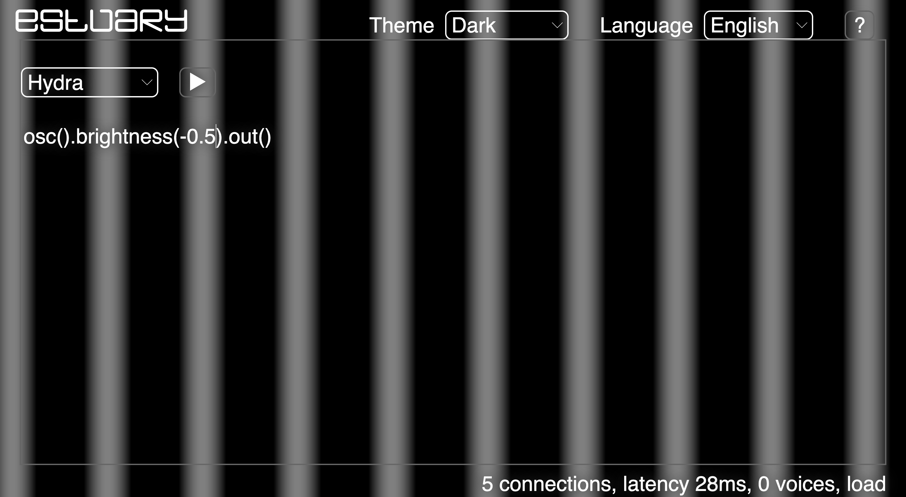
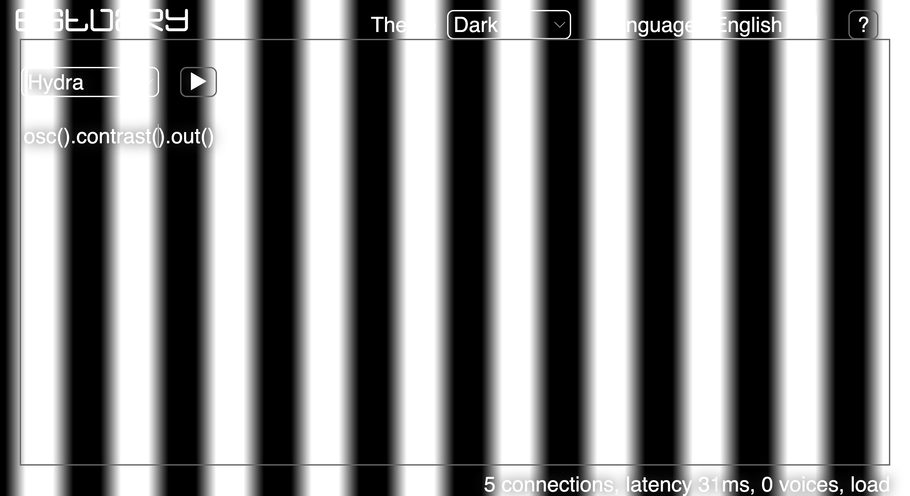
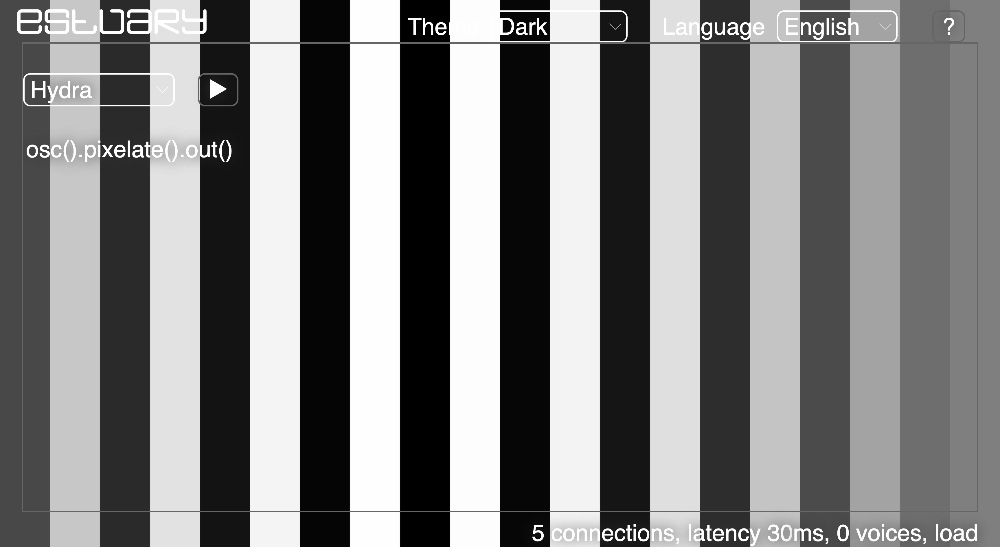
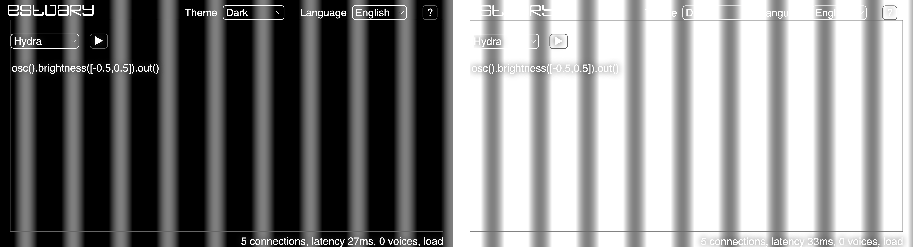
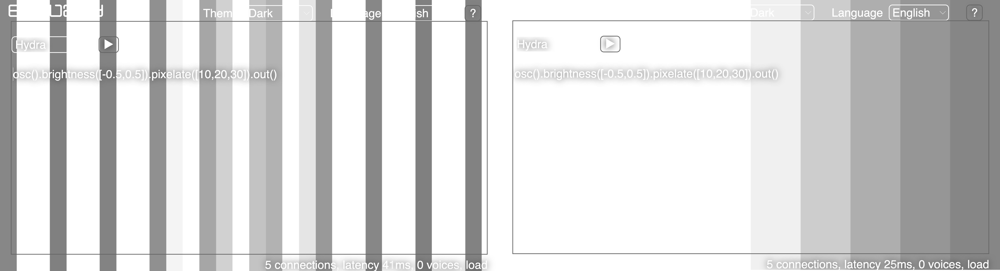

[Tutorials](../README.md) | [Tutorials in MiniTidal (TidalCycles), Hydra, & CineCer0](README.md)    

-------------------------------------------------------------------------------  

## Hydra: Transformers

Transformers are functions that can be applied to sources to change them in different ways.

Transformers should be added between the source and the output:

+ `source` + `.` + `transformer` + `.` + `output`

Example:

+ `osc().brightness().out()` // This runs an oscillator with a change in brightness, all parameters used are the default ones.

Another way to write the same syntax is as follows:

`osc()
  .brightness()
.out()`

More transformers can be added, always linked (applied) by using `.` (point)

+ `osc().brightness().kaleid().out()` // This adds a Kaleidoscope effect with default parameters.

_________________________________________________________________________________________
_________________________________________________________________________________________

### Transformers

#### Some examples

Syntax: `.brightness(amount)`

+ `osc().brightness().out()` // Brightness with default parameter: (0.4) = brightest.
+ `osc().brightness(-0.5).out()` // Brightness with a negative value of (-0.5) = darker.

This transformer modifies the brightness levels in the image, and it can be applied to any source. Negative parameters result in darker textures. Parameters greater than 0 result in more brightness.

Syntax: `.contrast(amount)`

+ `osc().contrast().out()` // Contrast with default parameter: (1.6) = most contrast.
+ `osc().contrast(0.5).out()` // Contrast with default parameter: (0.5) = less contrast.

This transformer modifies the contrast levels in the image. Contrast generates a greater (positive numbers) or lesser (negative numbers) exaggeration between bright and dark tones.

Syntax: `.pixelate(x,y)`

+ `osc().pixelate().out()` // Pixelation with default parameter: (20,20).
+ `osc().pixelate(40).out()` // Pixelation with a value of (40) = more pixels on the x-axis.

#### Some examples using a list of one or more parameters

The List of parameters is always identified by using the symbols `[]` with the list of parameters inside divided by `,` (comma).

+ `osc().brightness([-0.5,0.5]).out()` // Brightness with a list of parameters ([-0.5,0.5]) = the brightness will jump from one parameter to another.

+ `osc().brightness([-0.5,0.5]).pixelate([10,20,30]).out()` // Brightness with a list of parameters ([-0.5,0.5]) + Pixelate with a list of parameters for x value ([10,20,30]) = both brightness and pixelate will jump from one parameter to the other.

You can apply transformations to this list:

`[parameters].smooth()` will apply a "smooth" transition between the parameters

+ `osc().brightness([-0.5,0.5].smooth()).out()` // The brightness will not jump but will transition from one parameter to the other.

`[parameters].fast(speed)` will modify the rate at which parameters changes.

+ `osc().brightness([-0.5,0.5].fast()).out()` // The brightness will jump faster between its parameters.

You can apply both transformations to the list:

+ `osc().brightness([-0.5,0.5].fast().smooth()).out()`

### List of Transformers

+ `.brightness(amount)` // default: 0.4
+ `.contrast(amount)` // default: 1.6
+ `.color(red, green, blue, alpha)` // vec4
+ `.colorama(amount)` // default: 0.005 -- shifts HSV values
+ `.invert(amount)` // default:1.0
+ `.luma(threshold, tolerance)` // defaults: 0.5, 0.1
+ `.hue(amount)` // default: 0.4
+ `.posterize(bins, gamma)` // defaults: 3.0, 0.6
+ `.saturate(amount)` // default: 2.0
+ `.shift(r, g, b, a)` // defaults: 0.5 for all
+ `.thresh(threshold, tolerance)` // defaults: 0.5, 0.04
+ `.kaleid(#sides)` // default: 4.0
+ `.pixelate(x, y)` // defaults: 20.0, 20.0
+ `.repeat(repeatX, repeatY, offsetX, offsetY)` // defaults: 3.0, 3.0, 0.0, 0.0
+ `.repeatX(reps, offset)`
+ `.repeatY(reps, offset)`
+ `.rotate(angle, speed)` // defaults: 10.0, 0.0
+ `.scale(size, xMult, yMult)` // defaults: 1.5, 1.0, 1.0
+ `.scroll(scrollX, scrollY, speedX, speedY)` // defaults: 0.5, 0.5, 0.0, 0.0
+ `.scrollX(scrollX, speed)`
+ `.scrollX(scrollY, speed)`

--
