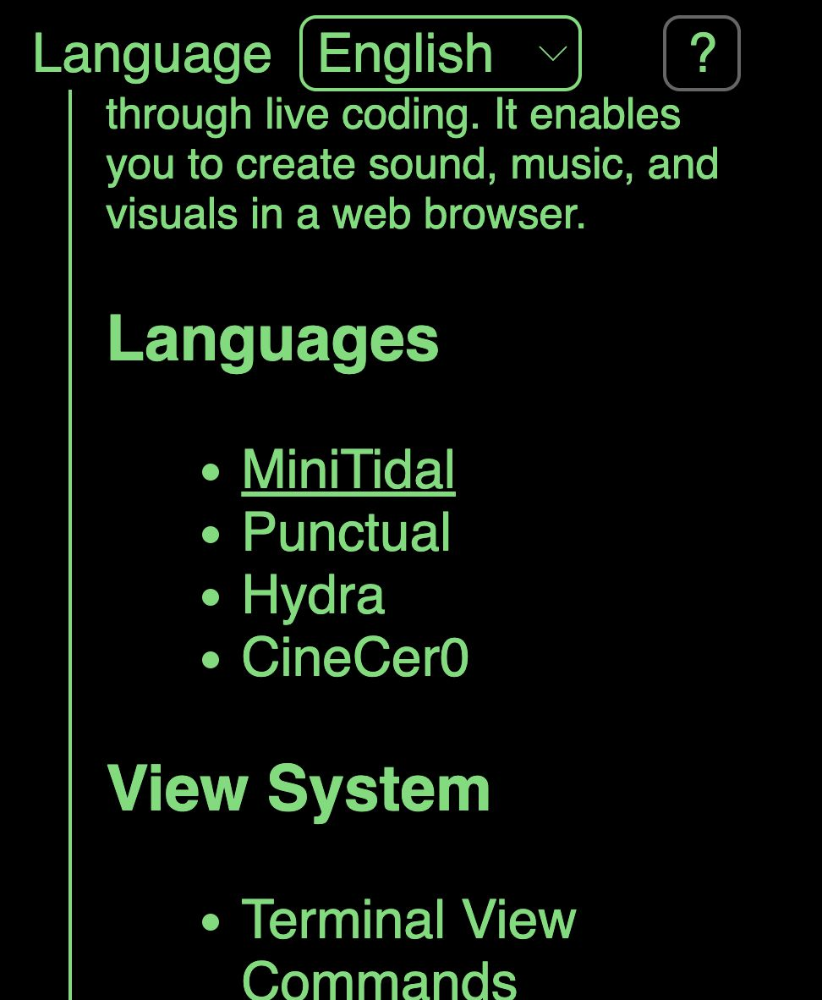
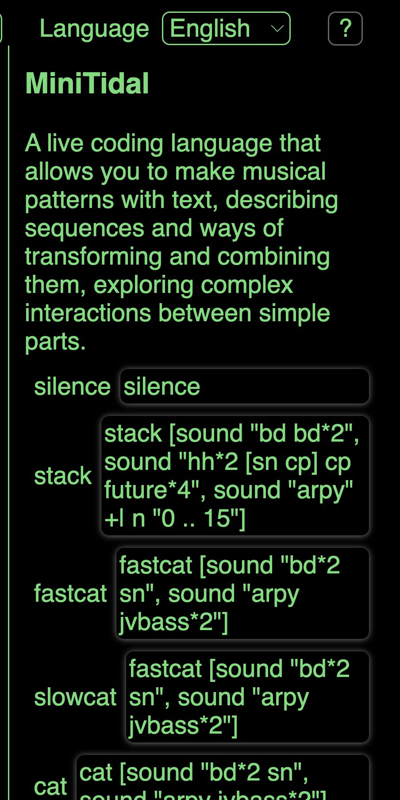

[Tutorials](../Tutorials/README.md) | [Tutorials on MiniTidal (TidalCycles), Hydra, & CineCer0](README.md)    

-------------------------------------------------------------------------------  

## MiniTidal Advance References

Just check the following references if you are interested in exploring more advance MiniTidal features.

_________________________________________________________________________________________
_________________________________________________________________________________________

### Examples in Estuary

In [https://estuary.mcmaster.ca/](https://estuary.mcmaster.ca/){:target="_blank"}:

1. Click on the ? Button located in the top-right corner.

2. A menu with information will appear. Click where it says MiniTidal.

3. You can copy/paste the available examples and play around.

The Estuary Discord server - all welcome! Sign-up at the following link (note that it's recommended to make an account on discord.com first): [https://discord.gg/snvFzkPtFr](https://discord.gg/snvFzkPtFr){:target="_blank"}  

If you would like to know more information about some of the function, you can look for them on the search tool at [https://tidalcycles.org/](https://tidalcycles.org/){:target="_blank"} (located on the top-right corner). See the bellow information if you do this.

_________________________________________________________________________________________
_________________________________________________________________________________________

### TidalCycles Vs MiniTidal

MiniTidal is a slightly reduced version of TidalCycles.  

+ You can check tutorials directly on the TidalCycles official webpage, such as this: [https://tidalcycles.org/docs/patternlib/tutorials/workshop](https://tidalcycles.org/docs/patternlib/tutorials/workshop){:target="_blank"}  

Something important to mention is that the MiniTidal version in Estuary differs slightly from the original Tidal Cycles syntax.

+ For example, in Estuary, you can run the following line: `s "cp"`

In Tidal Cycle’s workshops and references, you will find the the following structures:

+ `d1 $ s “cp"`
+ `once $ s "cp"`

If you use the references and examples from Tidal’s website, do not add structures such as `d1 $` or `once $`.
Additionally, some functions, such as `feedback` or `room` won’t work.

_________________________________________________________________________________________
_________________________________________________________________________________________

### Use personalized samples

Using your own samples in Estuary is possible, but it has a work around using GitHub pages. You can follow these tutorials:

+ [GitHub: Setup](../GitHub-setup.md)

+ [GitHub: Adding Media Files](../GitHub-addingFiles.md)

+ [Estuary: Importing Samples for TidalCycles](../Estuary-ImportingSamples.md)
