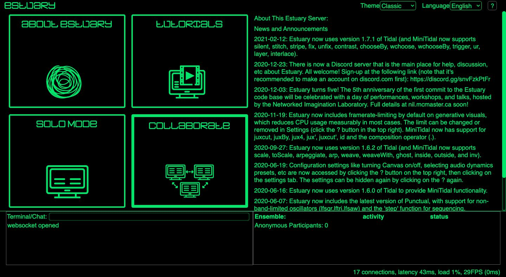
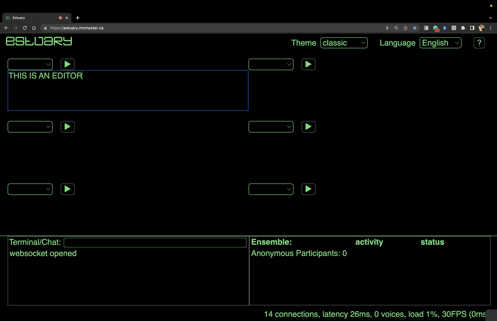
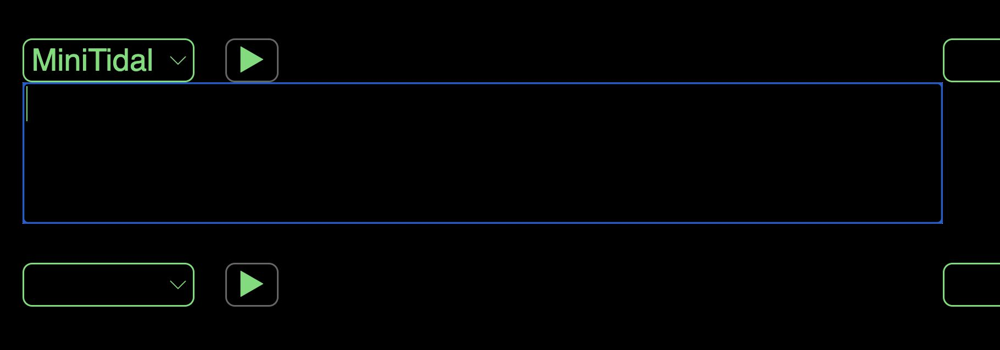
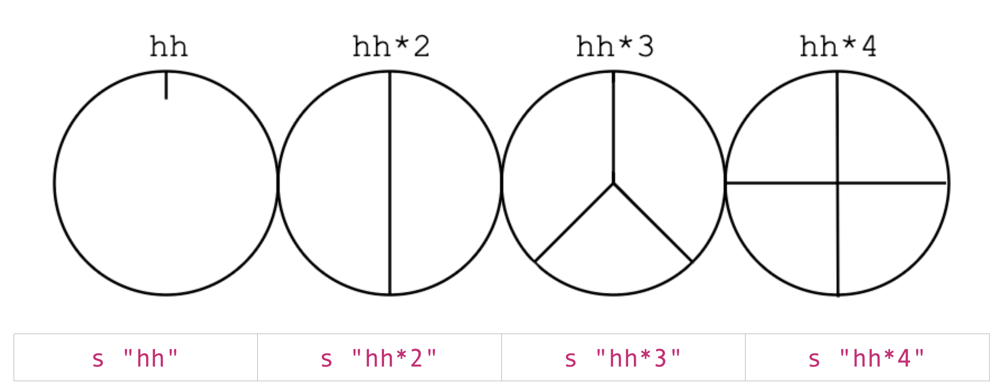
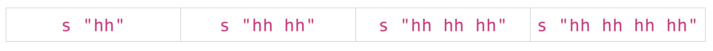
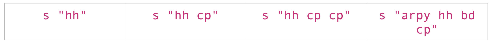

[Tutorials](../Tutorials/README.md) | [Tutorials on MiniTidal (TidalCycles), Hydra, & CineCer0](README.md)    

-------------------------------------------------------------------------------  

## MiniTidal Intro

### First Steps

MiniTidal es the implemented version of TidalCycles in Estuary. On MiniTidal, you can use almost all of the original functions. How to use it:

1. Go to [https://estuary.mcmaster.ca/](https://estuary.mcmaster.ca/)
2. Select SOLO MODE.

You will find a working space that, by default, has 6 code editors. Each code editor has a empty dropdown menu on the top-left. Estuary allows you to work with different programming languages to create visuals and/or sound. You can choose the programming language you want by opening the dropdown menu.

3. Choose MiniTidal on the dropdown menu of one of the code editors.

4. Write the following and press play (shift+return/enter or click on the play button)

+ `s "cp"` = this line will place a single (clap) sound.

IMPORTANT: Be careful with the quotation marks you use. They must be this type `""`, not this type “” (they generate a syntax error). If you copy/paste code from this tutorial, make sure that it has the correct type since text-editing software often changes the style.

5. Change `cp` for other available sounds like:
+ `bd`
+ `arpy`
+ `crow`
+ `glitch`
+ `hh`

6. Stop sound by erasing everything and pressing the play button.

_________________________________________________________________________________________
_________________________________________________________________________________________

### Using MiniTidal: Cycle

MiniTidal is using an specific time measurement called CPS: cycles per second. For MiniTidal, time is cyclical and not linear. It means that when a cycle ends, a new one will follow. Time is counted in smaller and smaller decrements of cycles per second (e.g. 1/3 of a cycle).  

+ Run the following code and hear what is happening:

+ `s "hh"`
+ `s "hh*2"`
+ `s "hh*3"`
+ `s "hh*4"`

In all above cases, we are incrementing the amount of samples/audios being play in each cycle.

+ You can also have the same result with the following codes:

+ `s "hh"`
+ `s "hh cp"`
+ `s "hh cp cp"`
+ `s "arpy hh bd cp"`

On both cases, the sample/sound hh is being repeated, but you can also add different sounds:

+ `s "hh"`
+ `s "hh hh"`
+ `s "hh hh hh"`
+ `s "hh hh hh hh"`

Experiment with the cycle adding more sounds.

_________________________________________________________________________________________
_________________________________________________________________________________________

### Using MiniTidal: Variations on Sonic Patterns

Besides adding as many samples as you want, you can also create variations on each repeating cycle.

The previous `*` (use right after the name) duplicates the sample:

+ `s "cp*8"`
+ `s "arpy*2"`
+ `s "bd cp*2"`
+ `s "arpy*4 cp*2"`

Other options:  

`~` creates a rest on the cycle:

+ `s "hh ~"`
+ `s "hh cp ~ ~ arpy"`
+ `s "arpy arpy ~ cp"`
+ `s "~ ~ cp"`

`/` (use right after the name) slows the cycle:

+ `s "cp/2"`
+ `s "cp/3"`
+ `s "cp/4"`
+ `s "cp/5"`

`[]` (use in between samples) creates pattern grouping. This is useful to apply some of the above options on groups of samples:

+ `s "[bd cp] arpy"`
+ `s "[bd cp]*2 ~ arpy"`
+ `s "[arpy ~ glitch bd]/2"`
+ `s "[bd cp*2]*2 [hh arpy]/3"`

`<>` (use in between samples) alternates the samples inside:

+ `s "bd <cp arpy>"` = This pattern will change the second sample every cycle.
+ `s "<glitch cp> <hh arpy>"` = This pattern with change both samples every cycle.

_________________________________________________________________________________________
_________________________________________________________________________________________

### Using MiniTidal: Samples/Sounds

The available samples for MiniTidal are: [https://github.com/tidalcycles/Dirt-Samples](https://github.com/tidalcycles/Dirt-Samples)   

As you can see from the link. The name of tidal cycle samples refers to the name of specific folders. Each folder contains more than one sound file.

When you play a sample, it plays the first audio file by default.  

Take, for example, `arpy`. If we look into its folder, we will find 11 sound files. If we run `s "arpy"`, the default sound is arpy01.wav  

You can play the other files by using : after the name of the sample, adding the number of the file you want to play. This number starts with `0`. For example:

+ `s "arpy:0"` = Will play the default arpy01.wav
+ `s "arpy:1"` = Will play arpy02.wav
+ `s "arpy:2"` = Will play the default arpy03.wav
+ `s "arpy:3"` = Will play arpy04.wav

Explore the with other available sounds!
