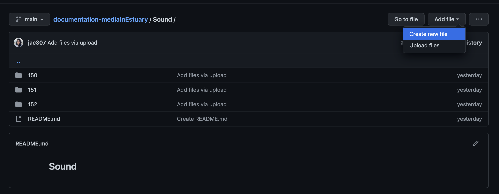
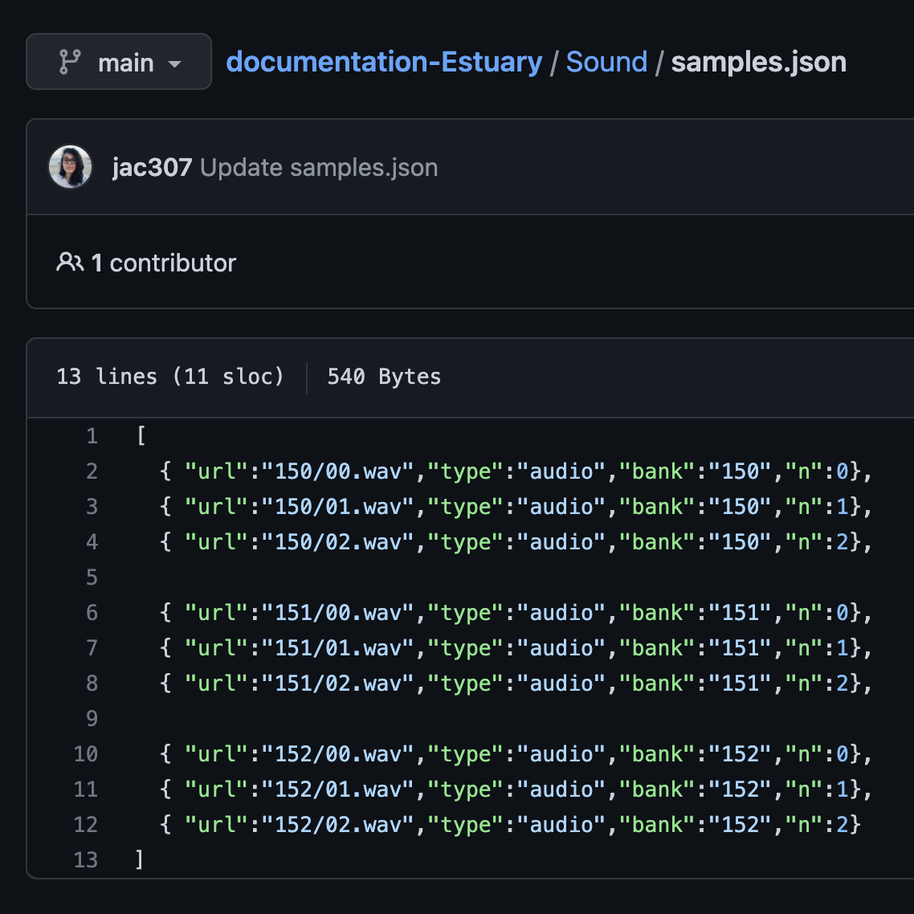
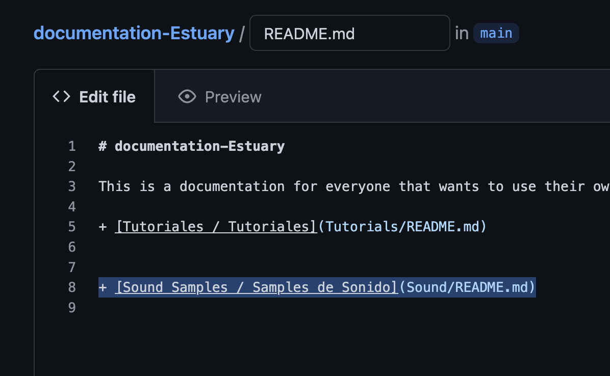
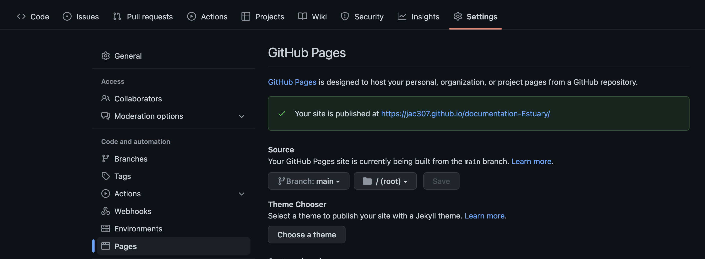
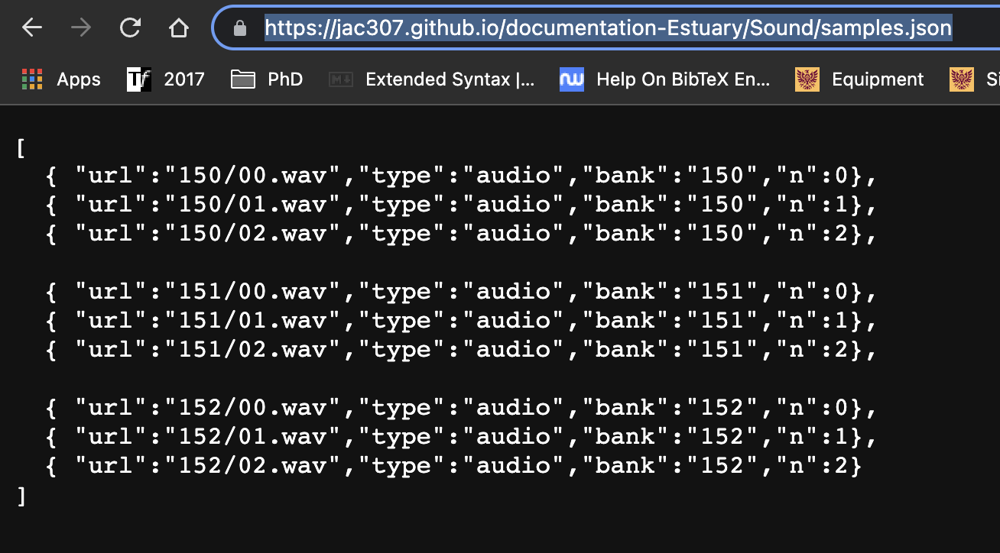
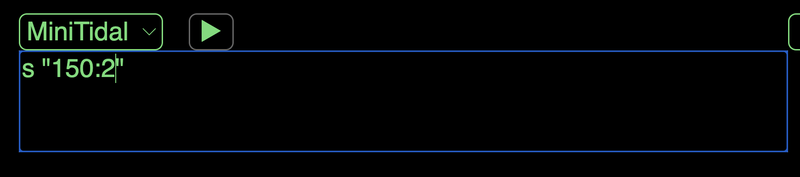

  
[Tutorials](../Tutorials/README.md) | [Main](../README.md)    
  
-------------------------------------------------------------------------------  
  
  
## Temporally importing samples in Estuary / Importando samples temporalmente en Estuary

If you have not made your repo a GitHub Page, please follow [GitHub: Setup](GitHub-setup.md) tutorial first.    
Si no has configurado tu repo como una GitHub Page ve al siguiente tutorial primero: [GitHub: Setup](GitHub-setup.md). 
  
+ On your repository, go to the section you have uploaded your sound files / Es tu repositorio, ve a la sección donde has subido tus archivos de sonido.  
+ Create a new file / Crea una nuevo archivo.  
  
In this example, I have a folder named "Sound" with three sub-folders with different samples.  
En este ejemplo tengo un folder llamado "Sound" con tres sub-folders con differentes sonidos.  
  
  
  
+ Name your file and add the extension ".json" / Escribe el nombre y agrega la extensión ".json".  
  
  
   
+ You will make a list of your sound samples `[]` / Escribirás una lista con tus samples de sonido `[]`.  
  
The sintax is the following: `[ { "url":"locationInGitHub","type":"audio","bank":"name-of-the-bank","n":samplesNumber} ]`.  
La sintaxis es la siguiente: `[ { "url":"locaciónEnGitHub","type":"audio","bank":"nombre-del-banco","n":númeroDeSample} ]`.  
  
  
   
+ Write the correct information in those fields / Escribe la información correcta en esos campos.  
  
  
   
In this example, I have three folders/banks (150, 151, 152) with three sound samples in each folder. The location is `"nameOfFolder/file.extension"`, in `name-of-the-bank` I am keeping the name of the folder (but this can be different), lastly, `samplesNumber` should start from 0,1,2...  
En este ejemplo tengo tres carpetas/bancos (150, 151, 152) con tres archivos cada una. La locación es `"nombreDelFolder/archivo.extensión"`, en `nombre-del-banco` estoy conservando el nombre el folder (pero éste puede ser diferente), por último, `númeroDeSample` debe comenzar desde 0,1,2...  
  
  
   
+ Add more files if needed separated by commas / Añade más archivos, si es necesario, separados por comas.  
+ Press commit at the end of the page / Envía tu commit al final de la páguina.  
  
  
   
You can see the file now. In this example, I finished adding the information of the other files I have.  
Puedes ver tu archivo publicado ahora. En este ejemplo, terminé de añadir los archivos restantes que tengo.  
  
  
   
+ Go to the folder where you have the new .json file and edit the README.md file there / Ve al folder donde tienes el nuevo archivo .json y edita el archivo README.md.  
+ Add a link to the .json file by following this sintax: `[text](url or location-on-GitHub)`, Commit changes / Añade un link al archivo .json siguiendo la siguiente sintaxis: `[texto](url o locación-en-GitHub)`, Commit tus cambios.   
  

   
+ Confirm the link works / Confirma que el link funcione.  
  
   
   
+ If you have uploaded and created these files inside of a folder/sub-folder, go to the beginning of your repository / Si has agregado estos archivos en una carpeta/sub-carpeta, ve al inicio de tu repositorio.  
+ Edit the README file there and add a link to your previous, Sound README file / Edita el archivo README de ahí y crea un link al archivo previos de README de sonido.  
These steps are not necesarry if you have all your files in the main repo / Estos pasos no son necesarios si tienes todos tus archivos en tu repositorio principal.  
  

   
+ Go to "Settings", then "Pages", click on the site's url / Ve a "Configuraciones", luego a "Páguinas", da click en la url del sitio.   
  
 

+ Click until you get to your .json file / Dale click hasta entrar a tu archivo de .json.  
In this example, I have to go to Sound Samples, then Samples / En este ejemplo, tengo que ir a Samples de Sonido, luego Samples.  
  

  
Something like this should appear / Algo como esto debe aparecer.  
+ Copy the URL / Copia la URL.  
  
 
   
+ Go to one of your README files (In this case, I will modify the README on Sound) / Ve a uno de tus archivos README (En este caso modificaré mi archivo README en Sound).  
  
 
  
+ Add the following: `!reslist "paste-url"` / Agrera la siguiente línea: `!reslist "copia-la-url"`.  
In this case, I also added some other information about the samples.  
En este caso también añadí algo de información de los samples.  
  
 
 
  
+ Go to: / Ve a: <a href="https://estuary.mcmaster.ca/" target="_blank">Estuary</a>
+ Go into Solo Mode or enter an ensamble / Ve a Modo Solo o entra a un ensamble.  
+ In the terminal, send your `!reslist "pasted-url"`/ En la terminal, envía tu `!reslist "url-copiada"`.  
  
  
  
Now you can use your samples! / Ahora puedes usar tus samples!
  
   
  
In Solo Mode, you will have to do this last step everytime you enter. In Collaborative/Ensamble mode, it should be saved.  
En Modo Solo, tendrás que hacer este último paso cada vez que entres. En modo Colaborativo/Ensamble, se deberían guardar.  
  
You can do `!localview audiomap` on the terminal to check all available samples. Your new samples should be there.  
Puedes enviar `!localview audiomap` en la terminal para revisar todos los samples disponibles. Tus nuevos samples deberían de estar ahí. 
  
  
 
  
