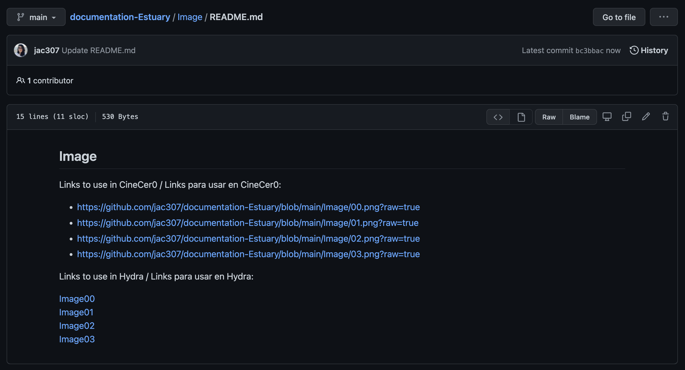
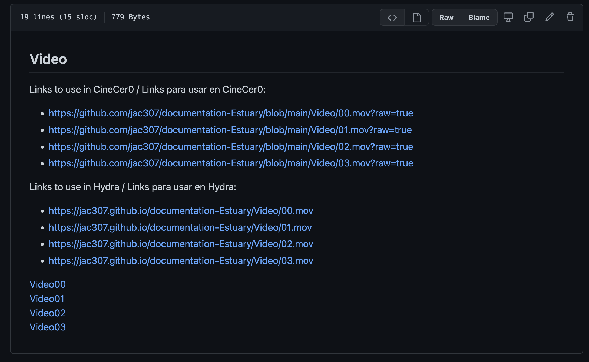

## Using/Playing Media (video,image) on Hydra / Usar/Reproducir Media (video,imagen) en Hydra
  
*This info also works for media in Punctual*  
  
  
In Hydra, if you use the URL from Media that is just hosted in a GitHub repo, you will get the following error:  
En Hydra, si utilizas una URL de Media que únicamente está alojada en un repo de GitHub, tendrás el siguiente error:  
  
  
  
To solve this, we have to use the GitHub Page settings to publish our media and then get a usable URL for Hydra. If you have not made your repo a GitHub Page, please follow [GitHub: Setup](GitHub-setup.md) tutorial first.    
Para resolver esto, debemos usar la configuración de GitHub Page y así publicar nuestra media y obtener una URL usable en Hydra. Si no has configurado tu repo como una GitHub Page ve al siguiente tutorial primero: [GitHub: Setup](GitHub-setup.md).  
  
  
+ Go to the repo/folder where you have your videos or images / Ve al repo o folder donde tienes tus videos o imágenes.  
+ Edit the README file in that folder, adding a direct link to each video or image using the following sintax: `[text](GitHub-location)`. Commit your changes / Edita el archivo README de esa carpeta añadiendo un link directo a cada video o imagen usando la siguiente sintaxis: `[texto](locación-en-GitHub)`. Commit tus cambios.  
+ Check that the links work / Revisa que los links funcionen.  
  
  
  
+ Go to Settings, then Pages, then click on the URL / Ve a settings, luego Pages, y da click en la URL.  
In this example, I have created direct links on my main README so I can access the Video and Image sections.  
En este ejemplo he creato links directos en mi README principal, así puedo accesar a las secciones de Video e Imagen.  
  
  
  
+ Right Click on your video or image, then click on "Copy link address" / Click derecho en el video o imagen, luego clicl en "Copiar dirección".  
  
  
  
+ As a good practice, you can copy the url links on your README file, so they're always accesible  / Como una buena práctica, pega los links/url en tu archivo README, así tendrás esa información accesible.  
In this example, I copied/pasted the links in both, the Image and Video README files.  
En este ejemplo, copié/pegué los links en los archivos README de Imagen y de Video.  
  
  
  
+ En Estuary, you can use these links on Hydra / En Estuary, ya puedes usar estos links en Hydra.  
  
  
  
  
