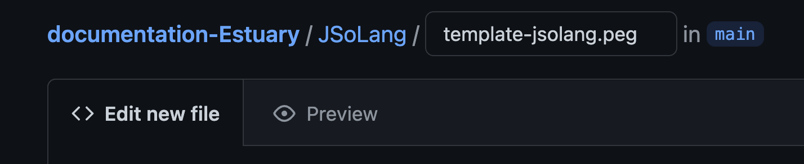
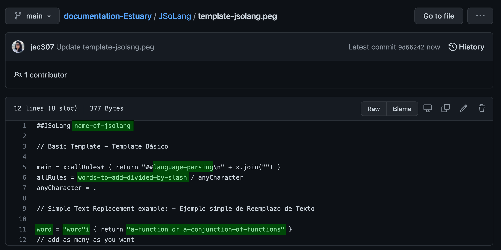

  
[Tutorials](../Tutorials/README.md) | [Home](../README.md)    
  
-------------------------------------------------------------------------------  
  
## JSoLangs: Simple Text Replacement / Reemplazo de Texto Simple 

[Example / Ejemplo 1](#Example-1)  
[Example / Ejemplo 2](#Example-2)  
[Example / Ejemplo 3](#Example-3)  

## Template
  
JSoLangs is an application in <a href="https://estuary.mcmaster.ca/" target="_blank">Estuary</a> to parse available live coding language to create new ones.  
Los JSoLangs es una aplicación en <a href="https://estuary.mcmaster.ca/" target="_blank">Estuary</a> que permite parsear lenguajes de live coding disponibles para crear nuevos.  
  
For this tutorial, I have created this [folder](../JSoLang/README.md) to host a simple text replacement template as well as some examples.  
Para este tutorial, he agregado esta [carpeta](../JSoLang/README.md) que contiene un template simple de reemplazo de texto, así como algunos ejemplos.  
  
JSoLangs can be written directly on Estuary but it is always better to write and save your JSoLang locally or in any other platform. For my project, I am using GitHub.  
Los JSoLangs pueden escribirse directamente en Estuary pero siempre es mejor guardarlos localmente o en alguna otra plataforma. Para mi proyecto estoy usando GitHub.  
  
+ Create a `name.peg` file / Crea un archivo `name.peg`.  
  
  
  

+ Write and save your JSoLang / Escribe y guarda tu JSoLang.  
For this project, I have this [template](../JSoLang/template-jsolang.peg) / Para este proyecto tengo este template [template](../JSoLang/template-jsolang.peg) 

  + `name-of-jsolang` = Name your JsoLang / Nombra tu JsoLang.  
  + `language-parsing` = Write the name of one of the lc languages in Estuary / Escribe el nombre de alguno de los lenguajes de lc que hay en Estuary.   
  + `a-function or a-conjunction-of-functions` = Write the function(s) you want to translate / Escribe la(s) funcion(es) que quieras traducir.  
  + `word` = Write the word you want to use to replace the above / Escribe la palabra que quieres para reemplazar lo anterior.  
  + `"word"i` = Write the word again inside quotation marks / Escribe de nuevo la palabra pero entre comillas.  
       + `i` = not case sensitive / no distingue mayúsculas y minúsculas.  
       + erase the i so it is case sensitive / borra el i para que distinga entre mayúsculas y minúsculas.  
  + `words-to-add-divided-by-slash` = Write all the words you used divided by "/" / Escribe todas las palabras que usaste divididas por "/".  

  
  
+ Go to: / Ve a: <a href="https://estuary.mcmaster.ca/" target="_blank">Estuary</a>
+ Copy/Paste your JSoLang in one editor-box. Evaluate and check for sintax errors / Copia/Pega tu JSoLang en un editor de texto. Evalúa y checa por errores de sintaxis.  
+ In a different editor-box write: `##name-of-jsolang` / En un editor de texto diferente, escribe: `##name-of-jsolang`.    
+ You can now use this second box to write with your new sintax / Ahora puedes usar este segundo editor para escribir con tu nueva sintaxis.    
  
    
  
  
_________________________________________________________________________________________
_________________________________________________________________________________________
  
## Example 1
### Text Replacement with MiniTidal / Ejemplo 1: Reemplazo de Text con MiniTidal

[This](../JSoLang/drSeuss.peg) is the JSoLang I wrote with the name `drSeuss`, where you can run the following sintax:    
  `I donT like "green" eggs 0.9 and ham 1.0`.   
which translate in MiniTidal as:  
  `slow 3.2 $ s "alphabet:4 alphabet:6 alphabet:6 alphabet:18" # gain 0.9 # up 1.0`  
  
[Este](../JSoLang/drSeuss.peg) que escribí con el nombre de `drSeuss`, donde puedes correr la siguiente sintaxis:    
  `I donT like "green" eggs 0.9 and ham 1.0`.   
que se traduce en MiniTidal como:  
  `slow 3.2 $ s "alphabet:4 alphabet:6 alphabet:6 alphabet:18" # gain 0.9 # up 1.0`  
  
I have seven statements, translating: / Tengo siete declaraciones, traduciendo:    
  
+ `like = "like"i { return "s" }` = single function / única función.    
  
+ `eggs = "eggs"i { return " # gain" }` and `ham = "ham"i { return "# up" }` = operator # + function / operador # + función.  
  
+ `green = "green"i { return "alphabet:4 alphabet:6 alphabet:6 alphabet:18" }` = a sound pattern / un patrón de sonidos
  
+ `I = "I"i { return "slow 3.2 $" }` = function + parameter + operator $ / función + parámetro + operador $.  
  
+ `and = "and"i { return "" }` and `donT = "donT"i { return "" }` = empty statement / declaración vacía.  
  
My new sintax must respect the rules of the pre-existing live coding language.  
La nueva sintaxis debe respetar las reglas del lenguajde de live coding pre-existente.  
  
  
  
_________________________________________________________________________________________
_________________________________________________________________________________________
  
## Example 2
### Text Replacement with CineCer0 / Ejemplo 2: Reemplazo de Text con CineCer0
  
[This](../JSoLang/humptyDumpty.peg) is the JSoLang I wrote with the name `humptyDumpty`, where you can run the following sintax:    
  `first Humpty dumpty sat on a wall; then Humpty Dumpty had a fall;`.   
which translate in CineCer0 as:  
  `setPosY (-0.2) $ setSize 0.5 $ setOpacity (range 0 1 $ sin 0.5) $ image "specific-url-01";` 
  `setPosY (-0.2) $ setSize 0.5 $ setOpacity (range 1 0 $ sin 0.5) $ imagespecific-url-02;"`  
  
[Este](../JSoLang/humptyDumpty.peg) que escribí con el nombre de `humptyDumpty`, donde puedes correr la siguiente sintaxis:    
  `first Humpty dumpty sat on a wall; then Humpty Dumpty had a fall`.   
que se traduce en CineCer0 como:  
  `setPosY (-0.2) $ setSize 0.5 $ setOpacity (range 0 1 $ sin 0.5) $ image "specific-url-01";` 
  `setPosY (-0.2) $ setSize 0.5 $ setOpacity (range 1 0 $ sin 0.5) $ imagespecific-url-02;"`  
  
I have ten statements, translating: / Tengo ten declaraciones, traduciendo:    
  
+ `a = "a"i { return "image" }` = single funcion: / única función.    

+ `sat = "sat"i { return "$" }` = operator $ / operador $.    

+ `humpty = "humpty"i { return "setSize 0.5" }` = function + parameter / función + parámetro.  
  
+ `first = "first"i { return "setPosY (-0.2) $" }` = function + parameter + symbol $ / función + parámetro + símbolo. 
The same translation applies to `then = "then"i { return "setPosY (-0.2) $" }`, so I have two options.  
La misma traducción se aplica a `then = "then"i { return "setPosY (-0.2) $" }`, y así tener dos opciones.  
  
+ `dumpty = "dumpty" { return "$ setOpacity (range 0 1 $ sin 0.5)" }` and `Dumpty = "Dumpty" { return "$ setOpacity (range 1 0 $ sin 0.5)" }` = symbol $ + function + dynamic-parameter / símbolo $ + función + parámetro-dinámico.  
In this case, I erased `i` so it is case sensitive and I can write `dumpty` or `Dumpty` and have two different functions.  
En este caso borré `i` y así distinga entre mayúsculas y minúsculas y pueda escribir `dumpty` o `Dumpty` y tenga dos funciones diferentes.   
  
+ `on = "on"i { return "" }` = empty statement / declaración vacía.  
  
+ `wall = "wall"i { return "\"url1\"" }` and `wall = "wall"i { return "\"url2\"" }` = url inside quotation marks / url entre comillas.  
  
My new sintax must respect the rules of the pre-existing live coding language.  
La nueva sintaxis debe respetar las reglas del lenguajde de live coding pre-existente.  
  
  
  
_________________________________________________________________________________________
_________________________________________________________________________________________
  
## Example 3
### Text Replacement with Hydra / Ejemplo 3: Reemplazo de Text con Hydra
  
[This](../JSoLang/peterPeter.peg) is the JSoLang I wrote with the name `peterPeter`, where you can run the following sintax:    
  `I donT like "green" eggs 0.9 and ham 1.0`.   
which translate in Hydra as:  
  `slow 3.2 $ s "alphabet:4 alphabet:6 alphabet:6 alphabet:18" # gain 0.9 # up 1.0`  
  
[Este](../JSoLang/peterPeter.peg) que escribí con el nombre de `peterPeter`, donde puedes correr la siguiente sintaxis:    
  `Peter.peter(punkinEater;`  
  `is(Peter).Punkin.eating`   
que se traduce en Hydra como:  
  `s0.initVideo("specific-url");`  
  `src(s0).modulate(o0).out()`   
  
I have seven statements, translating: / Tengo siete declaraciones, traduciendo:    

In this case, I erased all `i` so it is case sensitive.  
En este caso borré todas las `i` y así distinga entre mayúsculas y minúsculas.   
  
+ `Peter = "Peter" { return "s0" }`, `peter = "peter" { return "initVideo" }`, and `is = "is" { return "src" }` = single function / única función.  
  
+ `punkin = "punkin" { return "\"url\"" }` = url inside quotation marks / url entre comillas.  
  
+ `Eater = "Eater" { return ")" }` = symbol ) / símbolo ).    
  
+ `eating = "eating" { return "out()" }` = function + symbols () / function + símbolos ().    

+ `Punkin = "Punkin" { return "modulate(o0)" }` = function + symbols (+ parameter +) / function + símbolos (+ parameter +).    
  
My new sintax must respect the rules of the pre-existing live coding language.  
La nueva sintaxis debe respetar las reglas del lenguajde de live coding pre-existente. 
  
  
  
