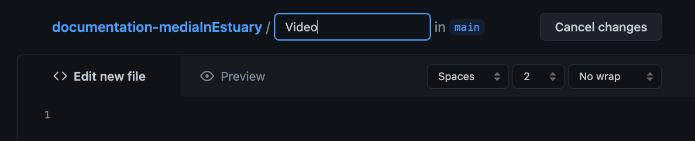

## Adding media files to GitHub / Añadiendo Archivos Multimedia a GitHub

There are many ways to add/create files in GitHub. This tutorial will go through the steps to create folders for each Media type and uploading files in those folders.  
  
Hay muchas formas de añadir/crear archivos en GitHub. Este tutorial tiene los pasos para crear carpetas que contengan cada tipo de media, y luego subir los archivos correspondientes en ellas.  
  
1. On your repository, main section: click on "Add file", then "Create new file" / En tu repo, en la sección inicial: da click en "Añadir archivo", y después en "Crear nuevo archivo".  
  
  
  
2. Write the name of your folder first. In this case "Video" / Escribe el nombre de tu carpeta primero. En este caso "Video".  
  
  
  
3. Write: "/" , the folder will be created / Escribe: "/" , así se creará el folder.  
   
  
  
4. Write "README.md" to create a text file. On the lower text-area, write "##" followed by your title. / Escribe "README.md" para crear un archivo de texto. En el área de texto, en la parte inferior, escribe "##" seguido por tu título.  
5. You can add more information if you desire. To do this, please use the [Markdown sintaxis](https://www.markdownguide.org/basic-syntax/) / Puedes agregar más información si lo deseas. Para hacer esto, usa la [sintaxis de Markdown ](https://www.markdownguide.org/basic-syntax/).  
   
  
  
6. Go to the end and click on "Commit new file" / Ve al final y dale click en "Commit nuevo archivo".  
   
  
  
Now you can see your new folder and file / Ahora puedes ver tu nuevo nombre y archivo.  
If you want to make changes to your text file, click on the pencil icon / Si quieres hacer cambios en el archivo de texto, dale click en el ícono de lapiz.  
   
  
  
