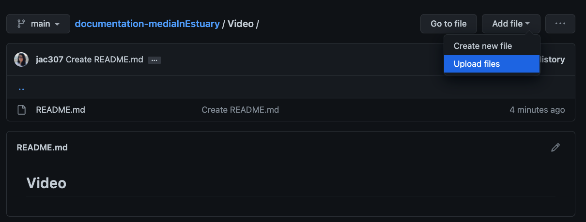
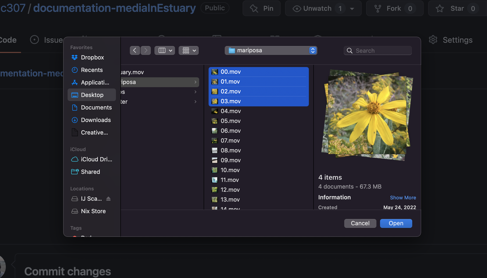
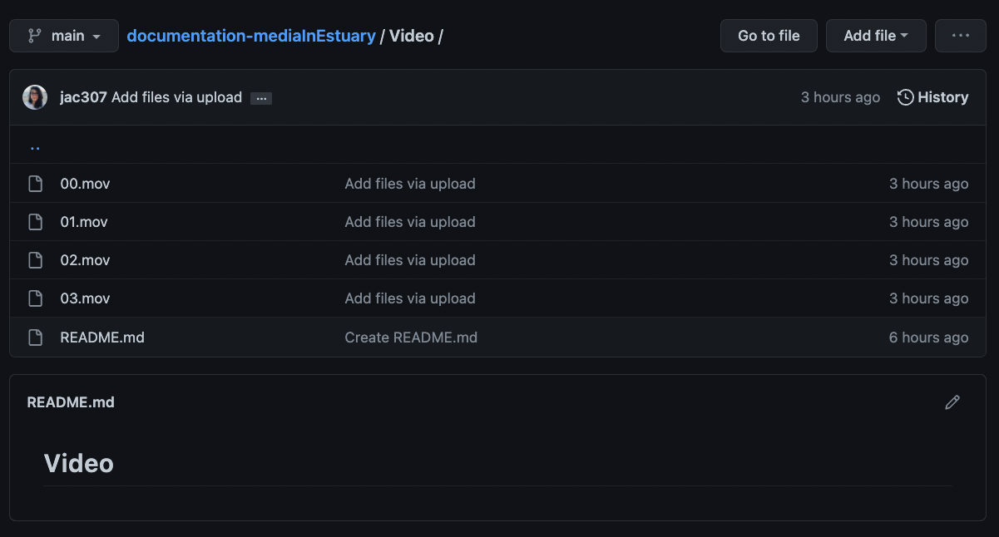

  
[Tutorials](../Tutorials/README.md) | [Main](../README.md)    
  
-------------------------------------------------------------------------------  
  
## Adding media files to GitHub / Añadiendo Archivos Multimedia a GitHub

There are many ways to add/create files in GitHub. This tutorial will go through the steps to create folders for each Media type and uploading files in those folders.  
  
Hay muchas formas de añadir/crear archivos en GitHub. Este tutorial tiene los pasos para crear carpetas que contengan cada tipo de media, y luego subir los archivos correspondientes en ellas.  
  
+ On your repository, main section: click on "Add file", then "Create new file" / En tu repo, en la sección inicial: da click en "Añadir archivo", y después en "Crear nuevo archivo".  
  
  
  
+ Write the name of your folder first. In this case "Video" / Escribe el nombre de tu carpeta primero. En este caso "Video".  
  
  
  
+ Write: "/" , the folder will be created / Escribe: "/" , así se creará el folder.  
   
  
  
+ Write "README.md" to create a text file. On the lower text-area, write "##" followed by your title. / Escribe "README.md" para crear un archivo de texto. En el área de texto, en la parte inferior, escribe "##" seguido por tu título.  
5. You can add more information if you desire. To do this, please use the [Markdown sintaxis](https://www.markdownguide.org/basic-syntax/) / Puedes agregar más información si lo deseas. Para hacer esto, usa la [sintaxis de Markdown ](https://www.markdownguide.org/basic-syntax/).  
   
  
  
+ Go to the end and click on "Commit new file" / Ve al final y dale click en "Commit nuevo archivo".  
   
  
  
Now you can see your new folder and file / Ahora puedes ver tu nuevo nombre y archivo.  
If you want to make changes to your text file, click on the pencil icon / Si quieres hacer cambios en el archivo de texto, dale click en el ícono de lapiz.  
   
  
  
+ On your Video folder: click on "Add file", then "Upload files" / En tu carpeta de Video: dale click en "Añadir archivo", después "Subir archivos".  
   
  
  
+ Click on "Choose your files". Then select/open them. / Click en "Eleguir tus archivos". Después seleccionalos/ábrelos.  
   
   
   
  
+ Wait until they're ready, then Commit changes. Wait until the files are processed / Espera a que estén listos y después manda los cambios. Espera a que se procesen los archivos.   
  
  
  
  
+ Check that your files are on the folder. / Revisa que tus archivos estén en el folder.  
  
  
  
__________________________________________________________   
__________________________________________________________   
  
You can also upload new files by Dragguing and Dropping. In the following steps, I created a Sound folder. / También puedes añadir archivos arrastrándolos y soltándolos. En los siguientes pasos, yo cree una carpeta para Sonidos.   
  
+ On your Sound folder: click on "Add file", then "Upload files" / En tu carpeta de Video: dale click en "Añadir archivo", después "Subir archivos".   
+ Select, drag, and drop / Selecciona, arrastra, suelta.  
In this example, I am selected three folders (150, 151, 152) instead of single files. I am doing this so I also import the corresponding folders.  
En este ejemplo, estoy seleccionando tres carpetas (150, 151, 152) en lugar de archivos. Estoy haciendo esto para también importar las carpetas correspondientes.  
   
    
  
+ Wait until they're ready, then Commit changes. Wait until the files are processed / Espera a que estén listos y después manda los cambios. Espera a que se procesen los archivos.  
You can notice the name of my uploaded information: "/150/02.wav..." - The folder's name is 150, then inside there are the audio files.  
Pueden notar que el nombre de la información que se está subiendo es la siguiente: "/150/02.wav..." - El nombre de la carpeta es 150 y adentro contiene los archivos de audio.  
  
  
  
+ Check that your folder/files are there. / Revisa que tus carpetas/archivos estén ahí.   
  
 
  
  
__________________________________________________________   
__________________________________________________________   
  
I repeated this process openning an Image folder and uploading some files.   
Repetí este proceso creando una capeta de Imagenes y subiendo algunos archivos en ella.  
  
  
  
On the main repo, I can see those three folders now / En mi repo principal puedo ver ahora las tres carpetas.  
  
  
  
  
  
