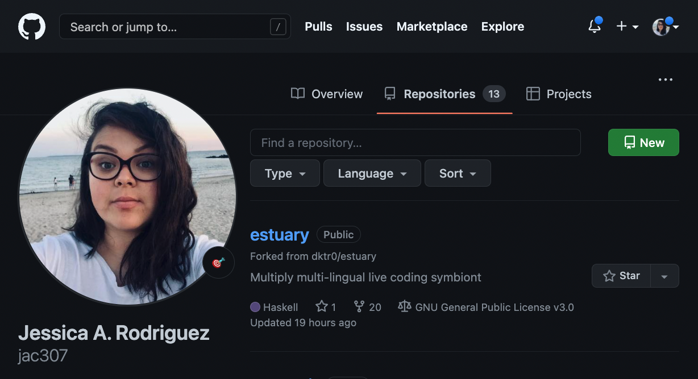
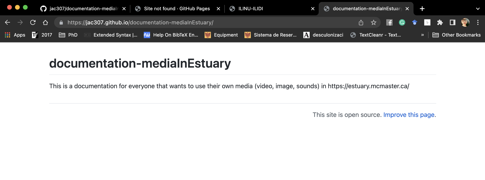

  
[Tutorials](../Tutorials/README.md) | [Home](../README.md)    
  
-------------------------------------------------------------------------------  
  
  
## GitHub Setup

+ Open/have an account on [GitHub](https://github.com/) / Abrir/Tener una cuenta en [GitHub](https://github.com/).  
+ On your "Repositories", click on "New" / En "Repositorios", dar click en "Nuevo".   
  
  
  
+ Add information: name, description, add a README file, make the repo public. Then, press "Create repository" / Añade la información: nombre, descripción, añade un archivo README, haz el repo público. Después, presiona en "Crear repositorio".  
  
  
  
+ You can now see you repository / Puedes ahora ver tu repositorio.  
  
  
  
+ Go to "Settings", then on the left meny, choose "Pages" / Ve a "Configuraciones", después en el menú izquierdo selecciona "Páginas".   
  
  
  
+ Open the dropdown menu where it says "None" and choose your main branch / Abre el menu de opciones donde dice "None" y selecciona tu branch principal.  
  
  
  
+ Once selected, click on "save" / Una vez seleccionada, presiona "guardar".  
  
  
  
+ The following message with the url of your site should appear / El siguiente mensaje con el url de tu sitio deberá aparecer.  
  
  
  
+ If you click on the url, the page should open / Si le das click a la URL, la página debe de abrirse.  
A "not-found" message may appear, so give it some time to the browser updates the info and re-fresh / Podría aparecer un mensaje de que no encuentra la páguina, si pasa esto: dale algo de tiempo al páguina de actualizarse y vuelve a cargar.  
  
  
  
