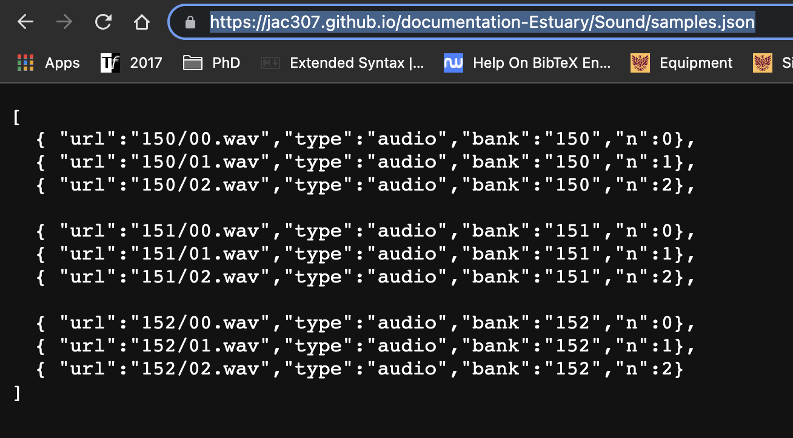

[Tutoriales](../Tutorials/README.md) | [Home](../../README.md)    

-------------------------------------------------------------------------------  

## Importando samples temporalmente en Estuary

Si no has configurado tu repo como una GitHub Page ve al siguiente tutorial primero: [GitHub: Setup](GitHub-setup.md).

+ Es tu repositorio, ve a la sección donde has subido tus archivos de sonido.  
+ Crea una nuevo archivo.  

En este ejemplo tengo un folder llamado "Sound" con tres sub-folders con differentes sonidos.  

  

+ Escribe el nombre y agrega la extensión ".json".  

  

+ Escribirás una lista con tus samples de sonido `[]`.  

La sintaxis es la siguiente: `[ { "url":"locaciónEnGitHub","type":"audio","bank":"nombre-del-banco","n":númeroDeSample} ]`.  

  

+ Escribe la información correcta en esos campos.  

  

En este ejemplo tengo tres carpetas/bancos (150, 151, 152) con tres archivos cada una. La locación es `"nombreDelFolder/archivo.extensión"`, en `nombre-del-banco` estoy conservando el nombre el folder (pero éste puede ser diferente), por último, `númeroDeSample` debe comenzar desde 0,1,2...  

  

+ Añade más archivos, si es necesario, separados por comas.  
+ Envía tu commit al final de la página.  

  

Puedes ver tu archivo publicado ahora. En este ejemplo, terminé de añadir los archivos restantes que tengo.  

  

+ Ve al folder donde tienes el nuevo archivo .json y edita el archivo README.md.  
+ Añade un link al archivo .json siguiendo la siguiente sintaxis: `[texto](url o locación-en-GitHub)`, Commit tus cambios.   

+ Confirma que el link funcione.  

   

+ Si has agregado estos archivos en una carpeta/sub-carpeta, ve al inicio de tu repositorio.  
+ Edita el archivo README de ahí y crea un link al archivo previos de README de sonido.  
Estos pasos no son necesarios si tienes todos tus archivos en tu repositorio principal.  

+ Ve a "Configuraciones", luego a "Páginas", da click en la url del sitio.   

+ Dale click hasta entrar a tu archivo de .json.  
En este ejemplo, tengo que ir a Samples de Sonido, luego Samples.  

Algo como esto debe aparecer.  
+ Copia la URL.  

+ Ve a uno de tus archivos README (En este caso modificaré mi archivo README en Sound).  

+ Agrega la siguiente línea: `!reslist "copia-la-url"`.  
En este caso también añadí algo de información de los samples.  

+ Ve a: <a href="https://estuary.mcmaster.ca/" target="_blank">Estuary</a>
+ Ve a Modo Solo o entra a un ensamble.  
+ En la terminal, envía tu `!reslist "url-copiada"`.  

  

Ahora puedes usar tus samples!

   

En Modo Solo, tendrás que hacer este último paso cada vez que entres. En modo Colaborativo/Ensamble, se deberían guardar.  

Puedes enviar `!localview audiomap` en la terminal para revisar todos los samples disponibles. Tus nuevos samples deberían de estar ahí.

