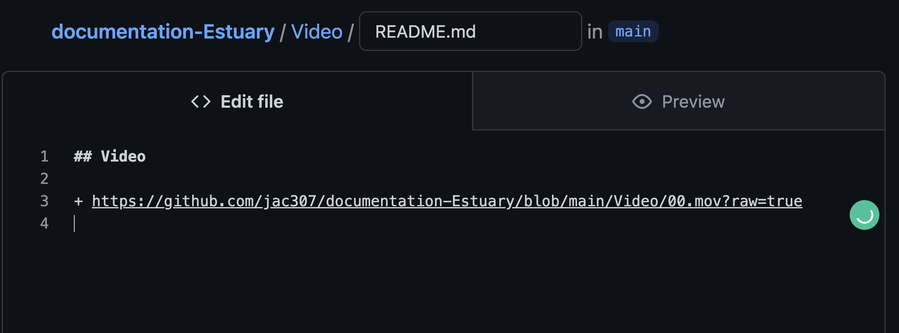
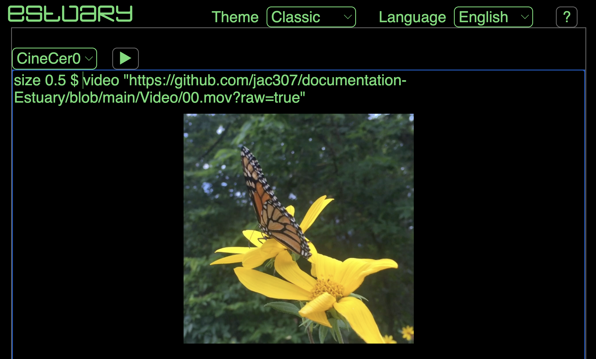

[Tutorials](../Tutorials/README.md) | [Home](../README.md)    

-------------------------------------------------------------------------------  

## Usar/Reproducir Media (video,imagen,gif) en CineCer0

+ Ve al repo o folder donde tienes tus videos o imágenes.    

  

+ Para videos: Abre el archivo, Click derecho en "View raw", y después en "Copiar link de la dirección".  

  

+ Para imágenes: Abre el archivo, Click derecho en la imagen, y después en "Copiar link de la dirección".  

  

+ Como una buena práctica, pega los links/url en tu archivo README, así tendrás esa información accesible.  

   

En este ejemplo, copié/pegué los links en los archivos README de Imagen y de Video.  

   

+ En Estuary, ya puedes usar estos links en CineCer0.  

  
  

Puedes seguir los mismos pasos para usar GIFs. Obten el link del mismo modo que con las imágenes, luego úsalo con la función `image "url"` en CineCer0.   

  
  
  
