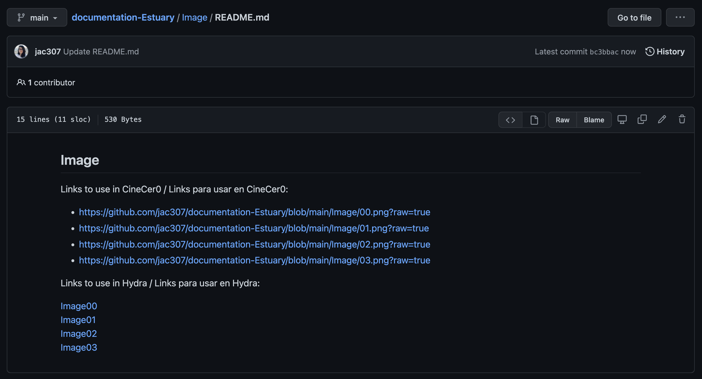

[Tutoriales](../Tutorials/README.md) | [Home](../../README.md)     

-------------------------------------------------------------------------------  

## Usar/Reproducir Media (video,imagen) en Hydra

*This info also works for media in Punctual*    

En Hydra, si utilizas una URL de Media que únicamente está alojada en un repo de GitHub, tendrás el siguiente error:  

  

Para resolver esto, debemos usar la configuración de GitHub Page y así publicar nuestra media y obtener una URL usable en Hydra. Si no has configurado tu repo como una GitHub Page ve al siguiente tutorial primero: [GitHub: Setup](GitHub-setup.md).  

+ Ve al repo/folder donde tienes tus videos e imágenes.
+ Edita el archivo README de esa carpeta añadiendo un link directo a cada video o imagen usando la siguiente sintaxis: `[texto](locación-en-GitHub)`. Commit tus cambios.  
+ Revisa que los links funcionen.  

  

+ Ve a settings, luego Pages, y da click en la URL.  
En este ejemplo he creado links directos en mi README principal, así puedo accesar a las secciones de Video e Imagen.  

  

+ Click derecho en el video o imagen, luego clicl en "Copiar dirección".  

  

+ Como una buena práctica, pega los links/url en tu archivo README, así tendrás esa información accesible.  
En este ejemplo, copié/pegué los links en los archivos README de Imagen y de Video.  

  

+ En Estuary, ya puedes usar estos links en Hydra.  

  
  
