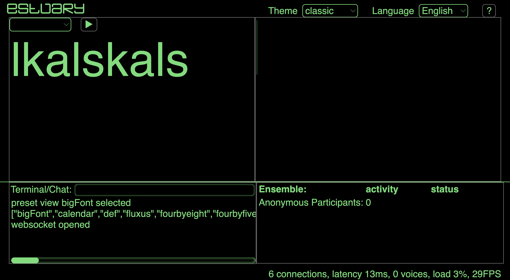
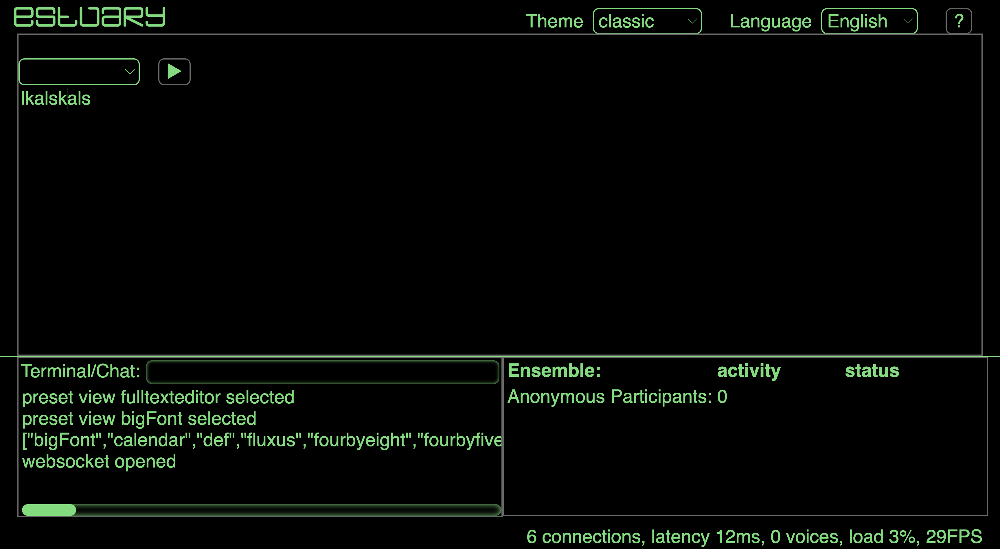
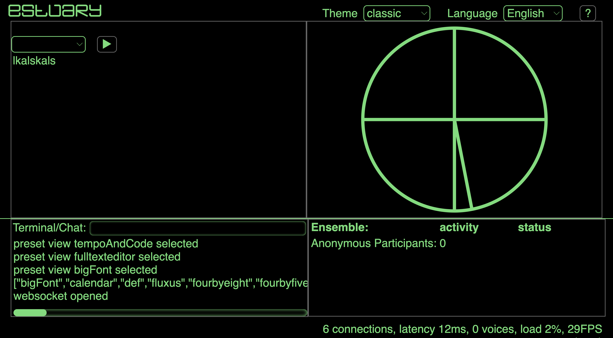
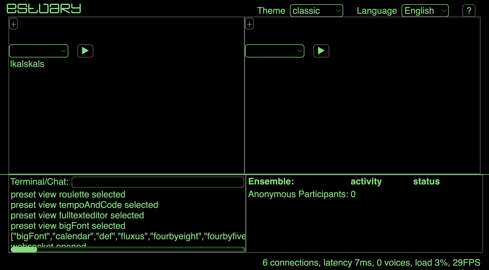
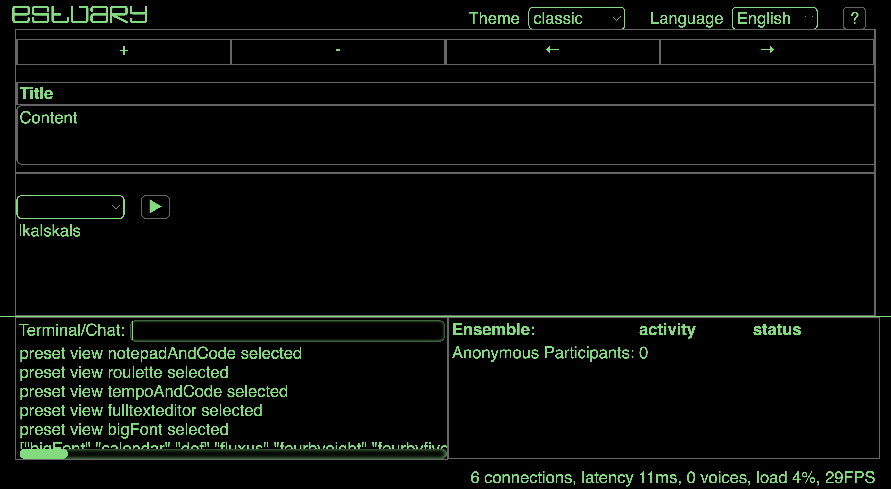

[Tutoriales](../Tutorials/README.md) | [Home](../../README.md)    

-------------------------------------------------------------------------------  

## Usando el sistema de Vistas

Estuary te permite personalizar el número de editores de código y otros aspectos de la vista que se da por defecto. Todo esto se hace usando el lenguaje de la terminal.

## PresetViews

Si se corre en la terminal `!listviews`, te dará la siguiente lista de vistas pre-determinadas:

`bigFont`, `calendar`, `def`, `fluxus`, `fourbyeight`, `fourbyfive`, `fourbyfour`, `fourbyone`, `fourbyseven`, `fourbysix` , `fourbythree`, `fourbytwo`, `fulltexteditor`, `justtexteditor`, `notepad`,` notepadAndCode`, `notepadAndCodeWithCollapDiv`, `notepadAndCodeWithCollapDiv2`, `roulette`, `tempoAndCode`, `threebyeight`, `threebyfive`, `threebyfour`, `threebyone`, `threebyseven`, `threebysix`, `threebythree`, `threebytwo`, `twobyeight`, `twobyfive` , `twobyfour`, `twobyone`, `twobyseven`, `twobysix`, `twobythree`, `twobytwo`, `twocolumns`

Puedes correr cada una con la siguiente línea de código:

`!presetview` + `vista`

Aquí algunos ejemplos:

+ `!presetview bigFont`

+ `!presetview fulltexteditor`

+ `!presetview tempoAndCode`

+ `!presetview roulette` -- únicamente funciona en Modo Ensamble

+ `!presetview notepadAndCode`

## Customizaciones

pronto
