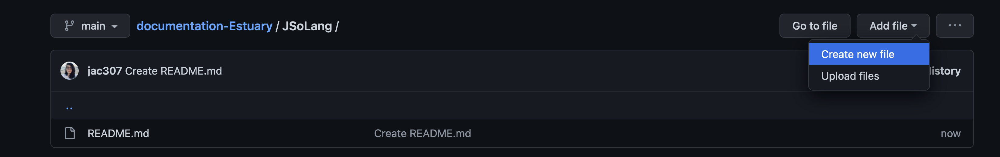
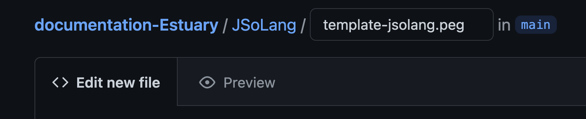
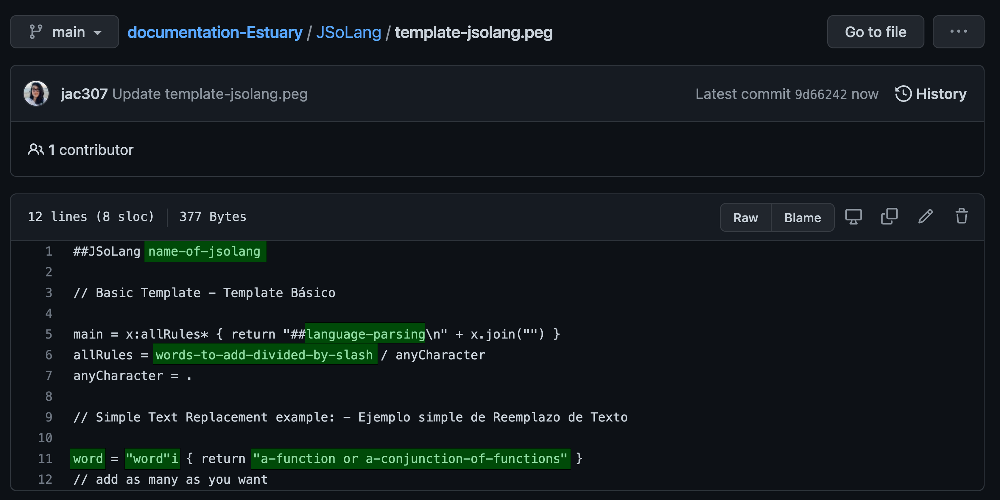
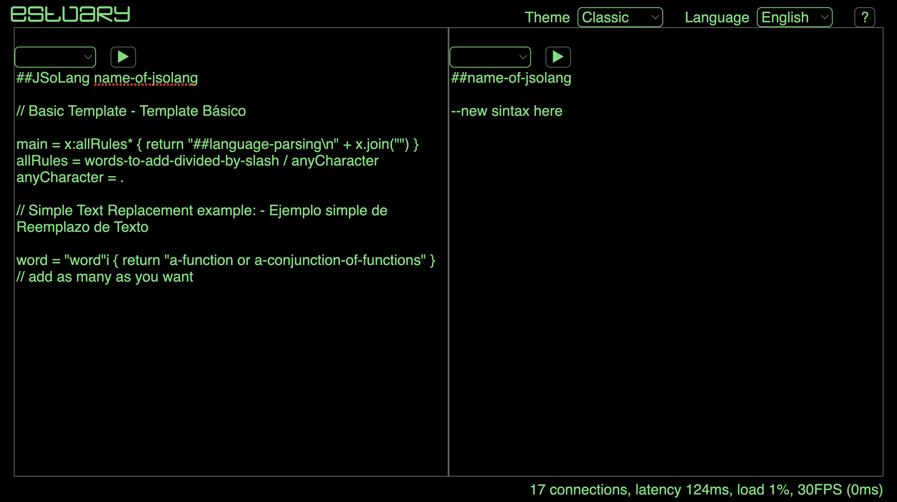
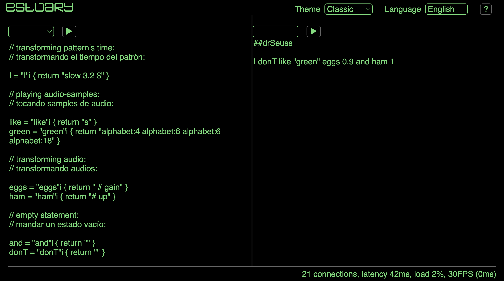
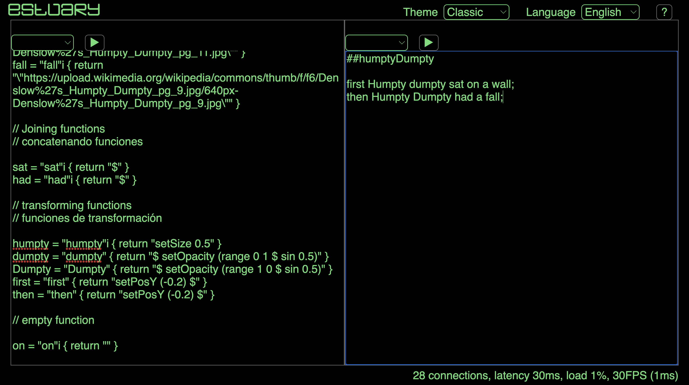
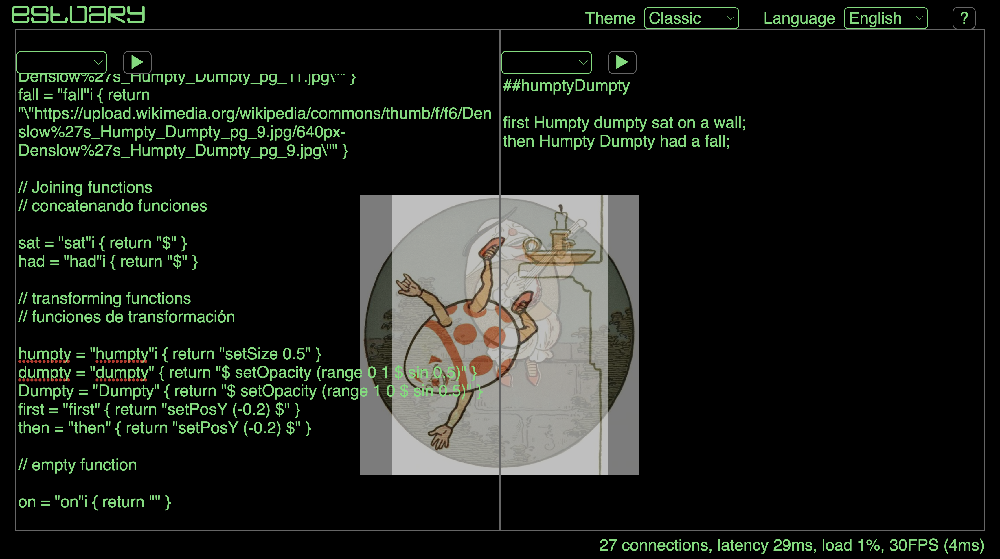
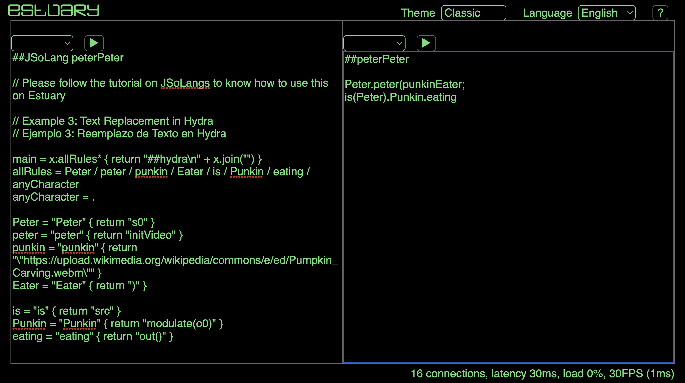

[Tutoriales](../Tutorials/README.md) | [Home](../../README.md)   

-------------------------------------------------------------------------------  

## Reemplazo de Texto Simple

<a href="#temp">Template</a>  
<a href="#ex1">Ejemplo 1</a>  
<a href="#ex2">Ejemplo 2</a>  
<a href="#ex3">Ejemplo 3</a>    

-------------------------------------------------------------------------------  

<h3 id="temp">Template</h3>  

Los JSoLangs es una aplicación en <a href="https://estuary.mcmaster.ca/" target="_blank">Estuary</a> que permite parsear lenguajes de live coding disponibles para crear nuevos.  

Para este tutorial, he agregado esta [carpeta](../../JSoLang/README.md) que contiene un template simple de reemplazo de texto, así como algunos ejemplos.  

Los JSoLangs pueden escribirse directamente en Estuary pero siempre es mejor guardarlos localmente o en alguna otra plataforma. Para mi proyecto estoy usando GitHub.  

+ Crea un archivo `name.peg`.  

  
  

+ Para este proyecto tengo este template [template](../../JSoLang/template-jsolang.peg)

  + `name-of-jsolang` = Nombra tu JsoLang.  
  + `language-parsing` = Escribe el nombre de alguno de los lenguajes de lc que hay en Estuary.   
  + `a-function or a-conjunction-of-functions` = Escribe la(s) funcion(es) que quieras traducir.  
  + `word` = Escribe la palabra que quieres para reemplazar lo anterior.  
  + `"word"i` = Escribe de nuevo la palabra pero entre comillas.  
       + `i` = no distingue mayúsculas y minúsculas.  
       + borra el i para que distinga entre mayúsculas y minúsculas.  
  + `words-to-add-divided-by-slash` = Escribe todas las palabras que usaste divididas por "/".  

  

+ Ve a: <a href="https://estuary.mcmaster.ca/" target="_blank">Estuary</a>
+ Copia/Pega tu JSoLang en un editor de texto. Evalúa y checa por errores de sintaxis.  
+ En un editor de texto diferente, escribe: `##name-of-jsolang`.    
+ Ahora puedes usar este segundo editor para escribir con tu nueva sintaxis.    

    

_________________________________________________________________________________________
_________________________________________________________________________________________

<h3 id="ex1">Example 1</h3>  

### Ejemplo 1: Reemplazo de Text con MiniTidal

[Este](../../JSoLang/drSeuss.peg) que escribí con el nombre de `drSeuss`, donde puedes correr la siguiente sintaxis:   

  `I donT like "green" eggs 0.9 and ham 1.0`.   

que se traduce en MiniTidal como:  

  `slow 3.2 $ s "alphabet:4 alphabet:6 alphabet:6 alphabet:18" # gain 0.9 # up 1.0`  

Tengo siete declaraciones, traduciendo:    

+ `like = "like"i { return "s" }` = única función.    

+ `eggs = "eggs"i { return " # gain" }` y `ham = "ham"i { return "# up" }` = operador # + función.  

+ `green = "green"i { return "alphabet:4 alphabet:6 alphabet:6 alphabet:18" }` = un patrón de sonidos

+ `I = "I"i { return "slow 3.2 $" }` = función + parámetro + operador $.  

+ `and = "and"i { return "" }` y `donT = "donT"i { return "" }` = declaración vacía.  

La nueva sintaxis debe respetar las reglas del lenguajde de live coding pre-existente.  

  

_________________________________________________________________________________________
_________________________________________________________________________________________

<h3 id="ex2">Example 2</h3>  

### Ejemplo 2: Reemplazo de Text con CineCer0

[Este](../../JSoLang/humptyDumpty.peg) que escribí con el nombre de `humptyDumpty`, donde puedes correr la siguiente sintaxis:    

  `first Humpty dumpty sat on a wall; then Humpty Dumpty had a fall`.   

que se traduce en CineCer0 como:  

  `setPosY (-0.2) $ setSize 0.5 $ setOpacity (range 0 1 $ sin 0.5) $ image "specific-url-01";`
  `setPosY (-0.2) $ setSize 0.5 $ setOpacity (range 1 0 $ sin 0.5) $ imagespecific-url-02;"`  

Tengo ten declaraciones, traduciendo:    

+ `a = "a"i { return "image" }` = única función.    

+ `sat = "sat"i { return "$" }` = operador $.    

+ `humpty = "humpty"i { return "setSize 0.5" }` = función + parámetro.  

+ `first = "first"i { return "setPosY (-0.2) $" }` = función + parámetro + símbolo.
La misma traducción se aplica a `then = "then"i { return "setPosY (-0.2) $" }`, y así tener dos opciones.  

+ `dumpty = "dumpty" { return "$ setOpacity (range 0 1 $ sin 0.5)" }` y `Dumpty = "Dumpty" { return "$ setOpacity (range 1 0 $ sin 0.5)" }` = símbolo $ + función + parámetro-dinámico.  
En este caso borré `i` y así distinga entre mayúsculas y minúsculas y pueda escribir `dumpty` o `Dumpty` y tenga dos funciones diferentes.   

+ `on = "on"i { return "" }` = declaración vacía.  

+ `wall = "wall"i { return "\"url1\"" }` y `wall = "wall"i { return "\"url2\"" }` = url entre comillas.  

La nueva sintaxis debe respetar las reglas del lenguajde de live coding pre-existente.  

  

_________________________________________________________________________________________
_________________________________________________________________________________________

<h3 id="ex3">Example 3</h3>  

### Ejemplo 3: Reemplazo de Text con Hydra

[Este](../../JSoLang/peterPeter.peg) que escribí con el nombre de `peterPeter`, donde puedes correr la siguiente sintaxis:    

  `Peter.peter(punkinEater;`  
  `is(Peter).Punkin.eating`   

que se traduce en Hydra como:  

  `s0.initVideo("specific-url");`  
  `src(s0).modulate(o0).out()`   

Tengo siete declaraciones, traduciendo:    

En este caso borré todas las `i` y así distinga entre mayúsculas y minúsculas.   

+ `Peter = "Peter" { return "s0" }`, `peter = "peter" { return "initVideo" }`, y `is = "is" { return "src" }` = única función.  

+ `punkin = "punkin" { return "\"url\"" }` = url entre comillas.  

+ `Eater = "Eater" { return ")" }` = símbolo ) .    

+ `eating = "eating" { return "out()" }` = function + símbolos ().    

+ `Punkin = "Punkin" { return "modulate(o0)" }` = function + símbolos (+ parameter +).    

La nueva sintaxis debe respetar las reglas del lenguajde de live coding pre-existente.

  
