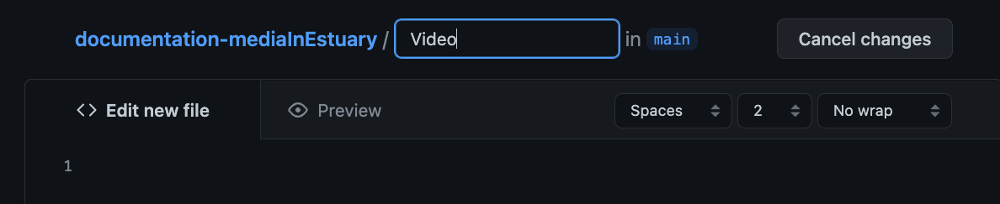
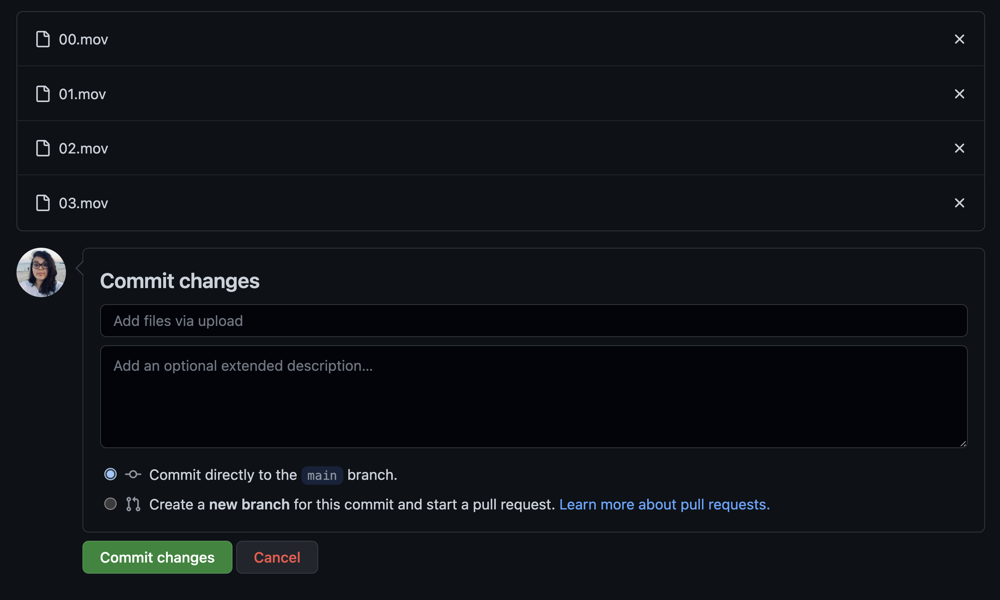

[Tutoriales](README.md) | [Home](../../README.md)    

-------------------------------------------------------------------------------  

## Añadiendo Archivos Multimedia a GitHub

Hay muchas formas de añadir/crear archivos en GitHub. Este tutorial tiene los pasos para crear carpetas que contengan cada tipo de media, y luego subir los archivos correspondientes en ellas.  

+ En tu repo, en la sección inicial: da click en "Añadir archivo", y después en "Crear nuevo archivo".  

  

+ Escribe el nombre de tu carpeta primero. En este caso "Video".  

  

+ Escribe: "/" , así se creará el folder.  

  

+ Escribe "README.md" para crear un archivo de texto. En el área de texto, en la parte inferior, escribe "##" seguido por tu título.

5. Puedes agregar más información si lo deseas. Para hacer esto, usa la [sintaxis de Markdown ](https://www.markdownguide.org/basic-syntax/).  

  

+ Ve al final y dale click en "Commit nuevo archivo".  

  

Ahora puedes ver tu nuevo nombre y archivo.  
Si quieres hacer cambios en el archivo de texto, dale click en el ícono de lapiz.  

  

+ En tu carpeta de Video: dale click en "Añadir archivo", después "Subir archivos".  

  

+ Click en "Eleguir tus archivos". Después seleccionalos/ábrelos.  

   
   

+ Espera a que estén listos y después manda los cambios. Espera a que se procesen los archivos.   

  
  

+ Revisa que tus archivos estén en el folder.  

  

__________________________________________________________   
__________________________________________________________   

También puedes añadir archivos arrastrándolos y soltándolos. En los siguientes pasos, yo cree una carpeta para Sonidos.   

+ En tu carpeta de Video: dale click en "Añadir archivo", después "Subir archivos".   
+ Selecciona, arrastra, suelta.  

En este ejemplo, estoy seleccionando tres carpetas (150, 151, 152) en lugar de archivos. Estoy haciendo esto para también importar las carpetas correspondientes.  

    

+ Espera a que estén listos y después manda los cambios. Espera a que se procesen los archivos.  

Pueden notar que el nombre de la información que se está subiendo es la siguiente: "/150/02.wav..." - El nombre de la carpeta es 150 y adentro contiene los archivos de audio.  

  

+ Revisa que tus carpetas/archivos estén ahí.   

  

__________________________________________________________   
__________________________________________________________   

Repetí este proceso creando una capeta de Imagenes y subiendo algunos archivos en ella.  

  

En mi repo principal puedo ver ahora las tres carpetas.  

  
