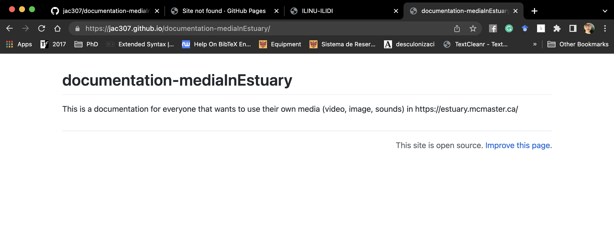

[Tutoriales](../Tutorials/README.md) | [Home](../../README.md)   

-------------------------------------------------------------------------------  

## GitHub Setup

+ Abrir/Tener una cuenta en [GitHub](https://github.com/).  
+ En "Repositorios", dar click en "Nuevo".   

  

+ Añade la información: nombre, descripción, añade un archivo README, haz el repo público. Después, presiona en "Crear repositorio".  

  

+ Puedes ahora ver tu repositorio.  

  

+ Ve a "Configuraciones", después en el menú izquierdo selecciona "Páginas".   

  

+ Abre el menu de opciones donde dice "None" y selecciona tu branch principal.  

  

+ Una vez seleccionada, presiona "guardar".  

  

+ El siguiente mensaje con el url de tu sitio deberá aparecer.  

  

+ Si le das click a la URL, la página debe de abrirse.  
Podría aparecer un mensaje de que no encuentra la página, si pasa esto: dale algo de tiempo al página de actualizarse y vuelve a cargar.  

  
