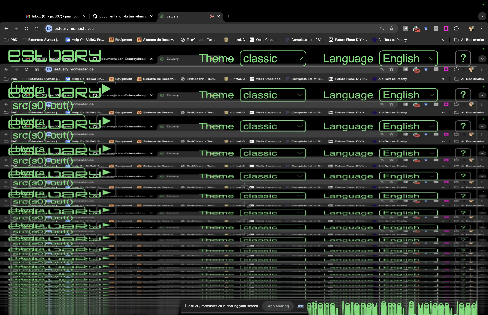

[Tutoriales](../README.md) | [Tutoriales en MiniTidal (TidalCycles), Hydra, y CineCer0](README.md)    

-------------------------------------------------------------------------------  

## Hydra: Referencias Avanzadas

Puedas revisar las siguientes referencias sobre funciones más avanzadas en Hydra.

_________________________________________________________________________________________
_________________________________________________________________________________________

### Importar Imagen, Video, Camera, y Pantalla

Para importar

+ `entrada` + `.` + `iniciador`

Las opciones para la entrada son: `s0`, `s1`, `s2`, y `s3`

Las opciones para los iniciadores son:

+ `initVideo("url")` // inicia un video. Parámetro: url del video publicado en la web.
+ `initImage("url")` // inicia una imágen. Parámetro: url de la imágen publicada en la web.
+ `initScreen()` // inicia captura de pantalla.
+ `initCam()` // inicia la cámara de tu computadora.

Por ejemplo, la siguiente línea iniciará-llamará el video que le proporcionamos por medio de la url, aunque no visualizará nada.

+ `s0.initVideo("https://jac307.github.io/documentation-Estuary/Video/00.mov")`

Para visualizar el video, tenemos que hacer un par de adiciones.

Primero colocaremos un `;` al finalizar nuestra línea anterior:

`s0.initVideo("https://jac307.github.io/documentation-Estuary/Video/00.mov");`

El `;` nos permitirá agregar otro statement en hydra; `src(entrada).out()` que es lo que visualizará nuestra entrada. El parámetro de `entrada` seria el mismo que se utilizó para iniciar-cargar la fuente.

`s0.initVideo("https://jac307.github.io/documentation-Estuary/Video/00.mov");
 src(s0).out()`

Podemos hacer lo mismo para visualizar una imagen:

`s0.initImage("https://jac307.github.io/documentation-Estuary/Image/03.png");
 src(s0).out()`

 Y lo mismo para visualizar la cámara:

 `s0.initCam();
  src(s0).out()`

Para iniciar y visualizar la pantalla, se tiene que realizar otro proceso.

Primero, corremos el iniciador:

+ `s0.initScreen()`

El navegador te pedirá los permisos correspondientes y te dejará elegir la pantalla o ventana que quieras capturar.

Una vez iniciada, borrarás esa línea de código y escribirás-evaluarás únicamente:

+ `src(s0).out()`

Al igual que las otras fuentes, puedes añadir transformadores, moduladores y operadores a estas líneas de código.

`s0.initVideo("https://jac307.github.io/documentation-Estuary/Video/00.mov");
src(s0).kaleid().out()`

Para iniciar dos o más elementos, se tiene que utilizar entradas diferentes: `s0`, `s1`, `s2`, y `s3`. Para cambiar la visualización, nada más se cambia la entrada.

`s0.initVideo("https://jac307.github.io/documentation-Estuary/Video/00.mov");
s0.initImage("https://jac307.github.io/documentation-Estuary/Image/03.png");
src(s0).kaleid().out()`

_________________________________________________________________________________________
_________________________________________________________________________________________

### Usar materiales propios

Se puede usar imágenes y videos propios en Estuary. Una forma de hacer esto es utilizando GitHub pages, los siguientes tutoriales tienen instrucciones de cómo hacer esto:

+ [GitHub: Setup](../GitHub-setup.md){:target="_blank"}

+ [GitHub: Añadiendo Archivos Multimedia](../GitHub-addingFiles.md){:target="_blank"}

+ [Estuary: Usando Media en Hydra](../Estuary-MediaInHydra.md){:target="_blank"}

_________________________________________________________________________________________
_________________________________________________________________________________________

### Salidas

La función `out()` tiene cuatro posibles valores: `o0`, `o1`, `o2`, `o3`. Por defecto, el valor es `o0`.

Estas salidas en hydra te permiten visualizar varias fuentes al mismo tiempo, pero Estuary no cuenta actualmente con la función que se usa para esto.

Aún así, este parámetro se puede usar para los moduladores y operadores.

`s0.initVideo("https://jac307.github.io/documentation-Estuary/Video/00.mov");
s1.initImage("https://jac307.github.io/documentation-Estuary/Image/03.png");
src(s0).out();
src(s1).out(o1)`

En este ejemplo, tenemos otra línea con `src(s1).out(o1)` y aunque no podemos ver la visualización de la imágen en este momento, sí la podemos usar agregando un modulador con `o1` como la fuente. Así podemos mezclar ambas fuentes.

`s0.initVideo("https://jac307.github.io/documentation-Estuary/Video/00.mov");
s1.initImage("https://jac307.github.io/documentation-Estuary/Image/03.png");
src(s0).modulate(o1).out();
src(s1).out(o1)`

Aquí otro ejemplo:

`osc(10, 0.1, 0.1).modulate(o1).out();
voronoi().kaleid().out(o1)`

_________________________________________________________________________________________
_________________________________________________________________________________________

### Hydra en Estuary

En [https://estuary.mcmaster.ca/](https://estuary.mcmaster.ca/){:target="_blank"}:  

Dale click en el button `?` localizado en la parte superior derecha. Aparecerá un menú con diferentes opciones. Da click en donde dice Hydra.

Puedes copiar y pegar los ejemplos disponibles y experimentar. En esta sección, también encontrarás las funciones de Hydra que no se pueden utilizar en Estuary.

The Estuary Discord server - all welcome! Puedes entrar al discord de Estuary usando la siguiente liga (se recomienda tener una cuenta en discord.com antes de dar click a esta invitación): [https://discord.gg/snvFzkPtFr](https://discord.gg/snvFzkPtFr){:target="_blank"}    

Si deseas tener más información sobre algunas funciones en Hydra y sus parámetros, puedes revisar los tutoriales y referencias completas en [https://hydra.ojack.xyz/](https://hydra.ojack.xyz/){:target="_blank"}.

--
