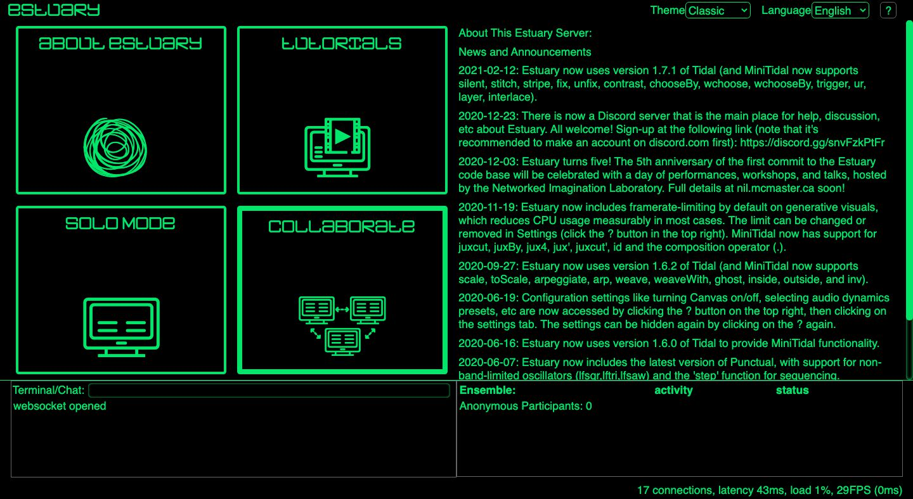
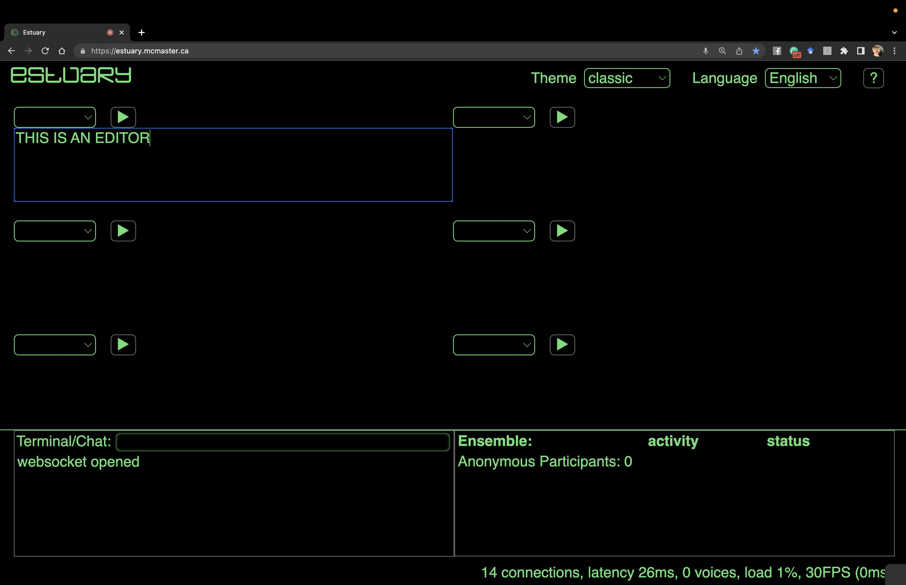
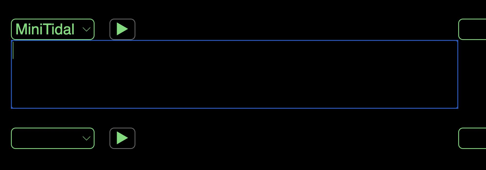
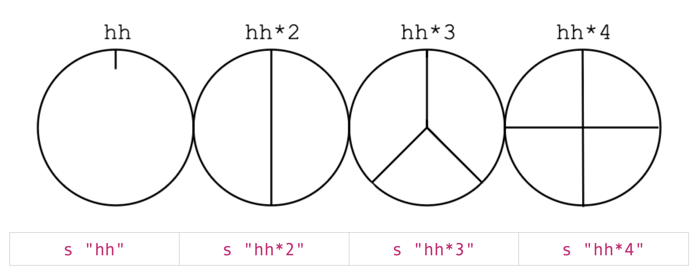
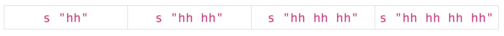
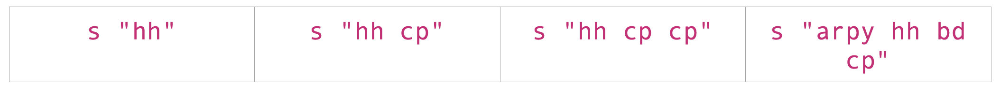
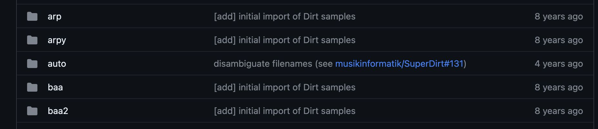
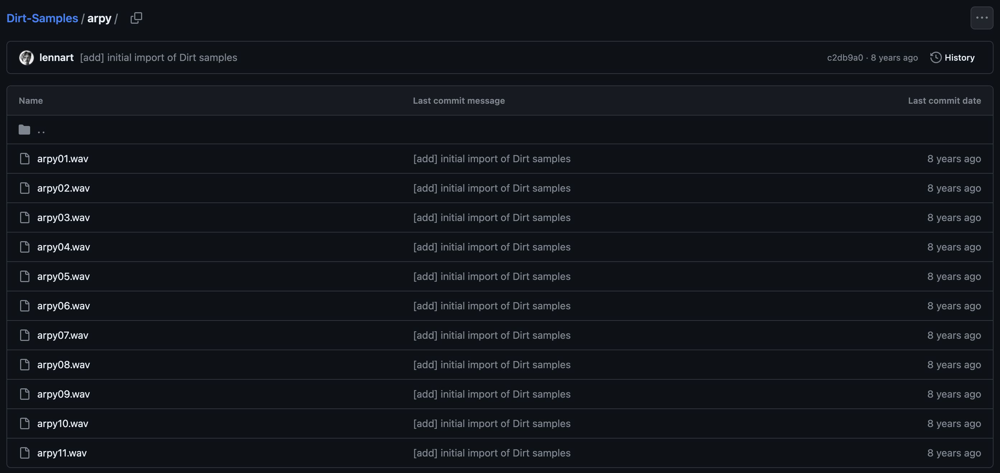

[Tutoriales](../Tutorials/README.md) | [Tutoriales en MiniTidal (TidalCycles), Hydra, y CineCer0](README.md)    

-------------------------------------------------------------------------------  

## Hydra: Intro

Hydra es una plataforma de live coding para síntesis visual basado en los desarrollos visuales que los sintetizadores análogos generan. Hydra es un proyecto open-source desarrollado por [Olivia Jack](https://ojack.github.io/){:target="_blank"}.  

Hidra en Estuary es una versión reducida del stand-alone de Hydra.  

### Primeros pasos

Ve a [https://estuary.mcmaster.ca/](https://estuary.mcmaster.ca/){:target="_blank"}  
Selecciona SOLO MODE (Modo Solo).  

Encontraras un espacio de trabajo con 6 editores de código. Cada editor tiene un menu vacío en la parte superior izquierda. Estuary permite trabajar con diferentes lenguajes para live coding. Puedes elegir el lenguaje de programación que quieras operar en este menú.  

Selecciona MiniTidal en el menú de uno de los editores.

Escribe lo siguiente y presiona el botón de play (o también puedes presionar shift+return/enter).  

+ `s "cp"` = esta línea reproducirá un sonido de aplauso (clap).

IMPORTANTE: cuidado con las comillas que usas. Éstas tienen que ser del tipo `""`, no “” (estas últimas generarán un error de sintaxis). Si haces copias y pegas las líneas de código de este tutorial code from this tutorial, revisa que tengan las comillas correctas ya que algunas veces se pueden cambiar.  

Cambia `cp` por otros sonidos disponibles:  

+ `bd`
+ `arpy`
+ `crow`
+ `glitch`
+ `hh`

Puedes parar el sonido borrando todo tu código y presionando el botón de play.

_________________________________________________________________________________________
_________________________________________________________________________________________

### Usando MiniTidal: Ciclo

MiniTidal usa un medida de tiempo llamada CPS: ciclos por segundo. Para MiniTidal, el tiempo es cíclico y no linear: cada vez que un ciclo termina, un nuevo ciclo comienza. El tiempo del ciclo puede ser divido en secciones (e.g. 1/3 del ciclo, etc).  

+ Reproduce las siguientes líneas de código por separado y escucha qué pasa:  

+ `s "hh"`
+ `s "hh*2"`
+ `s "hh*3"`
+ `s "hh*4"`

En todos los casos anteriores, estamos incrementando el número de samples/audios que suceden en cada ciclo.

+ Puedes obtener el mismo resultado con las siguientes líneas de código:

+ `s "hh"`
+ `s "hh cp"`
+ `s "hh cp cp"`
+ `s "arpy hh bd cp"`

En estos casos, estamos usando únicamente el sample/audio hh, pero puedes jugar con más sonidos:

+ `s "hh"`
+ `s "hh hh"`
+ `s "hh hh hh"`
+ `s "hh hh hh hh"`

Experimenta con el ciclo añadiendo más sample/audios.

_________________________________________________________________________________________
_________________________________________________________________________________________

### Usando MiniTidal: Variaciones en patrones sonoros

También puedes crear otras variaciones.  

El símbolo previamente usado `*` (colocado justo después del sample/audio) lo duplica:

+ `s "cp*8"`
+ `s "arpy*2"`
+ `s "bd cp*2"`
+ `s "arpy*4 cp*2"`  

El símbolo `~` agrega un silencio en el ciclo:  

+ `s "hh ~"`
+ `s "hh cp ~ ~ arpy"`
+ `s "arpy arpy ~ cp"`
+ `s "~ ~ cp"`

El símbolo `/` (colocado justo después del sample/audio) alenta esa sección del ciclo:

+ `s "cp/2"`
+ `s "cp/3"`
+ `s "cp/4"`
+ `s "cp/5"`

El símbolo `[]` (usado entre samples/audios) crea un grupo de patrones sonoros. Puedes usar este grupo para aplicar algunos de los símbolos anteriores afectando a todo el grupo:

+ `s "[bd cp] arpy"`
+ `s "[bd cp]*2 ~ arpy"`
+ `s "[arpy ~ glitch bd]/2"`
+ `s "[bd cp*2]*2 [hh arpy]/3"`

El símbolo `<>` (usado entre samples/audios) alterna los samples/audios que estan adentro:

+ `s "bd <cp arpy>"` = En este patrón, el segundo sample/audio cambiarán en cada ciclo.
+ `s "<glitch cp> <hh arpy>"` = En este patrón, tendremos un ciclo con `glitch hh` y otro con `cp arpy`.

_________________________________________________________________________________________
_________________________________________________________________________________________

### Usando MiniTidal: Samples/Sonidos

Los samples/audios disponibles en MiniTidal son: [https://github.com/tidalcycles/Dirt-Samples](https://github.com/tidalcycles/Dirt-Samples){:target="_blank"}   

Como puedes ver por el link, el nombre de cada sample/audio refiere al nombre de una carpeta específica. Cada carpeta contiene más de un archivo sonoro.

Cuando se reproduce un sample/audio, siempre reproducirá el primer archivo sonoro de esa carpeta.  

Por ejemplo, `arpy`. Si vemos esta carpeta encontraremos 11 archivos sonoros. Si reproducimos `s "arpy"`, por defecto escucharemos el archivo arpy01.wav  

Puedes reproducir los otros archivos sonoros usando `:` (colocado justo después del sample/audio), añadiendo el número de archivo que quieras reproducir. Este número siempre comienza con `0`. Por ejemplo:

+ `s "arpy:0"` = reproducirá arpy01.wav
+ `s "arpy:1"` = reproducirá arpy02.wav
+ `s "arpy:2"` = reproducirá arpy03.wav
+ `s "arpy:3"` = reproducirá arpy04.wav

Explora con lo otros sonidos disponibles!
