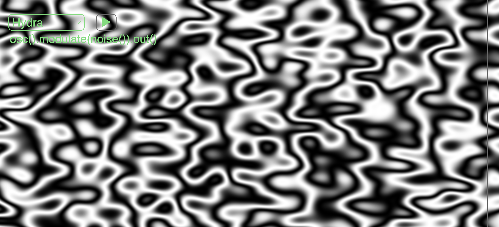
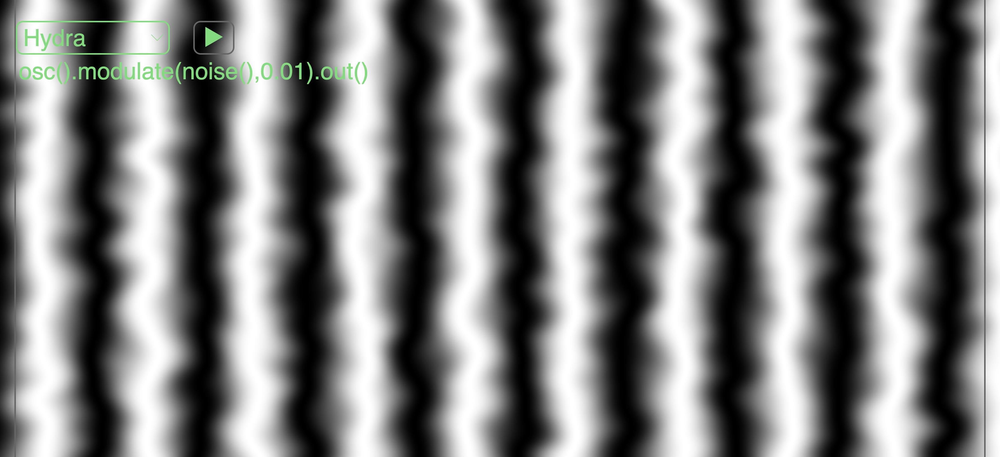
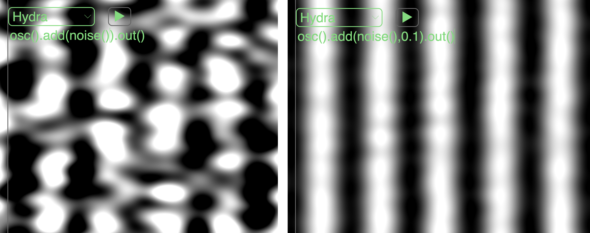

[Tutoriales](../README.md) | [Tutoriales en MiniTidal (TidalCycles), Hydra, y CineCer0](README.md)    

-------------------------------------------------------------------------------  

## Hydra: Moduladores y Operadores

Al igual que las transformaciones, los moduladores y operadores son funciones que puedes aplicarse a las fuentes para transformarlas de diferentes maneras.

Los moduladores y operadores también se escriben entre la fuente y la salida, siempre unidos (aplicados) por `.

+ `fuente` + `.` + `operadores-o-moduladores` + `.` + `salida`

La diferencia radica en que los moduladores y operadores siempre necesitarán de una fuente como primer parámetro.  

Analicemos la siguiente línea:

+ `osc().modulate(noise()).out()`

En esta línea se esta aplicando el modulador básico `.modulate(t,v)`. El primer parámetro `t` = texture = fuente => `osc()`, `solid()`, `gradient()`, `noise()`, `shape()`, `voronoi()`. Este parámetro `t` siempre se tiene que determinar, no se puede dejar vacío. En el ejemplo de arriba, estos utilizando un `noise()` como parámetro, lo que provoca que el `osc()` inicial se distorsione con esta segunda fuente.

El segundo parámetro es un número que determina la cantidad en la que esta segunda fuente se aplica. El parámetro por defecto 0.1. En este segundo ejemplo estamos utilizando un número más pequeño para reducir el efecto del `noise()`.

+ `osc().modulate(noise(),0.01).out()`

Al igual que los moduladores, los operadores también necesitan de un parámetro `t`. Los operadores mezclarán dos fuentes utilizando diferentes métodos de yuxtaposición. El valor determina qué tanto la segunda fuente se visibiliza sobre la primera.

+ `osc().add(noise()).out()`
+ `osc().add(noise(),0.1).out()`

_________________________________________________________________________________________
_________________________________________________________________________________________

### Lista de Opciones

#### Modulators

// t = texture = source => osc, solid, gradient, noise, shape, voronoi

+ `.modulate(t, valor)` // amount’s default: 0.1
+ `.modulateHue(t, valor)` // default: 0.4
+ `.modulateKaleid(t, #Sides)` // default: 4.0
+ `.modulatePixelate(t, multiple, offset)` // defaults: 10.0, 3.0
+ `.modulateRepeat (t, repeatX, repeatY, offsetX, offsetY)` //defaults: 3.0, 3.0, 0.5, 0.5
+ `.modulateRepeatX (t, repeatX, offsetX)`
+ `.modulateRepeatY (t, repeatY, offsetY)`
+ `.modulateRotate(t, multiple, offset)` // defaults: 1.0, 0.0
+ `.modulateScale(t, multiple, offset)` // defaults: 1.0, 1.0
+ `.modulateScrollX(t, scrollX, velocidad)` // defaults: 0.5, 0.0
+ `.modulateScrollY(t, scrollY, velocidad)` // defaults: 0.5, 0.0

#### Operators

+ `.add(t, valor)` // default: 0.5
+ `.mult(t, valor)` // default: 0.5
+ `.blend(t, valor)` // default: 0.5
+ `.diff(t)`
+ `.layer(t)`
+ `.mask(t, reps, offset)` // defaults: 3.0, 0.5

--
