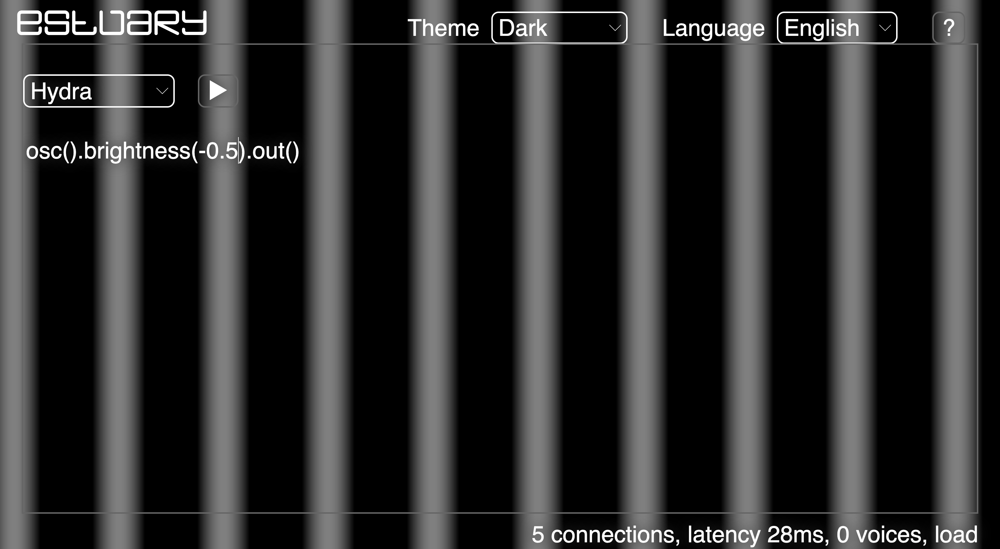
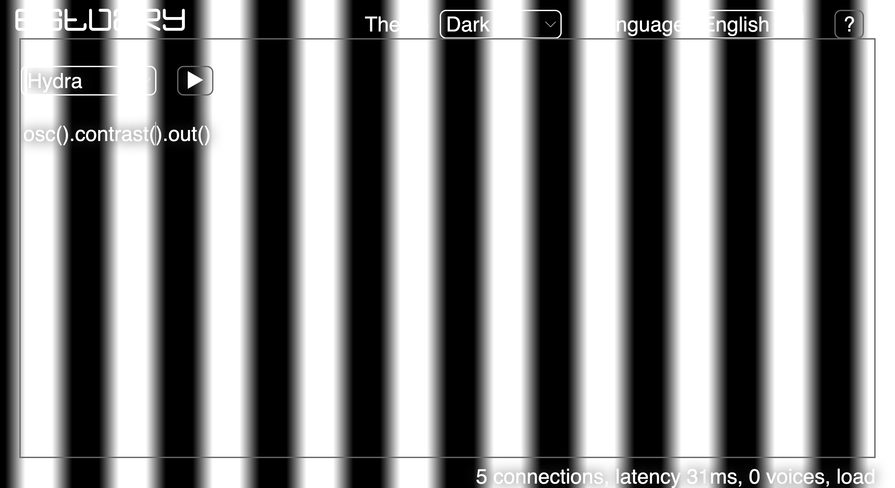
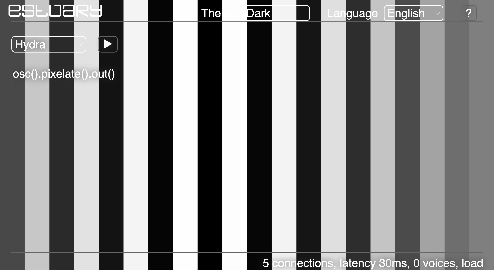
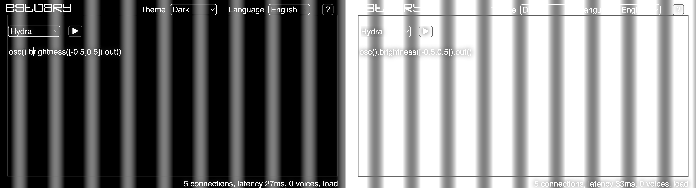
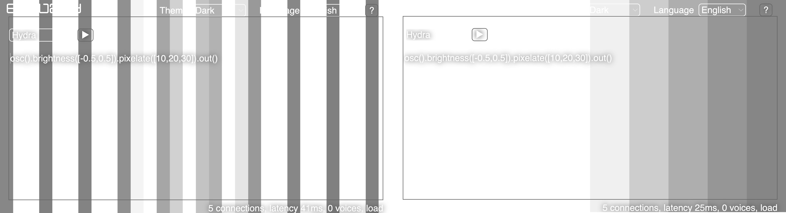

[Tutoriales](../README.md) | [Tutoriales en MiniTidal (TidalCycles), Hydra, y CineCer0](README.md)    

-------------------------------------------------------------------------------  

## Hydra: Transformadores

Los transformadores son funciones que puedes aplicarse a las fuentes para transformarlas de diferentes maneras.

Los transformadores se escriben entre la fuente y la salida:

+ `fuente` + `.` + `transformadores` + `.` + `salida`

Ejemplo:

+ `osc().brightness().out()` // Esto corre un oscilador con un cambio en el brillo, todos los parámetros usados son los que están por defecto.

Otra manera de escribir la misma sintaxis es la siguiente:

`osc()
  .brightness()
.out()`

Se puede correr bloques de código (desarrollado en líneas separadas).

Se pueden añadir más transformadores, siempre unidos (aplicados) por `.`

+ `osc().brightness().kaleid().out()` // Esto agrega un efecto the Kaleidoscópio con parametros con defecto.

_________________________________________________________________________________________
_________________________________________________________________________________________

### Transformadores

#### Algunos ejemplos

Sintaxis: `.brightness(cantidad)`

+ `osc().brightness().out()` // Brillo con parámetro por defecto: (0.4) = más brillo.
+ `osc().brightness(-0.5).out()` // Brillo con un valor negativo de (-0.5) = más oscuro.

Brightness incrementa los niveles de luz en la imagen, se puede aplicar a cualquier source. Los números negativos resultan en texturas oscuras. Números mayores a 0 resultan adición de brillo.

Sintaxis: `.contrast(cantidad)`

+ `osc().contrast().out()` // Contraste con parámetro por defecto: (1.6) = más contraste.
+ `osc().contrast(0.5).out()` // Contraste con un valor de (0.5) = menos contraste.

Contrast genera una exageración mayor (números positivos) o menor (números negativos) entre los tonos brillantes y oscuros, resultando en texturas con colores más o menos definidos.

Sintaxis: `.pixelate(x,y)`

+ `osc().pixelate().out()` // Contraste con parámetro por defecto: (20,20).
+ `osc().pixelate(40).out()` // Contraste con un valor de (40) = más pixeles en el eje x.

#### Algunos ejemplos con listas de parámetros

+ `osc().brightness([-0.5,0.5]).out()` // Brillo con una lista de parámetros ([-0.5,0.5]) = el brillo saltará de un parametro al otro.

+ `osc().brightness([-0.5,0.5]).pixelate([10,20,30]).out()` // Brillo con una lista de parámetros ([-0.5,0.5]) + Pixelate con una lista de parámetros para el valor x ([10,20,30]) = tanto el brillo con el pixelate saltarán de un parámetro al otro.

Las listas de parámetros tienen dos transformaciones específicas:

`[parametros].smooth()` aplicará una transición entre los parámetros

+ `osc().brightness([-0.5,0.5].smooth()).out()` // El brillo no saltará sino que transicionará de un parámetro al otro.

`[parametros].fast(velocidad)` modificará la velocidad en la que cada parámetro cambia.

+ `osc().brightness([-0.5,0.5].fast()).out()` // El brillo no saltará más rápido entre sus parámetros.

Se pueden aplicar ambas:

+ `osc().brightness([-0.5,0.5].fast().smooth()).out()`

### Lista de Opciones

+ `.brightness(valor)` // default: 0.4
+ `.contrast(valor)` // default: 1.6
+ `.color(red, green, blue, alpha)` // vec4
+ `.colorama(valor)` // default: 0.005 -- desplaza los valores de HSV
+ `.invert(valor)` // default:1.0
+ `.luma(threshold, tolerance)` // defaults: 0.5, 0.1
+ `.hue(valor)` // default: 0.4
+ `.posterize(bins, gamma)` // defaults: 3.0, 0.6
+ `.saturate(valor)` // default: 2.0
+ `.shift(r, g, b, a)` // defaults: 0.5 para todos
+ `.thresh(threshold, tolerancia)` // defaults: 0.5, 0.04
+ `.kaleid(#sides)` // default: 4.0
+ `.pixelate(x, y)` // defaults: 20.0, 20.0
+ `.repeat(repeatX, repeatY, offsetX, offsetY)` // defaults: 3.0, 3.0, 0.0, 0.0
+ `.repeatX(reps, offset)`
+ `.repeatY(reps, offset)`
+ `.rotate(ángulo, velocidad)` // defaults: 10.0, 0.0
+ `.scale(size, xMult, yMult)` // defaults: 1.5, 1.0, 1.0
+ `.scroll(scrollX, scrollY, speedX, speedY)` // defaults: 0.5, 0.5, 0.0, 0.0
+ `.scrollX(scrollX, velocidad)`
+ `.scrollX(scrollY, velocidad)`

--
