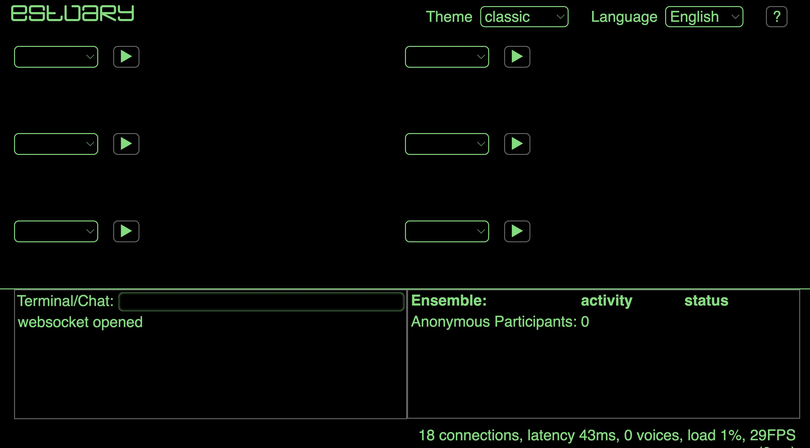
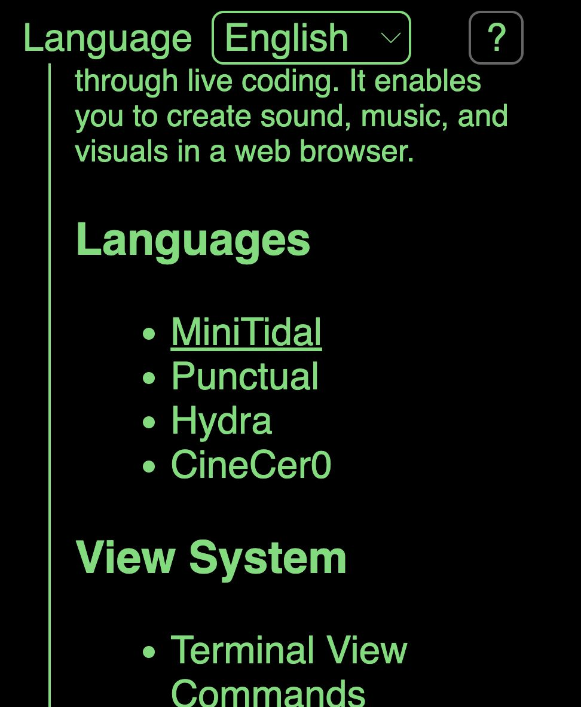
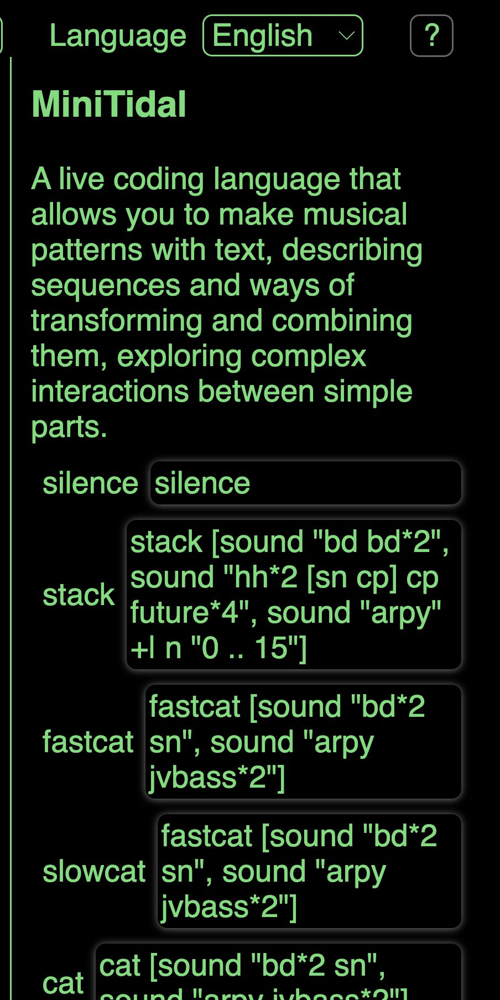

[Tutoriales](../Tutorials/README.md) | [Tutoriales en MiniTidal (TidalCycles), Hydra, y CineCer0](README.md)    

-------------------------------------------------------------------------------  

## MiniTidal: Referencias Avanzadas

Puedas revisar las siguientes referencias sobre funciones más avanzadas en MiniTidal.

_________________________________________________________________________________________
_________________________________________________________________________________________

### Examples in Estuary

En [https://estuary.mcmaster.ca/](https://estuary.mcmaster.ca/){:target="_blank"}:  

Dale click en el button `?` localizado en la parte superior derecha.

Aparecerá un menú con diferentes opciones. Da click en donde dice MiniTidal.

Puedes copiar y pegar los ejemplos disponibles y experimentar.

The Estuary Discord server - all welcome! Puedes entrar al discord de Estuary usando la siguiente liga (se recomienda tener una cuenta en discord.com antes de dar click a esta invitación): [https://discord.gg/snvFzkPtFr](https://discord.gg/snvFzkPtFr){:target="_blank"}    

Si deseas tener más información sobre algunas funciones en MiniTidal y sus parámetros, puedes buscarlas usando la herramienta de búsqueda en la siguiente página: [https://tidalcycles.org/](https://tidalcycles.org/){:target="_blank"}. La herramienta de búsqueda está localizada en la parte superior derecha. Antes de revisar esta documentación externa, lee la siguiente sección.

_________________________________________________________________________________________
_________________________________________________________________________________________

### TidalCycles Vs MiniTidal

MiniTidal es una versión reducida de TidalCycles.  

+ Puedes revisar los tutoriales disponibles directamente en la página oficial de TidalCycles: [https://tidalcycles.org/docs/patternlib/tutorials/workshop](https://tidalcycles.org/docs/patternlib/tutorials/workshop){:target="_blank"}  

Una parte fundamental a mencionar es que MiniTidal varia un poco en comparación de la sintaxis oficial de TidalCycles.

Por ejemplo, in MiniTidal-Estuary, se puede correr la siguiente línea:

+ `s "cp"`

Pero si revisan las referencias en la web oficial de TidalCycles, encontrarás la siguiente estructuras:

+ `d1 $ s “cp"`
+ `once $ s "cp"`

Si quieren usar los ejemplos y referencias de la web oficial de TidalCycles en MiniTidal, no usen las siguientes funciones:

+ `d1 $` or
+ `once $`.

Adicionalmente algunas funciones como `feedback` o `room` (entre otras) no funcionarán en MiniTidal.

_________________________________________________________________________________________
_________________________________________________________________________________________

### Usar samples propios

Se puede usar samples/audios propios en Estuary. Una forma de hacer esto es utilizando GitHub pages, los siguientes tutoriales tienen instrucciones de cómo hacer esto:

+ [GitHub: Setup](../GitHub-setup.md){:target="_blank"}

+ [GitHub: Añadiendo Archivos Multimedia](../GitHub-addingFiles.md){:target="_blank"}

+ [Estuary: Importando Samples para TidalCycles](../Estuary-ImportingSamples.md){:target="_blank"}
